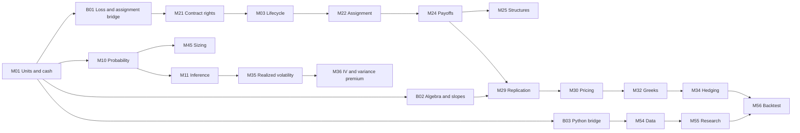

# Competency and dependency map

The graph has one assessed competency per module, including three entry bridges. Each competency has a measurable outcome, diagnostic prompt, linked assessments and distinct hard, recommended and optional preparation. Its granularity is a module exit capability; topic-level skills will be refined during lesson authoring without changing existing IDs. Original whole-module edges remain in source mappings even when reclassified.

This picture is an overview. [competencies.json](../../data/v1/competencies.json) contains the complete graph, including numerical, operational and specialist dependencies. [learning_paths.json](../../data/v1/learning_paths.json) expands every path’s prerequisite closure. A hard edge means the downstream task consumes that skill; recommended preparation helps but cannot block a beginner unnecessarily. Optional enrichment can point to a later revisit and is not an entry dependency. The validator checks the hard DAG and path reachability. The canonical review additionally checks recommended-preparation cycles.

Entry diagnostics are short work samples, not self-reported experience:

| Gate | Task | Reference and bridge |
|---|---|---|
| Units | Convert premium 3 × multiplier 100 × two contracts, then apply a 20% loss and 20% gain to100 | 600 premium;96 final equity. M01/B01 if incorrect. |
| Contract safety | Explain the cash/share consequence of assignment on one hypothetical 100-strike short put with multiplier 100 | Pay 10000 and receive 100 shares; premium accounting separate. B01/M21/M22. |
| Algebra/slope | Explain the difference between 20% volatility plus 1 point and plus 1% relative |21% versus 20.2%; B02, then M13 for derivatives. |
| Probability |80% chance to earn 1,20% chance to lose 5: compute expectation and discuss costs | -.2 before costs; M10. |
| Inference | Explain why the best of 100 backtests needs a record of all 100 trials | Selection invalidates an ordinary single-test interpretation; M11/M55. |
| Coding | Write a pure payoff function, reject invalid inputs, rerun it in a fresh environment and compare a hand case | B03 before M31/M54/M56. A spreadsheet audit does not award coding mastery. |

A bridge takes approximately 2–5 study hours plus a fresh diagnostic. B01 starts with obligations and a zero-position alternative; B02 uses concrete units before symbolic derivatives; B03 uses cash-flow functions before data frames and backtests. Passing a diagnostic grants provisional placement, confirmed by the downstream transfer task. Advanced stochastic calculus is required for derivations/models that consume it, not for understanding a put’s loss or assignment.
