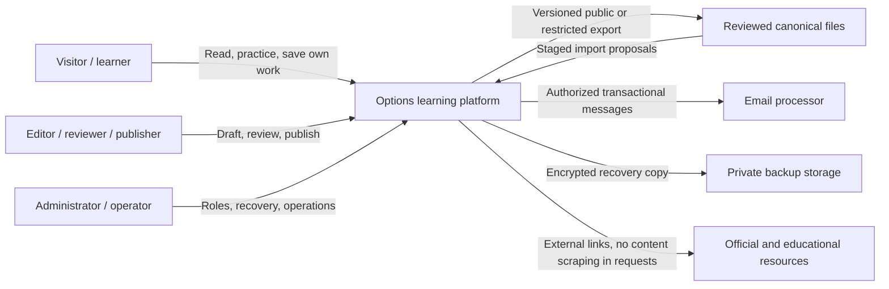
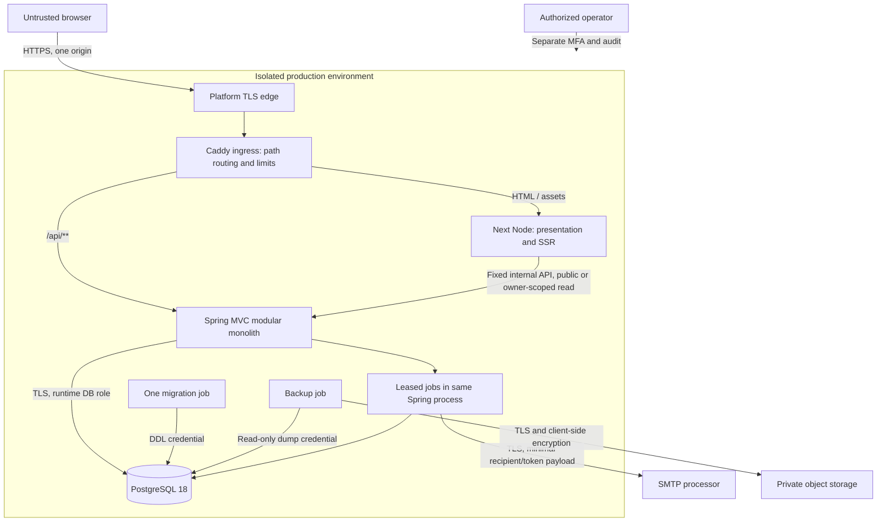
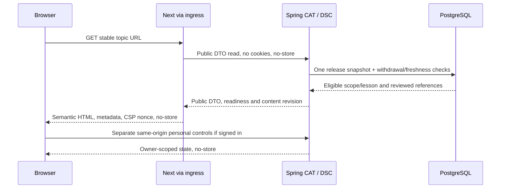

# Architecture — P03

Version 1.0, 23 September 2026. **Design gate only.** Use a Java/Spring modular monolith, PostgreSQL, a Next.js presentation runtime and a same-origin reverse proxy. No application features, database tables/migrations, containers or deployments were implemented in this assignment. P04 is the next eligible prompt.

The entry contract is [P02 requirements](../product/PRODUCT_REQUIREMENTS.md), [release content](../product/CONTENT_RELEASE_PLAN.md) and [traceability](../product/REQUIREMENTS_TRACEABILITY.md). `python3 scripts/validate_product_contract.py` passed on entry, covering 40 requirements, 17 journeys, 36 canonical topics and 99 lesson dependency edges; its fixed `as_of` date is P02's 22 September snapshot, not a claim about current market rules. All upstream publication exclusions survive. R1 is the separate Foundations course, six gates and a self-reviewed manual dossier. None of seven full canonical paths is completable; there are zero reviewed lessons today.

## Decisions and boundaries

| Record | Settled decision |
|---|---|
| [ADR-001](adr/001-supported-platform.md) | Temurin 25 / Boot 4.1, Maven, supported dependency policy, typed REST and test tooling |
| [ADR-002](adr/002-frontend-rendering.md) | Next 16 / React / TypeScript, dynamic SSR, no shared HTML cache, no business backend in Next |
| [ADR-003](adr/003-relational-data.md) | PostgreSQL 18 / Flyway, JPA plus targeted JDBC, relational public search, durable jobs |
| [ADR-004](adr/004-browser-identity.md) | Spring JDBC sessions, same-origin cookies/CSRF, password + WebAuthn for privileged roles |
| [ADR-005](adr/005-editorial-authority.md) | One database editorial authority after bootstrap, reviewed imports, immutable publication, restricted Markdown |
| [ADR-006](adr/006-hosting-topology.md) | Local HTTPS proxy; managed container reference production; dated costs, recovery and scaling |

[SECURITY](SECURITY.md) defines data classes, trust boundaries and threat controls. [Official source notes](evidence/official-sources.md) distinguish documented compatibility from unperformed runtime tests. These decisions do not silently select a final application schema or commercial service contract.

## Context



No broker/trading connection, live quote feed, payments, ad tracking, community service or hosted Python execution is present. Existing educational project specifications remain content, not automatically deployed tools.

## Containers and trust boundaries



The public edge and ingress are infrastructure, not authorization authorities. The private network and hosting administrators are part of the trusted computing base; internal HTTP is not described as mTLS. Next is an authenticated-data recipient during private SSR and therefore inside the personal-data boundary, but owns no database or identity store. PostgreSQL, backups, mail and operator access are separate protection boundaries. A compromised frontend runtime can steal sessions it receives; Spring ownership checks do not eliminate that risk. Restrict dependencies, egress and secrets accordingly.

## Spring modules and allowed dependencies

One Maven executable with packages by domain; each domain contains controller/DTO, service and repository packages where needed. Controllers translate HTTP and validate shape; services enforce role/ownership/version invariants and transactions; repositories persist/query. Avoid empty layers or one interface per class. Package APIs are explicit; repositories are never called across domain boundaries from controllers.

| Module ID | Responsibility / owned state | Calls allowed |
|---|---|---|
| CAT — content/catalog | Stable IDs, hierarchy, scopes/lessons, resource assignments, competency graph, paths, projects, revisions, source/rule observations, public projection/manifest | Shared infrastructure only; takes an authenticated editor context from calling service |
| DSC — discovery | Public search/facets/ranking, navigation and sitemap queries | CAT public read interface; no identity or learner tables |
| IDN — identity | Accounts, credentials, factors, session lifecycle, roles, revocation, recovery and account privacy policy | Shared mail/jobs/audit; its own erasure/export participant called by FLOW |
| LRN — learning state | Owner-scoped progress, bookmarks, notes, enrollment/version, dashboard and deterministic recommendation | CAT read interfaces, IDN current principal; reads assessment evidence through ASMT interface |
| ASMT — assessment | Form selection/eligibility, protected keys, scoring, attempts, remediation, exhaustion requests, practice/dossier evidence | CAT versioned definitions, IDN current principal; no call into LRN services/repositories |
| ADM — administration | Draft/import/review/publication orchestration, content issue/freshness queues, maintenance queue and role management commands | CAT/IDN/ASMT/LRN published service interfaces only; no routine read of private notes |
| FLOW — application flow services | Only cross-domain request coordination, such as starting/submitting an eligible assessment | LRN/ASMT/CAT/IDN interfaces; no repositories; domain modules never call FLOW |
| OPS — shared infrastructure | Clock, request IDs, mail adapter, leased jobs/outbox, audit, health/metrics and export storage adapter | Narrow interfaces; not a dumping ground for domain logic |

ASMT records immutable outcomes; LRN derives next-step/evidence through an ASMT query. This avoids a circular ASMT↔LRN service dependency. A FLOW assessment service obtains prerequisite progress/evidence from LRN, then passes a server-created, versioned evidence snapshot to ASMT in the same transaction; the browser cannot supply that snapshot. ASMT validates versions and immutable form conditions. Privacy deletion orchestration similarly belongs to FLOW and invokes each owning module's erasure/export participant; IDN owns identity policy without importing the learner modules. Admin orchestrates, it does not own duplicate entities. A transactional publish service can coordinate CAT and ASMT definitions within the single database transaction; all cross-module calls still use explicit interfaces. These few service coordinators prevent dependency cycles; ordinary CRUD needs no additional facade. P07 architecture tests enforce these directions.

## Key request and data flows

### Public lesson, search and source transparency



For a planned topic, return only approved map metadata and “planned”; no lesson body/start/score controls. Search/filter URLs preserve P02 state; use the same public eligibility projection and deterministic sorting. Public map pages can be indexed; individual planned stubs, search/filter variants, private routes and previews are noindex and omitted from sitemap. Unknown IDs return a real 404; retired IDs return an approved replacement redirect or a clear tombstone, not a homepage redirect. Use safe robots metadata plus actual authorization; robots is not access control. P05 assigns precise endpoints/statuses.

### Session, saved note and scored attempt

```mermaid
sequenceDiagram
  participant B as Browser
  participant I as Ingress
  participant S as Spring Security + services
  participant D as PostgreSQL
  B->>I: GET /api/auth/csrf
  I->>S: Fixed origin route
  S-->>B: Session cookie + masked CSRF token, no-store
  B->>S: POST login with CSRF through ingress
  S->>D: Verify account/hash; rotate session
  S-->>B: Secure HttpOnly cookie; fresh CSRF fetch required
  B->>S: Save note or submit attempt + CSRF + expected revision / idempotency key
  S->>D: Check active owner/session and transaction invariants
  alt Valid and new request
    S->>D: Commit owner state or immutable scored outcome
    S-->>B: Confirmed state/version, permitted feedback
  else Stale, revoked, duplicate or ineligible
    S-->>B: Conflict/denial or same prior outcome; no duplicate score
  end
```

Browser arrows to Spring always traverse ingress; diagrams abbreviate transport after login. Account ID from JSON is never authority. Notes compare expected revisions and preserve both texts on conflict. Assessment submission verifies assigned form, eligibility, item versions, exact numeric conventions, critical-item criteria and ownership; correct answers are not in the initial DTO. One durable submission receipt makes timeouts retryable with the same idempotency key. Solution viewing cannot earn fresh credit. A two-form exhausted gate creates the explicit private maintenance queue, not unlimited “fresh” retries. No WebSocket is needed; fetch at navigation/save and bounded status polling suffice.

### Editorial import, review, publication and correction

```mermaid
sequenceDiagram
  participant E as Editor browser / authorized importer
  participant S as Spring ADM / CAT / ASMT
  participant D as PostgreSQL
  participant J as Durable export job
  E->>S: Proposed edit/import + base revisions
  S->>D: Compare versions, stage valid drafts, audit
  S-->>E: Diff/conflicts + affected review gates
  E->>S: Review exact revisions; publish with current release ID and fresh MFA
  S->>D: Atomic validated manifest + search + pointer + audit/outbox
  D-->>S: Commit or all-or-nothing rejection
  S-->>E: Published revision or conflict
  J->>D: Claim export job with lease
  J-->>E: Checksum-verified interchange snapshot / retry status
  Note over S,D: Withdrawal is synchronous and overrides rollback manifests
```

No public request depends on Git availability. Repeat import does nothing, omission does not delete, stale base does not overwrite, failed export does not undo a committed publication. Market-rule changes mark dependent content for review; stable teaching and old learner evidence do not mutate in place. See ADR-005 for ownership, review, Markdown, cache and rollback details.

## Proposed monorepo layout

This is a design listing; do not create empty application directories in P03.

```text
backend/                  Maven Wrapper, one Spring executable
  src/main/java/.../      catalog, discovery, identity, learning, assessment, admin
  src/main/resources/     environment templates; Flyway migrations after P08
  src/test/               unit, architecture and PostgreSQL integration tests
frontend/                 Next App Router, TypeScript, package-lock
  app/                    public, account, learning and admin route groups
  components/             accessible presentation and theme primitives
  lib/api/                generated types + public/private fetch adapters
  lib/content/            restricted Markdown/math renderer
  tests/                  components and browser journeys
infrastructure/           Compose, proxy, image/CI/runbooks after P07/P21
data/                     reviewed interchange; never raw public static assets
sources/                  immutable restricted archive boundary
research/                 provenance/evidence; publication is explicit
docs/                     product, curriculum, engineering, decisions
scripts/                  deterministic audits/import/export utilities
```

Keep public export manifests explicitly allowlisted. Docker build contexts exclude sources, restricted exports, private evidence, local secrets and test email. No package manager scans or copies the whole repository into `public/`.

## API integration, errors and resource limits

Spring provides versioned REST JSON under `/api/v1`; identity endpoints may use `/api/auth` with the same security chain. P05 defines the complete OpenAPI 3.1 contract. DTOs are separate public, owner-private and editorial representations; absent fields are not “hidden” client-side. Use generated TypeScript types and a small adapter for credentials, CSRF, timeouts and problem responses. No frontend copy of authorization, grade calculation or editorial eligibility. A UI may predict disabled controls, but the server checks again.

Use Spring ProblemDetail following RFC 9457: stable `type`, `title`, `status`, safe `detail`, request `instance`, application `code`, correlation ID and allowlisted field errors. Do not echo submitted passwords, note bodies, SQL, stack traces or token URLs. P05 catalogs 400 validation, 401 session, 403 policy/CSRF, privacy-preserving 404, 409 state conflict, 412 failed expected revision, 422 semantic validation, 429 with Retry-After and 503 temporary dependency failure. Choose consistent 409 versus 412 semantics there: architecture requires a visible conflict, not an arbitrary status default. Unknown-account recovery still uses a generic success response.

GETs may retry once after a transient failure with backoff; writes never blindly retry without a stable idempotency receipt. Start showing loading within 500 ms; at ten seconds offer clear retry/status guidance. Server read/write timeouts and cancellation protect pools; the API save result is authoritative even if the response is lost. Re-fetch confirmed state or retry with the same key before claiming failure/success. Offline operation does not queue writes; in-tab text warns before loss and is cleared on account switch. No background private browser persistence.

Initial request ceilings: ordinary JSON 128 KiB, admin text/change package 2 MiB; larger canonical imports run a bounded authenticated operator job rather than an unbounded browser upload. Enforce product-specific character limits separately (notes 10,000; dossier fields 20,000; issue reports 2,000). Limit page size to 50, import entity counts to a configured reviewed maximum, database statement and upstream connection timeouts, and concurrent exports/hash operations. Return an actionable size/limit error rather than truncating data. Numeric grading uses explicit decimal/unit/tolerance rules, not locale-dependent parsing.

## Configuration, environments and CI

Use typed, validated Spring configuration and validated server-only Next environment settings. Local/test/staging/production have independent DB credentials, cookies/origins, mail targets and WebAuthn RP IDs. Required settings include `PUBLIC_ORIGIN`, `API_INTERNAL_ORIGIN`, `JDBC_URL`, runtime DB credentials, migration credentials only in migration jobs, `MAIL_MODE`, SMTP secrets, allowed sender, backup bucket/key references and release/build identifiers. No actual credentials in documentation or frontend variables. `NEXT_PUBLIC_*` contains public display configuration only. Missing production origin, TLS requirements, auth keys or safe mail configuration fails readiness; do not fall back to localhost/test accounts. Store instants in UTC and display product-selected locale/timezone explicitly.

Local uses a mail sink and synthetic data. Pull-request CI has no production secrets and does not run untrusted contributions with privileged runners. Staging is private/noindex, uses test accounts and an authorized recipient allowlist or sink, with no production DB copy. Production uses the exact immutable artifacts validated in staging; no rebuild with different source. Public build-time settings and runtime configuration are recorded so Next's bundled settings cannot accidentally point at staging.

CI stages after P07: document/data validation → Java compile/unit/ArchUnit → migrations on clean and upgrade PostgreSQL Testcontainers databases → OpenAPI diff/type generation → TypeScript/lint/component tests → production images → real-stack Playwright ownership/auth/learning/editor flows and axe → dependency/license/secret/image scan and SBOM → artifact digest manifest. Preview and acceptance tests use synthetic data; never email real learners. P18 manual browser/accessibility/content review, P19 security/privacy review, P20 load/SEO, P21 restore/runbooks, P22 authorized deployment remain distinct gates. A successful P03 validator proves documentation integrity, not any of those tests.

## Observability, performance and failure handling

Use Spring Actuator/Micrometer and structured stdout logs. Liveness indicates the process can run, not whether every dependency is healthy; readiness includes migration compatibility and DB reachability. Detailed health, environment, heap/thread dumps and metrics are internal-only. Ingress exposes only a minimal health response; use external synthetic read and authenticated save probes for the actual SLO. Mail/storage failure should degrade queued mail/export/recovery jobs visibly, not fail all public reading. DB failure returns bounded 503s; no stale cached private response or false save confirmation. Content-status uncertainty fails closed for unsafe/current-rule content.

Generate a request ID at ingress, validate/replace hostile supplied IDs, propagate to Next/Spring/SQL timing diagnostics and return it in safe errors. Logs contain route templates, status, duration, component and release ID; never full query strings, email tokens, cookies, headers, note/answer bodies or raw SQL parameters. Separate security audit (90 days), sanitized operational logs (30 days) and aggregate operational measurements (90 days). Publication provenance remains with minimized/pseudonymized actor identity as required by REQ-30. Private bucket log export extends the reference provider's shorter console retention; apply lifecycle to all object versions. No ad trackers, replay or per-user behavioral analytics.

Track public/read/write/search/scoring latency, unexpected 5xx/timeouts, DB connections/slow queries, JVM/Node memory/CPU, jobs/backlog age, token/mail failure counts, last successful backup/restore test and publication revision mismatch. Alerts cover sustained SLO burn, readiness failure, oldest recoverable point nearing 24h, failed deletion/export and content withdrawal mismatch. Optional distributed traces are disabled initially; aggregate timers and correlation IDs suffice for three processes. If later enabled, no bodies, high-cardinality IDs or private attributes are exported.

The complete REQ-33 budgets remain unchanged: 5,000 accounts, 500 DAU, 50 concurrent sessions; 250k progress, 200k attempts, one million answers, 50k notes and 100k bookmarks. Load: 20 RPS sustained and 100 RPS for 30 seconds. Public API p95 ≤300 ms/p99 ≤1 s; search/dashboard ≤500 ms/1.5 s; writes/scoring ≤700 ms/2 s; login p95 ≤1 s. Browser p75 LCP ≤2.5 s, INP ≤200 ms, CLS ≤0.1; initial compressed route ≤1 MiB, JS ≤200 KiB, critical CSS/fonts ≤150 KiB. Unexpected errors <1% over a 30-minute sustained run after ten-minute warmup. P02 defines separate mobile/desktop and constrained-network measurement; these are targets, not measured properties of the selected plan.

Nonce-based dynamic SSR trades cache savings for simpler correctness. If public rendering exceeds budgets, first reduce payload/JS, parallelize independent reads, remove N+1 queries and tune indexes. A later shared cache requires a new tested withdrawal/revision invalidation design; do not quietly turn on ISR. Failure to meet sizing or recovery targets blocks release until evidence or an explicit product-contract amendment exists.

## P02 requirement-to-component coverage

Every requirement retains its P02 acceptance criteria; this is allocation, not a replacement specification. Validation owners are prompt IDs.

| Requirement | Components / architectural mechanism | Validation owner |
|---|---|---|
| REQ-01 | CAT + Next education-only content; no trading/payment adapter | P17/P18 |
| REQ-02 | CAT public projection/readiness + Next planned display | P09/P10/P18 |
| REQ-03 | IDN roles/MFA + ADM review attribution | P13/P16/P19 |
| REQ-04 | Next public routes + DSC navigation | P11/P18 |
| REQ-05 | CAT stable IDs, hierarchy, redirects/tombstones | P04/P10/P18 |
| REQ-06 | CAT original lesson revisions + safe Next renderer | P11/P17/P18 |
| REQ-07 | CAT graph + ASMT diagnostics/eligibility | P09/P15/P18 |
| REQ-08 | CAT distinct R1 course/full paths + LRN pinned enrollment | P12/P14/P18 |
| REQ-09 | CAT project/capstone map + ASMT manual dossier | P12/P15/P18 |
| REQ-10 | DSC parameterized facets/ranking + Next URL state | P10/P12/P18 |
| REQ-11 | DSC public search + PostgreSQL GIN/projections | P10/P20 |
| REQ-12 | CAT explicit sources/rights/review scope + renderer links | P09/P17/P19 |
| REQ-13 | Next interaction state + Spring problems/idempotency | P05/P11/P18 |
| REQ-14 | Next semantic UI/math + manual accessibility process | P06/P18 |
| REQ-15 | Next responsive theme tokens/browser support | P06/P18 |
| REQ-16 | IDN verified email/password lifecycle + mail outbox | P13/P19 |
| REQ-17 | IDN JDBC sessions/recency/revocation/throttles | P13/P19 |
| REQ-18 | IDN recovery/email change + fixed-origin mail | P13/P19/P22 |
| REQ-19 | IDN principal + owner predicates in LRN/ASMT | P08/P13/P19 |
| REQ-20 | LRN versioned evidence and CAT correction links | P14/P18 |
| REQ-21 | LRN unique owner/target bookmark and retirement state | P14/P18 |
| REQ-22 | LRN plain-text notes + expected revisions | P14/P19 |
| REQ-23 | LRN deterministic next-step with ASMT evidence | P14/P18 |
| REQ-24 | ASMT server scoring/protected forms/maintenance queue | P15/P19 |
| REQ-25 | ASMT practice/solution state, no code execution | P15/P18 |
| REQ-26 | ASMT owner dossier/self-review, no file uploads | P15/P18 |
| REQ-27 | ADM orchestration + CAT/ASMT immutable review/publish | P16/P18 |
| REQ-28 | CAT publication transaction/base revisions; ADR-005 | P09/P16/P20 |
| REQ-29 | CAT rule eligibility + ADM freshness/correction queue | P16/P17/P20 |
| REQ-30 | IDN erasure participants + OPS retention/lifecycle | P19/P21 |
| REQ-31 | IDN export/delete + owned module projections/jobs | P13/P19/P21 |
| REQ-32 | OPS aggregate metrics, no surveillance adapters | P19/P20 |
| REQ-33 | Entire measured runtime, pools/bundles and representative data | P20 |
| REQ-34 | OPS probes/backups/independent ledger/recovery | P21/P22 |
| REQ-35 | Spring security + ingress + safe renderer/CI boundaries | P07/P19 |
| REQ-36 | Next SSR/metadata + CAT/DSC eligible sitemap | P11/P20 |
| REQ-37 | Layered modular monolith/typed contracts/real-stack tests | P04–P21 |
| REQ-38 | CAT publication gate exact R1 revisions + ADM evidence | P16/P17/P18 |
| REQ-39 | Explicit absent future feature routes/adapters; TODO retained | P06/P18/P23 |
| REQ-40 | ADR-006 scenario + recorded operator launch dependencies | P19/P21/P22 |

## Handoff and architecture gate

P04 receives settled runtime, ownership, release and session decisions; it must model revisions, publication manifests, rule intervals, explicit associations, private assessment keys, idempotency, job leases, retention and user deletion without application-blob shortcuts. P05 fixes endpoint-specific error/transaction/authorization details. P07 must recheck current patches and prove the integrations; it is not authorized by completing P03.

No material architecture choice is left to an accidental default. Remaining external inputs are U01 budget/coverage/region, U02 operator/territories, U03 rights, U04 accountable operator/editor, U05 sender/support and U06 branding/domain. A costed reference and local topology permit P04; these inputs still gate their dependent publication/deployment actions. Actual cloud IP trust configuration, load capacity, mail deliverability and recovery timings require future environment evidence. They are recorded implementation/launch checks, not invented successful results. See [P03 review](evidence/p03-review.md) and [validation report](evidence/p03-validation.json).
