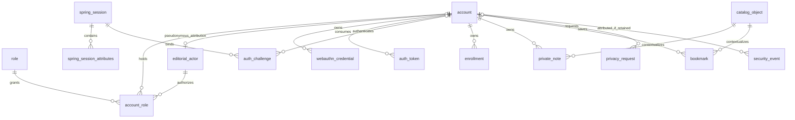

# P04 entity relationship diagrams

23 September 2026. These three views show principal keys and cardinalities. The [data dictionary](SCHEMA.md) is normative for every table, composite FK, conditional source and delete action; omitting a secondary join from a view does not remove it. Mermaid source has been checked for named entities and relationships, not rendered or reverse-engineered from a database.

## Identity and ownership

An anonymous session has no account FK. Authenticated principal UUID and generation must resolve to a live eligible account. The optional actor/account relationship is retained as pseudonymous editorial attribution after account erasure. Ownership of notes, answers and submissions is independent of editorial attribution; admin roles confer no reading permission to those records.

## Catalog, provenance and publication

```mermaid
erDiagram
    catalog_object ||--|{ catalog_revision : versions
    catalog_object ||--o{ catalog_route : addressed_by
    catalog_object ||--o| draft_head : edited_through
    catalog_revision ||--o{ catalog_link : contains_typed_edges
    catalog_object ||--o{ catalog_link : stable_target
    catalog_revision ||--o{ hard_prerequisite : requires
    catalog_object ||--o{ hard_prerequisite : prerequisite_target
    catalog_revision ||--o{ recommended_preparation : recommends
    catalog_revision ||--o{ optional_enrichment : enriches
    catalog_revision ||--o{ revision_section : ordered_prose
    catalog_revision ||--o| resource_revision : typed_detail
    resource_revision ||--o{ resource_locator : cites_location
    external_locator ||--o{ resource_locator : locates
    catalog_revision ||--o| assignment_revision : typed_detail
    catalog_object ||--o{ assignment_revision : resource_or_competency
    assignment_revision ||--o{ assignment_claim : supports
    evidence_claim ||--o{ assignment_claim : bounded_evidence
    source_artifact ||--o{ provenance_anchor : anchors
    source_artifact ||--o{ source_record : preserves_original
    provenance_anchor ||--o{ revision_provenance : locates_origin
    catalog_revision ||--o{ revision_provenance : derives_from
    source_mapping ||--o{ mapping_target : reconciles
    catalog_object ||--o{ mapping_target : retains_identity
    source_mapping ||--o{ mapping_anchor : source_location
    provenance_anchor ||--o{ mapping_anchor : locates_mapping
    import_batch ||--o{ import_proposal : proposes
    catalog_object ||--o{ import_proposal : targets
    publication ||--o{ publication_entry : selects
    catalog_revision ||--o{ publication_entry : exact_version
    publication ||--o| active_publication : active_pointer
    catalog_revision ||--o{ review_decision : reviewed_hash
    catalog_object ||--o{ content_withdrawal : overrides_publication
    publication_entry ||--o| public_search_document : safe_projection
    rule_subject ||--o{ rule_revision : observations
    official_notice ||--o{ rule_revision : authority
    catalog_revision ||--o{ verification_event : verifies_scope
    rule_revision ||--o{ rule_certification : bounded_validity
    verification_event ||--o{ rule_certification : supports
```

Catalog kinds and endpoint checks distinguish containment, resource assignment, preparation and optional links. The shared supertype supplies real FK targets; every specialized relationship checks its allowed kind. It is not an arbitrary table-name/ID pair. Resource editions may share a locator; a locator is not resource identity. Rule observations can conflict; active certifications cannot overlap within the same defined subject scope.

## Assessment and learning evidence

```mermaid
erDiagram
    path_revision ||--o{ course_gate : requires_version
    path_revision ||--o{ course_project : requires_project
    quiz_revision ||--o{ course_gate : gate_definition
    project_revision ||--o{ course_project : dossier_definition
    path_revision ||--o{ enrollment : pinned_by
    enrollment ||--|{ enrollment_requirement : frozen_denominator
    catalog_revision ||--o{ enrollment_requirement : exact_requirement
    account ||--o{ learning_progress : self_reports
    catalog_revision ||--o{ learning_progress : topic_version
    quiz_revision ||--|{ quiz_form : immutable_variants
    assessment_exposure_group ||--|{ quiz_form : lineage
    quiz_form ||--|{ quiz_form_item : orders
    question_revision ||--o{ quiz_form_item : versioned_item
    question_revision ||--o{ question_choice : allowed_choices
    enrollment ||--o{ quiz_attempt : learner_attempts
    quiz_form ||--o{ quiz_attempt : pins
    quiz_attempt ||--o{ attempt_answer : receives
    attempt_answer ||--o{ answer_choice : selects
    question_choice ||--o{ answer_choice : validates_choice
    quiz_attempt ||--o| attempt_result : immutable_score
    account ||--o{ form_exposure : tracks_freshness
    assessment_exposure_group ||--o{ form_exposure : prevents_false_freshness
    quiz_attempt ||--o{ remediation_record : failed_requires_review
    enrollment ||--o{ assessment_request : exhausted_bank
    project_revision ||--o{ project_field : structured_dossier
    project_revision ||--o{ project_work : pins
    project_work ||--o{ project_response : owns_writing
    competency_revision ||--o{ assessment_competency : explicit_attribution
    competency_revision ||--o{ mastery_evidence : qualified_evidence
    quiz_attempt o|--o{ mastery_evidence : scored_source
    project_work o|--o{ mastery_evidence : self_review_source
    mastery_evidence o|--o{ evidence_recheck : correction
    account ||--o{ command_receipt : owns
    command_receipt }o--o| enrollment : typed_result
    command_receipt }o--o| quiz_attempt : typed_result
    command_receipt }o--o| publication : typed_result
    quiz_revision ||--o{ quiz_remediation_requirement : requires
    question_revision ||--o{ quiz_remediation_requirement : maps
    catalog_revision ||--o{ quiz_remediation_requirement : topic_version
    exercise_revision ||--o{ quiz_remediation_requirement : transfer_version
    practice_response |o--o{ remediation_record : same_owner_evidence
```

Exactly one attempt/project source exists per evidence row. Composite owner FKs stop cross-account linkage. Question/choice composite FKs stop an answer being attached to another form. The schema allows one scored result per attempt and retains old scores on correction; current eligibility reads separate recheck and withdrawal records. Learner erasure cascades only within owned data, never from deleting or reimporting catalog content.

P08 adds P05 receipt/remediation relationships within the learning view. Receipt links are representative typed results; the complete operation/result CHECK matrix remains in executable SQL and the P05 supplement.
