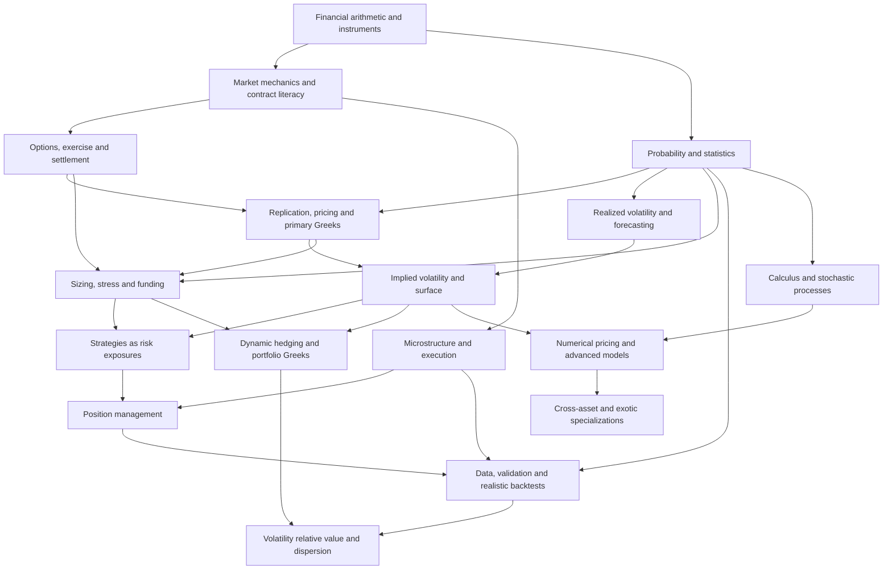

# Options Curriculum — Reading and Mastery Roadmap

Research checkpoint: 17 September 2026. The full topic encyclopedia is in **options-master-knowledge-map.md**.

## Part B — Prerequisite / Dependency Map

The hierarchy in Part A is a reference taxonomy. The learning order below is different. Prerequisites mean the relevant entry competencies in a module, not automatic completion of every specialist extension. For example, algebra, derivatives and Taylor intuition precede introductory Greeks; measure theory does not precede the first payoff diagram. Advanced derivations return to M13–M14 later.

The initial safety briefing draws on M05, M22, M45, M49 and M60 from day one. Full mathematical treatment comes later. A market's applicable contract, account and operational rules must be understood before any live position in that market.

### Important dependency chains

| Destination | Required reasoning chain |
|---|---|
| A valid options trade | Contract and cash-flow literacy → payoff/profit distinction → risk budget → executable prices → operational plan |
| BSM intuition | Algebra and probability → one-period replication → binomial pricing → continuous-time intuition; rigorous derivation later adds Ito calculus |
| Greeks | Pricing function → partial derivatives → units → position aggregation → spot/time/IV interactions |
| Volatility trading | Return measurement → realized variance forecast → model-implied variance → risk premium → hedging policy → net P&L distribution |
| Calendar and diagonal spreads | Vanilla pricing → primary Greeks → term structure → front-expiry valuation → exercise/margin cash flows |
| Gamma scalping | Delta/gamma/theta → realized path → hedge cash ledger → discrete rebalancing → transaction costs and jumps |
| Dealer-flow interpretation | Chain data → open-interest limits → signed inventory assumptions → hedging mechanics → empirical identification |
| Dispersion | Portfolio variance identity → component/index exposures → implied correlation → skew and jump effects → rebalancing and costs |
| A defensible backtest | Data provenance → point-in-time universe → contract lifecycle → executable fills → capital accounting → holdout testing |
| Surface modeling | Forwards/discounting → IV inversion → strike convexity/calendar consistency → constrained interpolation → calibration and model validation |
| Professional deployment | Research replication → realistic simulation → risk controls → shadow/paper operation → monitored, limited deployment if separately chosen |

Psychology, journaling, source checking and operational discipline run across the graph. They are not graduation topics that can be postponed until trading begins.

### Complete module prerequisite register

| Module | Entry prerequisite modules |
|---|---|
| [M01 — Financial arithmetic and economic purpose](options-master-knowledge-map.md#m01) | None |
| [M02 — Instruments and underlying-market structure](options-master-knowledge-map.md#m02) | [M01](options-master-knowledge-map.md#m01) |
| [M03 — Institutions, venues and the trade lifecycle](options-master-knowledge-map.md#m03) | [M01](options-master-knowledge-map.md#m01), [M02](options-master-knowledge-map.md#m02) |
| [M04 — Quotes, orders and matching](options-master-knowledge-map.md#m04) | [M03](options-master-knowledge-map.md#m03) |
| [M05 — Trading costs, financing and basic margin](options-master-knowledge-map.md#m05) | [M01](options-master-knowledge-map.md#m01), [M03](options-master-knowledge-map.md#m03), [M04](options-master-knowledge-map.md#m04) |
| [M06 — Financial statements and equity fundamentals](options-master-knowledge-map.md#m06) | [M01](options-master-knowledge-map.md#m01), [M02](options-master-knowledge-map.md#m02) |
| [M07 — Macroeconomics and policy transmission](options-master-knowledge-map.md#m07) | [M01](options-master-knowledge-map.md#m01), [M02](options-master-knowledge-map.md#m02) |
| [M08 — Intermarket relationships and correlation regimes](options-master-knowledge-map.md#m08) | [M07](options-master-knowledge-map.md#m07), [M10](options-master-knowledge-map.md#m10) |
| [M09 — Event taxonomy and information processing](options-master-knowledge-map.md#m09) | [M03](options-master-knowledge-map.md#m03), [M06](options-master-knowledge-map.md#m06), [M07](options-master-knowledge-map.md#m07) |
| [M10 — Probability and distributions](options-master-knowledge-map.md#m10) | [M01](options-master-knowledge-map.md#m01) |
| [M11 — Statistical inference and scientific reasoning](options-master-knowledge-map.md#m11) | [M10](options-master-knowledge-map.md#m10) |
| [M12 — Time series, forecasting and regimes](options-master-knowledge-map.md#m12) | [M10](options-master-knowledge-map.md#m10), [M11](options-master-knowledge-map.md#m11) |
| [M13 — Calculus, linear algebra and numerical foundations](options-master-knowledge-map.md#m13) | [M10](options-master-knowledge-map.md#m10) |
| [M14 — Stochastic processes and mathematical finance](options-master-knowledge-map.md#m14) | [M10](options-master-knowledge-map.md#m10), [M12](options-master-knowledge-map.md#m12), [M13](options-master-knowledge-map.md#m13) |
| [M15 — Chart construction, context and price structure](options-master-knowledge-map.md#m15) | [M02](options-master-knowledge-map.md#m02), [M04](options-master-knowledge-map.md#m04) |
| [M16 — Candlestick formations: a testable vocabulary](options-master-knowledge-map.md#m16) | [M15](options-master-knowledge-map.md#m15) |
| [M17 — Chart patterns and competing interpretations](options-master-knowledge-map.md#m17) | [M15](options-master-knowledge-map.md#m15) |
| [M18 — Trend indicators](options-master-knowledge-map.md#m18) | [M15](options-master-knowledge-map.md#m15), [M10](options-master-knowledge-map.md#m10) |
| [M19 — Momentum indicators](options-master-knowledge-map.md#m19) | [M18](options-master-knowledge-map.md#m18) |
| [M20 — Volatility, breadth, volume and order-flow indicators](options-master-knowledge-map.md#m20) | [M04](options-master-knowledge-map.md#m04), [M15](options-master-knowledge-map.md#m15), [M10](options-master-knowledge-map.md#m10) |
| [M21 — Option fundamentals and contract literacy](options-master-knowledge-map.md#m21) | [M02](options-master-knowledge-map.md#m02), [M03](options-master-knowledge-map.md#m03), [M05](options-master-knowledge-map.md#m05), [M10](options-master-knowledge-map.md#m10) |
| [M22 — Exercise, assignment and expiration operations](options-master-knowledge-map.md#m22) | [M21](options-master-knowledge-map.md#m21), [M04](options-master-knowledge-map.md#m04), [M05](options-master-knowledge-map.md#m05) |
| [M23 — Option-chain analysis and inference limits](options-master-knowledge-map.md#m23) | [M21](options-master-knowledge-map.md#m21), [M04](options-master-knowledge-map.md#m04), [M10](options-master-knowledge-map.md#m10) |
| [M24 — Single-leg, stock-linked and directional structures](options-master-knowledge-map.md#m24) | [M21](options-master-knowledge-map.md#m21), [M22](options-master-knowledge-map.md#m22), [M29](options-master-knowledge-map.md#m29), [M32](options-master-knowledge-map.md#m32), [M36](options-master-knowledge-map.md#m36), [M45](options-master-knowledge-map.md#m45) |
| [M25 — Vertical spreads and payoff algebra](options-master-knowledge-map.md#m25) | [M24](options-master-knowledge-map.md#m24) |
| [M26 — Straddles, strangles, butterflies and condors](options-master-knowledge-map.md#m26) | [M25](options-master-knowledge-map.md#m25), [M36](options-master-knowledge-map.md#m36), [M46](options-master-knowledge-map.md#m46) |
| [M27 — Time, ratio and asymmetric structures](options-master-knowledge-map.md#m27) | [M25](options-master-knowledge-map.md#m25), [M26](options-master-knowledge-map.md#m26), [M37](options-master-knowledge-map.md#m37) |
| [M28 — Synthetics, financing and constrained arbitrage](options-master-knowledge-map.md#m28) | [M25](options-master-knowledge-map.md#m25), [M29](options-master-knowledge-map.md#m29), [M05](options-master-knowledge-map.md#m05) |
| [M29 — No-arbitrage, carry and valuation foundations](options-master-knowledge-map.md#m29) | [M05](options-master-knowledge-map.md#m05), [M10](options-master-knowledge-map.md#m10), [M21](options-master-knowledge-map.md#m21) |
| [M30 — Vanilla pricing models and exercise](options-master-knowledge-map.md#m30) | [M29](options-master-knowledge-map.md#m29), [M13](options-master-knowledge-map.md#m13) |
| [M31 — Numerical pricing and implementation quality](options-master-knowledge-map.md#m31) | [M30](options-master-knowledge-map.md#m30), [M13](options-master-knowledge-map.md#m13), [M14](options-master-knowledge-map.md#m14) |
| [M32 — Primary Greeks and exposure units](options-master-knowledge-map.md#m32) | [M30](options-master-knowledge-map.md#m30) |
| [M33 — Higher-order Greeks and surface-sensitive risk](options-master-knowledge-map.md#m33) | [M32](options-master-knowledge-map.md#m32), [M13](options-master-knowledge-map.md#m13) |
| [M34 — Dynamic hedging, gamma scalping and P&L explanation](options-master-knowledge-map.md#m34) | [M32](options-master-knowledge-map.md#m32), [M33](options-master-knowledge-map.md#m33), [M35](options-master-knowledge-map.md#m35), [M36](options-master-knowledge-map.md#m36) |
| [M35 — Realized volatility and forecasting](options-master-knowledge-map.md#m35) | [M10](options-master-knowledge-map.md#m10), [M12](options-master-knowledge-map.md#m12) |
| [M36 — Implied volatility, distributions and risk premiums](options-master-knowledge-map.md#m36) | [M30](options-master-knowledge-map.md#m30), [M35](options-master-knowledge-map.md#m35) |
| [M37 — Smiles, skew, term structure and the surface](options-master-knowledge-map.md#m37) | [M29](options-master-knowledge-map.md#m29), [M32](options-master-knowledge-map.md#m32), [M36](options-master-knowledge-map.md#m36) |
| [M38 — Event volatility and short-dated optionality](options-master-knowledge-map.md#m38) | [M09](options-master-knowledge-map.md#m09), [M35](options-master-knowledge-map.md#m35), [M37](options-master-knowledge-map.md#m37) |
| [M39 — Volatility indices, derivatives and exchange-traded products](options-master-knowledge-map.md#m39) | [M37](options-master-knowledge-map.md#m37), [M42](options-master-knowledge-map.md#m42) |
| [M40 — Advanced volatility models and calibration](options-master-knowledge-map.md#m40) | [M14](options-master-knowledge-map.md#m14), [M31](options-master-knowledge-map.md#m31), [M37](options-master-knowledge-map.md#m37) |
| [M41 — Professional volatility and relative-value trading](options-master-knowledge-map.md#m41) | [M28](options-master-knowledge-map.md#m28), [M34](options-master-knowledge-map.md#m34), [M37](options-master-knowledge-map.md#m37), [M38](options-master-knowledge-map.md#m38), [M46](options-master-knowledge-map.md#m46), [M48](options-master-knowledge-map.md#m48) |
| [M42 — Futures contracts, curves and options on futures](options-master-knowledge-map.md#m42) | [M02](options-master-knowledge-map.md#m02), [M03](options-master-knowledge-map.md#m03), [M05](options-master-knowledge-map.md#m05), [M29](options-master-knowledge-map.md#m29) |
| [M43 — Rates, FX, commodities, credit and digital-asset options](options-master-knowledge-map.md#m43) | [M30](options-master-knowledge-map.md#m30), [M42](options-master-knowledge-map.md#m42), [M07](options-master-knowledge-map.md#m07) |
| [M44 — Exotics, OTC contracts and structured optionality](options-master-knowledge-map.md#m44) | [M14](options-master-knowledge-map.md#m14), [M31](options-master-knowledge-map.md#m31), [M40](options-master-knowledge-map.md#m40), [M43](options-master-knowledge-map.md#m43) |
| [M45 — Trade risk, sizing and survival](options-master-knowledge-map.md#m45) | [M05](options-master-knowledge-map.md#m05), [M10](options-master-knowledge-map.md#m10), [M21](options-master-knowledge-map.md#m21) |
| [M46 — Scenario analysis, stress and tail risk](options-master-knowledge-map.md#m46) | [M45](options-master-knowledge-map.md#m45), [M32](options-master-knowledge-map.md#m32), [M36](options-master-knowledge-map.md#m36), [M11](options-master-knowledge-map.md#m11) |
| [M47 — Margin, collateral and liquidity management](options-master-knowledge-map.md#m47) | [M05](options-master-knowledge-map.md#m05), [M22](options-master-knowledge-map.md#m22), [M45](options-master-knowledge-map.md#m45) |
| [M48 — Portfolio construction and option overlays](options-master-knowledge-map.md#m48) | [M08](options-master-knowledge-map.md#m08), [M32](options-master-knowledge-map.md#m32), [M45](options-master-knowledge-map.md#m45), [M46](options-master-knowledge-map.md#m46) |
| [M49 — Operational, model and information risk](options-master-knowledge-map.md#m49) | [M03](options-master-knowledge-map.md#m03), [M04](options-master-knowledge-map.md#m04), [M45](options-master-knowledge-map.md#m45) |
| [M50 — Market microstructure and price discovery](options-master-knowledge-map.md#m50) | [M04](options-master-knowledge-map.md#m04), [M10](options-master-knowledge-map.md#m10) |
| [M51 — Options market making and dealer-flow analysis](options-master-knowledge-map.md#m51) | [M34](options-master-knowledge-map.md#m34), [M37](options-master-knowledge-map.md#m37), [M50](options-master-knowledge-map.md#m50) |
| [M52 — Professional order execution and cost analysis](options-master-knowledge-map.md#m52) | [M04](options-master-knowledge-map.md#m04), [M50](options-master-knowledge-map.md#m50), [M21](options-master-knowledge-map.md#m21) |
| [M53 — Position management and decision policies](options-master-knowledge-map.md#m53) | [M22](options-master-knowledge-map.md#m22), [M24](options-master-knowledge-map.md#m24), [M25](options-master-knowledge-map.md#m25), [M32](options-master-knowledge-map.md#m32), [M45](options-master-knowledge-map.md#m45), [M52](options-master-knowledge-map.md#m52) |
| [M54 — Market data and research engineering](options-master-knowledge-map.md#m54) | [M03](options-master-knowledge-map.md#m03), [M11](options-master-knowledge-map.md#m11), [M21](options-master-knowledge-map.md#m21) |
| [M55 — Research design, edge and hypothesis validation](options-master-knowledge-map.md#m55) | [M11](options-master-knowledge-map.md#m11), [M12](options-master-knowledge-map.md#m12), [M54](options-master-knowledge-map.md#m54) |
| [M56 — Backtesting, validation and simulation](options-master-knowledge-map.md#m56) | [M55](options-master-knowledge-map.md#m55), [M10](options-master-knowledge-map.md#m10), [M52](options-master-knowledge-map.md#m52) |
| [M57 — Systematic signals and statistical learning](options-master-knowledge-map.md#m57) | [M12](options-master-knowledge-map.md#m12), [M55](options-master-knowledge-map.md#m55), [M56](options-master-knowledge-map.md#m56) |
| [M58 — Python, analytics tools and reliable automation](options-master-knowledge-map.md#m58) | [M54](options-master-knowledge-map.md#m54), [M56](options-master-knowledge-map.md#m56), [M49](options-master-knowledge-map.md#m49) |
| [M59 — Trading styles and complete system design](options-master-knowledge-map.md#m59) | [M23](options-master-knowledge-map.md#m23), [M45](options-master-knowledge-map.md#m45), [M53](options-master-knowledge-map.md#m53), [M55](options-master-knowledge-map.md#m55) |
| [M60 — Psychology, decision hygiene and deliberate practice](options-master-knowledge-map.md#m60) | [M01](options-master-knowledge-map.md#m01), [M10](options-master-knowledge-map.md#m10), [M45](options-master-knowledge-map.md#m45) |
| [M61 — Journaling, performance measurement and attribution](options-master-knowledge-map.md#m61) | [M11](options-master-knowledge-map.md#m11), [M45](options-master-knowledge-map.md#m45), [M52](options-master-knowledge-map.md#m52), [M53](options-master-knowledge-map.md#m53) |
| [M62 — United States regulatory, tax and operational branch](options-master-knowledge-map.md#m62) | [M03](options-master-knowledge-map.md#m03), [M05](options-master-knowledge-map.md#m05), [M22](options-master-knowledge-map.md#m22) |
| [M63 — India regulatory, tax and operational branch](options-master-knowledge-map.md#m63) | [M03](options-master-knowledge-map.md#m03), [M05](options-master-knowledge-map.md#m05), [M22](options-master-knowledge-map.md#m22) |
| [M64 — Other jurisdictions and cross-border trading](options-master-knowledge-map.md#m64) | [M03](options-master-knowledge-map.md#m03), [M22](options-master-knowledge-map.md#m22) |
| [M65 — Retail myths and evidence standards](options-master-knowledge-map.md#m65) | [M10](options-master-knowledge-map.md#m10), [M21](options-master-knowledge-map.md#m21), [M45](options-master-knowledge-map.md#m45) |
| [M66 — Failure taxonomy and historical case studies](options-master-knowledge-map.md#m66) | [M45](options-master-knowledge-map.md#m45), [M46](options-master-knowledge-map.md#m46), [M49](options-master-knowledge-map.md#m49), [M55](options-master-knowledge-map.md#m55), [M60](options-master-knowledge-map.md#m60) |
| [M67 — Professional desk practice and ongoing development](options-master-knowledge-map.md#m67) | [M48](options-master-knowledge-map.md#m48), [M49](options-master-knowledge-map.md#m49), [M51](options-master-knowledge-map.md#m51), [M58](options-master-knowledge-map.md#m58), [M61](options-master-knowledge-map.md#m61), [M66](options-master-knowledge-map.md#m66) |

## Part C — Expert Learning Roadmap

The sequence below covers every module. Related modules can be studied in parallel once their prerequisites are met. “Selected branch” means depth in the jurisdiction or asset class you intend to use; recognition-level coverage remains in the encyclopedia.

| Stage | Focus and modules | Progression gate | Indicative focused hours |
|---|---|---|---:|
| 0 | **Financial orientation** — [M01](options-master-knowledge-map.md#m01) | Reconcile money, returns, leverage and objectives. Introduce the safety briefing and journal immediately. | 15–25 |
| 1 | **How markets and accounts work** — [M02](options-master-knowledge-map.md#m02), [M03](options-master-knowledge-map.md#m03), [M04](options-master-knowledge-map.md#m04), [M05](options-master-knowledge-map.md#m05) | Trace a trade, choose orders and calculate realistic costs/cash needs. | 25–50 |
| 2 | **Probability, statistics and core mathematics** — [M10](options-master-knowledge-map.md#m10), [M11](options-master-knowledge-map.md#m11), [M13](options-master-knowledge-map.md#m13) | Solve uncertain-payoff problems; learn algebra/calculus entry skills. Defer specialist numerical/PDE extensions. | 60–120 |
| 3 | **Underlying, macro, events and time series** — [M06](options-master-knowledge-map.md#m06), [M07](options-master-knowledge-map.md#m07), [M08](options-master-knowledge-map.md#m08), [M09](options-master-knowledge-map.md#m09), [M12](options-master-knowledge-map.md#m12) | Separate information, expectation and hindsight; build elementary forecasts. | 40–80 |
| 4 | **Price behavior and technical-analysis literacy** — [M15](options-master-knowledge-map.md#m15), [M16](options-master-knowledge-map.md#m16), [M17](options-master-knowledge-map.md#m17), [M18](options-master-knowledge-map.md#m18), [M19](options-master-knowledge-map.md#m19), [M20](options-master-knowledge-map.md#m20) | Label unseen data and test one chosen method; keep most named patterns/indicators as reference material. | 25–60 |
| 5 | **Options and local-market operations** — [M21](options-master-knowledge-map.md#m21), [M22](options-master-knowledge-map.md#m22), [M23](options-master-knowledge-map.md#m23), [M62](options-master-knowledge-map.md#m62), [M63](options-master-knowledge-map.md#m63), [M64](options-master-knowledge-map.md#m64) | Decode contracts and pass exercise/settlement cases. Complete the selected jurisdiction branch; survey others. | 40–80 |
| 6 | **Pricing and primary Greeks** — [M29](options-master-knowledge-map.md#m29), [M30](options-master-knowledge-map.md#m30), [M32](options-master-knowledge-map.md#m32) | Derive replication/parity/binomial logic and calculate risk in correct units. Defer full stochastic derivations. | 60–120 |
| 7 | **Realized and implied volatility** — [M35](options-master-knowledge-map.md#m35), [M36](options-master-knowledge-map.md#m36) | Match forecasts to priced risks; distinguish IV ranking, expectation and risk premium. | 40–80 |
| 8 | **Risk, funding, operational control and behavior** — [M45](options-master-knowledge-map.md#m45), [M46](options-master-knowledge-map.md#m46), [M47](options-master-knowledge-map.md#m47), [M49](options-master-knowledge-map.md#m49), [M60](options-master-knowledge-map.md#m60) | Pass sizing, stress, cash-obligation and error-containment gates before implementing strategies. | 60–120 |
| 9 | **Strategy construction and surface literacy** — [M24](options-master-knowledge-map.md#m24), [M25](options-master-knowledge-map.md#m25), [M26](options-master-knowledge-map.md#m26), [M28](options-master-knowledge-map.md#m28), [M37](options-master-knowledge-map.md#m37), [M27](options-master-knowledge-map.md#m27) | Complete signed-leg dossiers; learn surface/term structure before multi-expiry valuation. | 70–140 |
| 10 | **Execution and position management** — [M50](options-master-knowledge-map.md#m50), [M52](options-master-knowledge-map.md#m52), [M53](options-master-knowledge-map.md#m53) | Reconcile fills and evaluate hold/close/adjust/roll policies with all cash flows. | 50–100 |
| 11 | **Research, software, systems and performance** — [M54](options-master-knowledge-map.md#m54), [M55](options-master-knowledge-map.md#m55), [M56](options-master-knowledge-map.md#m56), [M58](options-master-knowledge-map.md#m58), [M59](options-master-knowledge-map.md#m59), [M61](options-master-knowledge-map.md#m61), [M65](options-master-knowledge-map.md#m65) | Build a reproducible study, honest backtest, written system and complete journal analysis. Python basics can be introduced earlier. | 100–220 |
| 12 | **Dynamic hedging, futures and portfolio risk** — [M33](options-master-knowledge-map.md#m33), [M34](options-master-knowledge-map.md#m34), [M38](options-master-knowledge-map.md#m38), [M42](options-master-knowledge-map.md#m42), [M39](options-master-knowledge-map.md#m39), [M48](options-master-knowledge-map.md#m48) | Explain hedged P&L, distinguish futures/VIX products and stress a portfolio. | 80–160 |
| 13 | **Advanced trading and empirical specialization** — [M41](options-master-knowledge-map.md#m41), [M51](options-master-knowledge-map.md#m51), [M57](options-master-knowledge-map.md#m57) | Defend relative-value, dealer-flow and systematic-model hypotheses under realistic costs and alternative explanations. | 100–220 |
| 14 | **Professional quantitative models** — [M14](options-master-knowledge-map.md#m14), [M31](options-master-knowledge-map.md#m31), [M40](options-master-knowledge-map.md#m40) | Complete stochastic-calculus derivations, numerical validation and surface/model calibration for a quant track. | 150–350 |
| 15 | **Cross-asset, exotic and OTC specialist branches** — [M43](options-master-knowledge-map.md#m43), [M44](options-master-knowledge-map.md#m44) | Master the conventions and model/legal risks relevant to the selected product mandate. | 100–250 |
| 16 | **Failure analysis and professional integration** — [M66](options-master-knowledge-map.md#m66), [M67](options-master-knowledge-map.md#m67) | Pass integrated capstones, incident drills and a skeptical review of a desk-style mandate. | 60–150 |

Hours are planning allowances for selected depth. Do not add every specialist branch to estimate a core course; stages recur at deeper levels. The mastery descriptions in Part H provide separate cumulative core estimates.

### The high-impact path through the encyclopedia

Prioritize these twelve capabilities. They are not a shortened list of everything worth knowing; they are the capabilities on which the rest depends.

1. **Read the actual contract:** what is bought or sold, in what units, on which dates, and with which exercise and settlement obligations. M03–M05, M21–M22.
2. **Think in distributions and net expectancy:** outcomes, payoff magnitudes, costs, uncertainty and the difference between pricing and forecasting probabilities. M10–M11, M45, M55.
3. **Control size and survive adverse paths:** notional, stress loss, concentration, liquidity and margin cash calls. M45–M49.
4. **Use Greeks with correct units:** identify the risks carried by a trade and how they change. M32–M34.
5. **Compare implied pricing with a relevant forecast:** match horizons, distinguish variance from volatility, and account for risk premiums and events. M35–M38.
6. **Understand the surface:** a single IV number cannot describe different strikes, expiries or event exposure. M37.
7. **Evaluate executable economics:** spread, package fills, financing, borrow, tax and adjustment costs. M05, M23, M52.
8. **Distinguish expiration payoff from the path to expiration:** assignment, gaps, collateral, interim losses and multi-expiry positions. M22, M27, M46–M47.
9. **Validate an edge honestly:** point-in-time data, realistic accounting, untouched holdouts, selection bias and uncertainty. M54–M56.
10. **Manage the portfolio rather than isolated trade names:** common factors, correlated short convexity and liquidity needs. M48.
11. **Make decisions reproducible:** record the thesis, invalidation, alternatives, rules and actual fills; review process and outcomes separately. M53, M59–M61.
12. **Maintain operational competence:** reconciliation, current rules, error containment and recovery. M49, M58, M62–M67.

After foundations, a reasonable initial allocation of deliberate-practice time is 25% pricing/Greeks/volatility, 20% risk/portfolio, 20% data/validation, 15% contract/execution/operations, 10% underlying/macro/event context, 5% explicit behavioral review and 5% chart/indicator study. This is a curriculum-design suggestion, not an empirically optimal formula. Behavioral and risk controls are also practiced inside every other category. A discretionary price-action specialization can justify more chart work only when its incremental value is being tested.

### Specialization branches

| Track | Main modules | What depth is necessary |
|---|---|---|
| Discretionary directional options | M06–M09, M15–M25, M38, M45–M46, M52–M53, M55–M56, M60–M61 | Objective setups, probability, instrument selection, costs, events, risk and honest review |
| Systematic option strategies | M10–M13, M21–M38, M45–M49, M54–M59, M61 | Data engineering, lifecycle simulation, validation, portfolio allocation and monitoring |
| Volatility relative value | M28–M41, M45–M48, M50–M56 | Forecasts, surface dynamics, discrete hedging, P&L explanation, correlation and funding |
| Options market making | M29–M40, M45–M52, M54–M58, M67 | Quote formation, inventory, adverse selection, queues, low-latency reliability and risk controls |
| Portfolio hedging and overlays | M06–M10, M21–M38, M45–M48, M52–M53, M61 | Mandate, downside protection, basis, carry cost, benchmark and portfolio contribution |
| Quantitative derivatives/modeling | M13–M14, M29–M44, M46–M49, M54–M58, M67 | Derivations, numerical stability, calibration, independent validation and model limitations |
| Rates/FX/commodity/OTC specialist | M07–M08, M14, M29–M31, M40–M44, M47, M62–M64, M67 | Product-specific conventions, curves, correlation, collateral, counterparty and documentation |

## Part D — Importance Matrix

Difficulty and importance are independent. A difficult formula can be specialized; a basic settlement obligation can be essential. “Professional/Quantitative” marks depth and mathematical demands, not greater commercial value.

| Study priority | Operational meaning | Representative content |
|---|---|---|
| **Mandatory knowledge — Essential** | Required for the chosen activity before live risk; demonstrate it, not merely recognize it | Contract units, exercise/assignment, costs, leverage, basic probabilities, primary risk exposures, loss/cash obligations, execution and records |
| **High-value knowledge — Very Important** | Major analytical or operational value for a serious options trader; sequence by track | Volatility forecasts, skew/term structure, scenario risk, portfolio aggregation, research quality, management policies, microstructure and performance attribution |
| **Advanced knowledge — usually Very Important or Useful** | Deeper implementation or explanation after the core; selected by the problem | Higher-order Greeks, surface calibration, execution optimization, robust statistics, advanced stress and model validation |
| **Specialist knowledge — Specialized** | Deep mastery only where the mandate requires it | Exotic/OTC pricing, XVA, rates models, rough volatility, stochastic control, specialized execution and cross-asset structures |
| **Vocabulary/reference knowledge — Useful** | Learn enough to recognize, critique and test; do not allocate equal practice time | Many candle names, overlapping indicators, niche strategy labels and competing chart frameworks |

| Classification | Topic entries |
|---|---:|
| Essential | 183 |
| Very Important | 702 |
| Useful | 95 |
| Specialized | 39 |
| Beginner | 142 |
| Intermediate | 438 |
| Advanced | 361 |
| Professional/Quantitative | 78 |

The importance labels in Part A refer to a broad professional-options education. Before specializing, promote any relevant operational rule or risk exposure to mandatory status. For example, commodity delivery rules are essential to a trader who may hold deliverable futures, even if they remain a specialist branch for an equity-options learner.

### Evidence policy

- **T — Definitions and conditional theory:** identities, payoff algebra and mathematical results under stated assumptions. A correct model theorem is not proof that its assumptions hold in a particular market.
- **R — Rules and specifications:** authoritative only for their product, venue, participant, effective date and jurisdiction. Broker policies may be stricter.
- **E — Empirical research:** evaluate population, sample period, measurement, uncertainty, costs, replication and external validity.
- **H — Practitioner method:** potentially useful organization, implementation or decision practice; predictive or commercial value must be tested.
- **F — Folklore or overstated inference:** included so it can be recognized and evaluated, not endorsed.

Indicator calculations and candle names can be defined exactly while the prediction attached to them remains weak. The H/F labels concern the trading interpretation. Exchange research is primary evidence about its data, but exchange commercial interests and methodological limits still deserve scrutiny. Academic publication does not remove selection bias or guarantee implementability.

## Part E — Resources

The full annotated library and module-specific source links are in the master knowledge map.

## Part F — Practical Training Program

Each important module has a concrete exercise and a mastery gate below. These are assessment designs, not the first lessons or invitations to place trades. Start with hand calculations, historical records and simulation. Live trading is not required to complete the educational exercises.

### Common mastery standard

For each module, demonstrate four things: explain the concept in plain language; calculate or reconstruct an unfamiliar example; identify assumptions and failure modes; and connect the result to an options decision. A useful default written-quiz threshold is 85%, with **no unresolved errors in contract units, cash obligations, assignment, leverage or loss bounds**. This is a proposed educational rubric, not an evidence-based certification standard. Correct errors and pass a fresh case before advancing. An easy quiz or a profitable simulated trade does not substitute for the mastery gate.

### Required dossier for every named strategy

Every strategy entry in M24–M28 receives its own dossier, including variants. Do not reuse a generic “neutral strategy” summary.

| Dossier area | Required work |
|---|---|
| Exact construction | Signed legs, quantities, underlying, strikes, expiries, style, multiplier, debit/credit and dated cash flows |
| Economic thesis | Direction, volatility level, skew, term structure, event distribution, carry or relative value; why this instrument is appropriate |
| Payoff and profit | Derive terminal payoff; include premium, fees and financing; identify breakevens, maximum profit/loss or conditions preventing a simple bound |
| Probability and value | Identify the probability measure and horizon; calculate outcome-weighted expectancy with estimation uncertainty; compare alternatives |
| Dynamic risk | Delta/gamma/theta/vega/rho, material higher-order Greeks, changes with spot/time/IV, jump and correlation exposures |
| Environment | Helpful and harmful regimes, liquidity, events, volatility assumptions and failure modes |
| Selection | Strike/expiry choice, skew and event placement, executable prices and capital needs |
| Management | Entry, invalidation, sizing, stop/target, adjustment, roll and exit policies; incremental value after every change |
| Operations | Exercise, assignment, dividends, pinning, settlement, legging, collateral, taxes and broker rules |
| Validation | Historical or simulated evidence, out-of-sample results, cost sensitivity, stress cases and common beginner errors |

Multi-expiry trades require valuations at multiple dates and under several remaining-volatility assumptions. A front-expiry payoff graphic is not a universal profit boundary. A theoretical same-expiry loss bound also does not eliminate post-exercise stock exposure, execution costs or legging risk. [OCC contract-risk documentation](https://www.theocc.com/company-information/documents-and-archives/options-disclosure-document) and [FINRA options guidance](https://www.finra.org/investors/investing/investment-products/options) anchor that operational distinction.

### Required specification for every indicator and pattern

For each indicator in M18–M20, document formula and initialization; inputs and units; rationale; interpretation; useful and poor regimes; lag; failure modes; redundant indicators; combination logic; parameter sensitivity; data requirements; and research evidence after costs. Test incremental information rather than counting confirmations from correlated transformations of the same price series.

For each formation in M16–M17, document objective identification; proposed market psychology as a hypothesis; confirmation; invalidation; targets; volume/context; false signals; suitable regimes; sample frequency; statistical uncertainty; and net trading evidence. The [Lo–Mamaysky–Wang study](https://www.nber.org/papers/w7613) is a methodological example, not validation of every named formation.

### Module exercises and checkpoints

| Module | Exercise / work product | Mastery checkpoint |
|---|---|---|
| [M01](options-master-knowledge-map.md#m01) | Build a cash-flow and return ledger with fees, financing and a drawdown/recovery sequence. | Reconcile cash, equity and net return without confusing notional with money at risk. |
| [M02](options-master-knowledge-map.md#m02) | Compare a stock, ETF, leveraged ETF, future, option and swap expressing a similar thesis. | Identify ownership, leverage, path dependence, counterparty and settlement differences. |
| [M03](options-master-knowledge-map.md#m03) | Trace a simulated trade from order to custody and settlement, including a holiday and corporate action. | Identify who owes what to whom and when, including a failed-settlement contingency. |
| [M04](options-master-knowledge-map.md#m04) | Replay market, limit, stop and stop-limit orders through a gapping order book. | Explain fills, non-fills, partial fills and why a stop does not guarantee an exit price. |
| [M05](options-master-knowledge-map.md#m05) | Calculate net expectancy with commissions, spread, financing, borrow and turnover. | Reject a gross-profitable strategy when plausible costs or funding make it uneconomic. |
| [M06](options-master-knowledge-map.md#m06) | Read one company filing and produce a one-page earnings-risk brief. | Separate reported facts, adjusted measures, expectations and unsupported narrative. |
| [M07](options-master-knowledge-map.md#m07) | Reconstruct an economic release using the first release and later revisions. | Distinguish what was knowable at the decision time from hindsight. |
| [M08](options-master-knowledge-map.md#m08) | Estimate rolling equity/bond/dollar/volatility relationships in calm and stressed samples. | Explain why a single correlation estimate is not a stable hedge guarantee. |
| [M09](options-master-knowledge-map.md#m09) | Build a timestamped calendar and outcome tree for overlapping company and macro events. | Identify gaps, rescheduling, release-time uncertainty and conditional outcomes. |
| [M10](options-master-knowledge-map.md#m10) | Solve conditional-probability, expectancy, skewed-payoff and probability-of-touch problems. | Distinguish frequency, belief, pricing probability and payoff-weighted expectation. |
| [M11](options-master-knowledge-map.md#m11) | Estimate an edge with uncertainty, then repeat after multiple-testing correction. | Explain effect size, sample dependence, power and why a small p-value is insufficient. |
| [M12](options-master-knowledge-map.md#m12) | Compare random-walk, simple volatility and more complex forecasts on rolling holdouts. | Show that any improvement survives correct timing and a simple benchmark. |
| [M13](options-master-knowledge-map.md#m13) | Check analytic derivatives against finite differences and solve an IV-style root problem. | Explain units, tolerance, conditioning and convergence failure. |
| [M14](options-master-knowledge-map.md#m14) | Derive a self-financing diffusion hedge and simulate Brownian/GBM paths. | Use Ito's second-order term correctly and distinguish physical from pricing drift. |
| [M15](options-master-knowledge-map.md#m15) | Annotate unseen charts with a frozen rule for swings, regimes and invalidation. | Produce consistent labels without using future bars or inventing participant intent. |
| [M16](options-master-knowledge-map.md#m16) | Label randomized candle examples before seeing subsequent prices. | State context, alternative outcomes and an objective rule for each studied formation. |
| [M17](options-master-knowledge-map.md#m17) | Operationalize one chart pattern and compare outcomes with matched non-pattern controls. | Report failures and base rates; do not select examples only after favorable outcomes. |
| [M18](options-master-knowledge-map.md#m18) | Implement several trend indicators and compare lag, turnover and signal correlation. | Identify redundant filters and demonstrate sensitivity to lookback choices. |
| [M19](options-master-knowledge-map.md#m19) | Test RSI/MACD or another momentum pair across trending and ranging samples. | Avoid equating thresholds with universal reversal signals. |
| [M20](options-master-knowledge-map.md#m20) | Reconcile VWAP/profile calculations and compare ATR with realized-return volatility. | Explain different units, feed coverage, anchor choices and non-equivalent measures. |
| [M21](options-master-knowledge-map.md#m21) | Decode unfamiliar live or archived contract specifications and construct basic payoff tables. | Get underlying, multiplier, units, exercise style and settlement correct on every case. |
| [M22](options-master-knowledge-map.md#m22) | Work through early assignment, an ex-dividend date, a near-strike expiry and a one-leg exercise. | Produce correct resulting positions, deadlines and cash/share obligations. |
| [M23](options-master-knowledge-map.md#m23) | Audit a timestamped chain containing stale quotes, large OI and an ambiguous block trade. | Separate observed information from inferred direction, dealer inventory and probability. |
| [M24](options-master-knowledge-map.md#m24) | Complete the strategy dossier for each single-leg or stock-linked construction. | Rebuild signed legs and exposures from first principles without relying on the name. |
| [M25](options-master-knowledge-map.md#m25) | Derive all four verticals and reconcile equivalent debit/credit terminal payoffs. | Calculate bounds and explain how expiry operations can create additional exposure. |
| [M26](options-master-knowledge-map.md#m26) | Construct long/short volatility structures and compare spot/IV/time scenarios. | Identify where net Greeks change sign and where high win rates hide severe losses. |
| [M27](options-master-knowledge-map.md#m27) | Value calendars, diagonals and ratios before and at the front expiry. | Avoid assigning a model-free single-expiry maximum profit to a multi-expiry position. |
| [M28](options-master-knowledge-map.md#m28) | Build a conversion, reversal and European box with full dated cash flows. | Separate replication identity from implementable profit after borrow, financing and exercise. |
| [M29](options-master-knowledge-map.md#m29) | Derive forward pricing and parity, then test executable quotes against valid bounds. | State every contract/carry assumption and diagnose apparent arbitrage from bad data. |
| [M30](options-master-knowledge-map.md#m30) | Build a binomial tree, compare with BSM, and price an American exercise case. | Explain convergence, early-exercise economics and when the selected model is unsuitable. |
| [M31](options-master-knowledge-map.md#m31) | Price a benchmark with two numerical methods and publish convergence/error plots. | Reconcile results within justified tolerances and explain residual error. |
| [M32](options-master-knowledge-map.md#m32) | Calculate per-contract and portfolio Greeks under spot/time/IV shifts. | Keep units and signs consistent and distinguish delta from actual profit probability. |
| [M33](options-master-knowledge-map.md#m33) | Verify selected higher-order Greeks numerically under stated time and volatility units. | Explain nonstandard names, cross terms and why local sensitivities fail in large shocks. |
| [M34](options-master-knowledge-map.md#m34) | Replay delta hedging with two hedge frequencies and a jump scenario. | Reconcile hedge cash flows, option P&L, theta, fees and unexplained residuals. |
| [M35](options-master-knowledge-map.md#m35) | Compare realized-volatility estimators with gaps and high-frequency noise. | Choose an estimator appropriate to the forecast target and report uncertainty. |
| [M36](options-master-knowledge-map.md#m36) | Compare trailing realized volatility, forecast variance, IV rank and an implied distribution. | Explain why historical ranking alone cannot establish that an option is cheap. |
| [M37](options-master-knowledge-map.md#m37) | Build a small synchronized surface and check strike/calendar consistency. | Report forward inputs, conventions, bid/ask uncertainty and failed arbitrage checks. |
| [M38](options-master-knowledge-map.md#m38) | Estimate an event contribution using expiries around an announcement. | State baseline assumptions and evaluate direction, jump asymmetry and post-event repricing. |
| [M39](options-master-knowledge-map.md#m39) | Compare VIX, a VIX future, VIX index option and option on a VIX future. | Identify exposure, settlement and why an ETP need not track changes in spot VIX. |
| [M40](options-master-knowledge-map.md#m40) | Calibrate two models and compare fit, parameter stability and hedge behavior. | Explain tradeoffs; do not equate lower calibration error with a superior trading model. |
| [M41](options-master-knowledge-map.md#m41) | Produce a volatility-relative-value proposal with hedge policy and stress scenarios. | Identify all residual directional, jump, correlation, funding and model exposures. |
| [M42](options-master-knowledge-map.md#m42) | Trace a futures roll and an exercised futures option through margin and settlement. | Distinguish spot return, roll, collateral return and physical delivery obligations. |
| [M43](options-master-knowledge-map.md#m43) | Compare equivalent-seeming equity, FX, rates and commodity option quotations. | Convert units and explain discounting, collateral and settlement differences. |
| [M44](options-master-knowledge-map.md#m44) | Decompose an exotic/structured product and read a sample term sheet. | Identify path dependence, exercise, model, counterparty and documentation risks. |
| [M45](options-master-knowledge-map.md#m45) | Size a skewed-payoff position under several edge and loss assumptions. | Keep loss/cash needs within a declared budget and reject infeasible minimum contract sizes. |
| [M46](options-master-knowledge-map.md#m46) | Stress an option book with joint spot, skew, volatility, liquidity and margin shocks. | Identify ruin paths and funding failure even when final terminal payoff seems acceptable. |
| [M47](options-master-knowledge-map.md#m47) | Create a dated cash/collateral ladder including assignment and stressed margin. | Show how all obligations could be met without assuming instant transfers or liquid markets. |
| [M48](options-master-knowledge-map.md#m48) | Aggregate a portfolio of superficially different option strategies. | Expose shared beta/short-volatility risks and propose measurable concentration limits. |
| [M49](options-master-knowledge-map.md#m49) | Run a tabletop outage, duplicate-order and stale-data incident. | Contain new risk, reconcile positions and restore operation using a documented procedure. |
| [M50](options-master-knowledge-map.md#m50) | Analyze a quote/trade replay for spread, depth, queue position and price discovery. | Separate observed facts, model assumptions and plausible alternative explanations. |
| [M51](options-master-knowledge-map.md#m51) | Build dealer-gamma estimates under opposing inventory-sign assumptions. | Report a sensitivity range and demonstrate why OI alone does not reveal the actual book. |
| [M52](options-master-knowledge-map.md#m52) | Compare package execution policies on identical opportunities. | Attribute fill quality, non-fill cost, adverse selection and net implementation shortfall. |
| [M53](options-master-knowledge-map.md#m53) | Compare hold, close and roll policies using the same starting trade and prices. | Count every cash flow and evaluate the new exposure independently of sunk loss. |
| [M54](options-master-knowledge-map.md#m54) | Build a small point-in-time options dataset with corporate actions and missing quotes. | Produce an auditable data dictionary, exclusion log and timestamp checks. |
| [M55](options-master-knowledge-map.md#m55) | Write a preregistered hypothesis and attempt to falsify it. | Document rationale, null, tests, search count, costs and rejection criteria before results. |
| [M56](options-master-knowledge-map.md#m56) | Run an options backtest including expiry, capital and realistic execution. | Reproduce a hand-calculated sample and preserve a genuinely untouched holdout. |
| [M57](options-master-knowledge-map.md#m57) | Compare a simple forecasting rule with a statistical-learning model. | Show incremental out-of-sample benefit or correctly reject the added complexity. |
| [M58](options-master-knowledge-map.md#m58) | Build a paper-only analytics pipeline from ingestion to positions and risk. | Independently verify numbers and recover from a dropped message or rejected order. |
| [M59](options-master-knowledge-map.md#m59) | Write a complete one-market trading-system specification. | Another person must be able to reproduce every decision and identify when trading is prohibited. |
| [M60](options-master-knowledge-map.md#m60) | Keep a forecast/decision journal and replay a winning and losing streak. | Identify behavior changes, follow pause rules and judge decisions from ex-ante information. |
| [M61](options-master-knowledge-map.md#m61) | Analyze a full journal including fees, adjustments, missed trades and withdrawals. | Reconcile totals and separate exposure, execution, process and statistical uncertainty. |
| [M62](options-master-knowledge-map.md#m62) | Complete a dated U.S. instrument/account/rules worksheet. | Locate current official rules and broker cutoffs; explain where instrument-specific tax advice is needed. |
| [M63](options-master-knowledge-map.md#m63) | Complete a dated Indian contract, fee, margin, delivery and tax worksheet. | Verify live listings and effective dates; never fill current lots or tax rates from memory. |
| [M64](options-master-knowledge-map.md#m64) | Compare the same intended exposure in two jurisdictions. | Identify access, settlement, collateral, currency, reporting and tax differences. |
| [M65](options-master-knowledge-map.md#m65) | Write an evidence verdict for each listed myth with a counterexample or test design. | Distinguish false, overstated, unsupported and context-dependent claims without replacing one myth with another. |
| [M66](options-master-knowledge-map.md#m66) | Reconstruct a documented loss event and map each failure to a control. | Distinguish known facts from hindsight and show which losses the control could realistically prevent. |
| [M67](options-master-knowledge-map.md#m67) | Present a desk-style proposal, daily risk report and incident response to a skeptical reviewer. | Defend assumptions, admit unknowns, reconcile numbers and comply with a written mandate. |

### Integrated capstones

1. **Contract and operations examination:** compare an equity option, cash-settled index option, futures option and selected local-market contract. Process a split, special dividend, early assignment and holiday-adjusted expiry. Produce positions and dated cash flows.
2. **Pricing and risk notebook:** derive parity and binomial valuation; implement BSM and an American model; extract IV; calculate primary/higher Greeks; compare analytic and numerical results; flag invalid inputs.
3. **Volatility research report:** estimate realized variance, forecast it, construct a clean surface, isolate an event where feasible and distinguish pricing probabilities from physical forecasts. Report uncertainty.
4. **Strategy laboratory:** analyze one directional, one short-volatility, one long-volatility, one time-spread and one synthetic structure using the full dossier. Compare with simpler alternatives.
5. **Portfolio stress and funding report:** aggregate Greeks and factors, perform full revaluation, shock liquidity and margin, construct a cash ladder and identify a path to failure.
6. **Research falsification project:** predefine a testable edge, build point-in-time data, model fills and lifecycle cash flows, preserve a holdout, disclose every tried variant, and explain why the idea should be adopted or rejected.
7. **Simulated trading desk:** run a written mandate with daily reconciliation, risk reporting, journal review, operational incident drills and a final independent-style challenge. A losing but correctly evaluated strategy may be a successful research project if the appropriate decision is to reject it.

### The trader's decision card

The curriculum progressively trains these questions. The capstones require coherent, mutually consistent answers rather than isolated definitions.

1. What regime is the evidence consistent with, and how uncertain is that classification?
2. What is the underlying doing, over the horizon relevant to this trade?
3. What are realized and forecast volatility doing?
4. What does the implied surface price across strikes and expiries?
5. What scheduled or unscheduled event risk matters?
6. Which probabilities are market-implied, which are my forecasts, and why do they differ?
7. What observation would invalidate my thesis?
8. Which instrument expresses the thesis with the least unwanted risk and acceptable costs?
9. Which expiry matches the horizon and event exposure?
10. Which strikes and quantities fit the forecast and loss budget?
11. What Greeks and other exposures am I taking, in correct units?
12. What happens if spot rises, including a gap?
13. What happens if spot falls, including a crash or default?
14. What happens if spot barely moves?
15. What happens if IV rises, including a skew or term-structure change?
16. What happens if IV falls or event uncertainty disappears?
17. What changes after one day, over a weekend, and near expiry?
18. What are the contractual maximum loss, plausible stressed loss and cash obligations?
19. What hidden tail, liquidity, margin, borrow, basis, counterparty or operational risk remains?
20. What is the exit policy, and can it be executed in the adverse scenario?
21. What adjustment is permitted, and why is it better than closing or doing nothing?
22. Is the estimated net expected value worth the uncertainty, capital and tail risk?
23. What does the position do to the entire portfolio and its funding needs?

### Lesson delivery after roadmap approval

Teach one module at a time using the requested eleven steps: **Concept → Intuition → Mathematics → Example → Options relevance → Real trading application → Failure modes → Professional perspective → Exercises → Quiz → Mastery check.** Derivations and realistic numerical examples belong in those lessons. Where a module is large, divide it into lessons while retaining its prerequisite and assessment structure. Do not advance until the relevant mastery check is demonstrated.

## Part G — Knowledge Gaps Audit

Two self-audits were performed with different questions. They are critical reviews of this map, not independent external certification. The final map incorporates their changes.

### Audit 1 — Review by professional role

| Reviewer lens | Commonly omitted knowledge | Included location |
|---|---|---|
| Options market maker | Coherent surface quotes, inventory, adverse selection, queues, hedge costs, complex orders, stale inputs and operational limits | M31–M34, M37, M49–M52, M58 |
| Volatility trader | Physical versus pricing variance, gamma-weighted realized P&L, event extraction, forward variance, smile dynamics, volga and correlation | M34–M41 |
| Quantitative researcher | Point-in-time chains, dead contracts, corporate actions, quote synchronization, all failed trials, dependency-aware validation and lifecycle accounting | M11–M12, M54–M58 |
| Discretionary trader | Context, objectively labeled structures, tradeable invalidation, avoiding hindsight and measuring incremental indicator information | M15–M20, M53, M55, M59–M61 |
| Risk manager | Full revaluation, correlated tail scenarios, reverse stress, liquidity, collateral, margin procyclicality, model and operational risk | M45–M49 |
| Portfolio manager | Hidden equity beta and short convexity, factor/currency exposure, nonlinear allocation, benchmark choice, total-capital returns and mandate | M08, M43, M48, M61, M67 |
| Execution trader | Package versus leg execution, queue/auction mechanics, partial fills, non-fill cost, adverse selection and implementation shortfall | M04, M50–M52 |
| Trader learning from losses | Probability versus expectancy, finite capital, margin versus loss, rolling accounting, behavioral escalation and reasons to stop a strategy | M45–M47, M53, M60, M65–M66 |
| Operations/clearing specialist | Adjusted deliverables, settlement calendars, assignment allocation, cash ladders, borrow recall, outages and reconciliation | M03, M22, M42, M47, M49, M62–M64 |
| Cross-asset/OTC specialist | Normal-volatility pricing, FX conventions, delivery optionality, exotics, collateral agreements, wrong-way risk and XVA | M30, M43–M44 |

Concrete additions or expanded emphasis from this audit include options on VIX futures as a distinct product, reference-data histories, minimum feasible contract sizing, financing of convergence trades, model validation, OTC legal terms and rare but operationally important corporate-action outcomes. The [CME SPAN 2 methodology](https://www.cmegroup.com/clearing/risk-management/span-overview/span-2-methodology.html), [Cboe VIX-futures-options specification](https://www.cboe.com/tradable-products/vix/options-on-vix-futures) and [current model-risk guidance](https://www.federalreserve.gov/supervisionreg/srletters/SR2602.htm) supplied useful checks beyond retail strategy lists.

### Audit 2 — Attack the map's reasoning and implementation

| Challenge | Correction or explicit safeguard |
|---|---|
| Does a large topic count masquerade as a learning sequence? | Separate taxonomy, prerequisite graph, ordered stages, high-impact path and specialist branches |
| Is all advanced mathematics forced before practical competence? | Core entry competencies precede practical work; full stochastic calculus and numerical-specialist work occur later |
| Is risk delayed until after strategy excitement? | Begin operational/sizing controls at Stage 0; require the full risk gate before strategy implementation |
| Are Greeks mislabeled or treated as universal numbers? | Gamma is explicitly second-order; Greek units, time conventions, model inputs and higher-order naming differences are included |
| Are IV, delta or a straddle called literal real-world probabilities? | Distinguish pricing measure, model sensitivity, breakeven and physical forecast throughout |
| Are calendars assigned fictional fixed profit bounds? | Require front-expiry valuation, remaining-volatility assumptions and multi-date cash flows |
| Does defined terminal risk hide interim failure? | Include assignment mismatch, post-expiry positions, legging, margin and funding paths |
| Does gamma scalping become a cost-free volatility slogan? | Require the full hedge cash ledger, jumps, financing and execution attribution |
| Is a pretty surface accepted despite arbitrage or bad data? | Include bounds, synchronized inputs, constrained fitting, calibration uncertainty and validation |
| Does paper profitability imply a live edge? | Include fill optimism, lifecycle omissions, behavior, capacity and sample uncertainty |
| Are retail chart theories treated like pricing identities? | Explicit H/F evidence labels; individual studies and failed tests are required |
| Are dealer flows asserted from OI alone? | Require sign assumptions, alternative inventories, hedges, missing positions and causal limits |
| Are regulations and textbooks silently treated as current? | Effective-date worksheets, primary rule sources, acknowledged access limits and current-rule rechecks |
| Does “professional” mean collecting models without operational skill? | Add reconciliation, model inventory, independent challenge, incident drills and mandate compliance |
| Is profitability promised by passing a syllabus? | Competency gates assess reasoning and controlled practice; commercial edge remains a separate empirical question |

The final gap search primarily added detail inside established domains rather than revealing another major missing domain. That is a practical stopping point for this version, not proof that all future products or research have been exhausted.

### Deliberate scope boundaries

The map covers general professional trading knowledge with an options/volatility center. It includes recognition-level branches for rates, FX, commodities, credit, digital assets, exotics and OTC products. A specialist mandate may later justify deeper work in weather/energy operations, insurance derivatives, electricity dispatch, exotic credit, hardware engineering or jurisdiction-specific law. Those would expand the relevant branch; they are not prerequisites for every listed-options trader.

This first response does not claim that every technical pattern has received an individual systematic literature review or that every local rule has been checked globally. The source map establishes coverage and flags evidence quality. Topic-specific empirical adjudication and dated product checks occur in the corresponding lessons and projects. That distinction prevents “included in the curriculum” from becoming “proven to work.”

## Part H — Estimated Mastery Structure

Competence is demonstrated through unfamiliar cases, reproducible work and appropriate decisions under uncertainty. Hours are planning estimates, not validated predictors of skill, employment or returns.

| Level | Observable competence | Evidence required | Illustrative effort |
|---|---|---|---|
| **Foundation** | Reads contracts, understands basic market mechanics and payoffs, computes costs and simple probabilities, identifies loss/cash obligations | Contract quiz, ledger, order replay, basic payoff and assignment cases | Roughly 100–200 focused hours if starting from zero |
| **Competent** | Analyzes ordinary option structures, primary Greeks, IV/events, sizing and execution; keeps a complete journal and applies a written plan | Strategy dossiers, scenario report, risk gate and a sustained block of correctly recorded simulated decisions | Roughly 300–600 cumulative hours; repeat unfamiliar cases |
| **Advanced** | Explains hedged P&L, surfaces and portfolio interactions; builds defensible research and recognizes statistical/operational weaknesses | Pricing/volatility notebook, realistic backtest, stress/funding report and falsification project | Roughly 800–1,500 cumulative hours, highly dependent on math and coding background |
| **Expert** | Integrates forecasting, pricing, execution, portfolio risk and model uncertainty; adapts without abandoning evidence standards | Multiple independently challenged projects and observed decisions across materially different conditions | Usually a multi-year development process; no credible universal hour threshold |
| **Specialist/professional** | Performs a defined mandate reliably with relevant deep mathematics or market expertise, controls, reporting and accountability | Desk-specific validation, supervised/independently reviewed practice, incident competence and continuing requalification | Additional depth depends on role; employment and commercial success are separate outcomes |

These ranges refer to selected core study and practice, not reading all 1,000-plus entries to equal depth. At ten focused hours per week, 300–600 hours is about 7–14 months of study; 800–1,500 hours is about 18–35 months. Calendar time also limits exposure to varied regimes, and historical replay only partly addresses that limitation. An existing quantitative background can shorten mathematical preparation without replacing execution and operational practice.

**Passing the curriculum cannot establish profitability.** Knowledge, decision skill, operational reliability, a measurable net edge and sufficient capital are related but distinct. A professional-quality conclusion can be “the evidence does not justify this trade,” “this strategy should be retired,” or “the minimum contract is too large for the available risk budget.”
