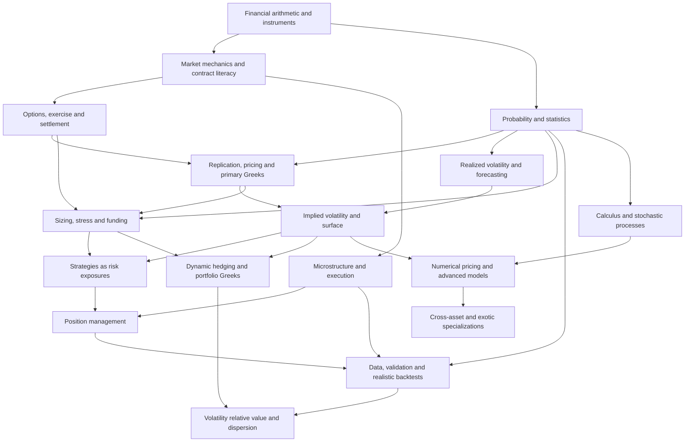

# Master Knowledge Map: Options, Trading and Derivatives

**Version 1.0 · Research checkpoint: 17 September 2026**

**1,019 classified topic entries · 67 modules · 14 domains · 17 learning stages · 70 annotated resources · 67 module assessments · 7 capstones · 2 gap audits**

This is the requested master curriculum, before teaching begins. It maps knowledge needed to reason from markets, probability, risk, volatility, pricing, execution, psychology and portfolio construction. It is deliberately broader than a retail options course. Advanced extensions are included without making every specialty a prerequisite for competent listed-options work.

The complete map is an original synthesis checked against exchange/clearing documentation, regulatory material, university courses, textbook contents and primary research. Completeness means broad professional coverage with explicit branches and a gap process; it does not mean that a finite map can contain every future product, jurisdictional detail or research result. No trading strategy is recommended for your account, and completing the curriculum does not demonstrate a profitable edge.

## Contents

- [Part A — Complete Trading Knowledge Map](#part-a)
- [Part B — Prerequisite / Dependency Map](#part-b)
- [Part C — Expert Learning Roadmap](#part-c)
- [Part D — Importance Matrix](#part-d)
- [Part E — Resource Map](#part-e)
- [Part F — Practical Training Program](#part-f)
- [Part G — Knowledge Gaps Audit](#part-g)
- [Part H — Estimated Mastery Structure](#part-h)

## How to read the map

Each entry has a stable ID and **[Difficulty · Importance · Evidence]** label. Its category is stated at the module heading and applies to every topic/subtopic in that module. Every listed subtopic inherits its parent entry's classification. Advanced-extension links lead to separately classified entries in the named destination module. The companion catalog expands these metadata into explicit fields for every topic.

| Dimension | Codes |
|---|---|
| Difficulty | **B** Beginner; **I** Intermediate; **A** Advanced; **Q** Professional/Quantitative |
| Importance | **E** Essential; **V** Very Important; **U** Useful; **S** Specialized |
| Evidence | **T** definition/conditional theory; **R** current-rule/specification subject; **E** empirical research; **H** practitioner method; **F** folklore or overstated inference |

The code is positional: **[I · E · T]** means Intermediate / Essential / Theory. An evidence label classifies what is being studied, not a blanket endorsement. In particular, indicator arithmetic can be exact while its predictive interpretation remains H. Q entries and the M14/M31/M40/M44 specialist track require advanced mathematics; some A entries require calculus or linear algebra but not full stochastic calculus.

The short descriptions name the required subtopics and failure modes. They are scope specifications for future lessons, not substitutes for derivations, numerical examples or evidence reviews.

## Part A — Complete Trading Knowledge Map

| Domain | Modules | Topics |
|---|---|---:|
| D01 · Financial and market foundations | [M01](#m01), [M02](#m02), [M03](#m03), [M04](#m04), [M05](#m05) | 72 |
| D02 · Fundamentals, macro and events | [M06](#m06), [M07](#m07), [M08](#m08), [M09](#m09) | 52 |
| D03 · Mathematics and inference | [M10](#m10), [M11](#m11), [M12](#m12), [M13](#m13), [M14](#m14) | 71 |
| D04 · Price behavior and technical methods | [M15](#m15), [M16](#m16), [M17](#m17), [M18](#m18), [M19](#m19), [M20](#m20) | 102 |
| D05 · Option contracts and structures | [M21](#m21), [M22](#m22), [M23](#m23), [M24](#m24), [M25](#m25), [M26](#m26), [M27](#m27), [M28](#m28) | 117 |
| D06 · Pricing, Greeks and hedging | [M29](#m29), [M30](#m30), [M31](#m31), [M32](#m32), [M33](#m33), [M34](#m34) | 84 |
| D07 · Volatility and volatility trading | [M35](#m35), [M36](#m36), [M37](#m37), [M38](#m38), [M39](#m39), [M40](#m40), [M41](#m41) | 101 |
| D08 · Futures and cross-asset derivatives | [M42](#m42), [M43](#m43), [M44](#m44) | 46 |
| D09 · Risk and portfolio construction | [M45](#m45), [M46](#m46), [M47](#m47), [M48](#m48), [M49](#m49) | 79 |
| D10 · Microstructure, execution and management | [M50](#m50), [M51](#m51), [M52](#m52), [M53](#m53) | 62 |
| D11 · Research, data and software | [M54](#m54), [M55](#m55), [M56](#m56), [M57](#m57), [M58](#m58) | 78 |
| D12 · Decision practice and professional development | [M59](#m59), [M60](#m60), [M61](#m61) | 58 |
| D13 · Rules, operations and market-specific practice | [M62](#m62), [M63](#m63), [M64](#m64) | 46 |
| D14 · Evidence, failure analysis and professional practice | [M65](#m65), [M66](#m66), [M67](#m67) | 51 |

### D01 · Financial and market foundations

#### M01 — Financial arithmetic and economic purpose

**Category:** Foundations · **Entry prerequisites:** None · **Roadmap stage:** 0

**Resource anchors:** [R01: OCC — Characteristics and Risks of Standardized Options](https://www.theocc.com/company-information/documents-and-archives/options-disclosure-document); [R05: John C. Hull — Options, Futures, and Other Derivatives](https://www.pearson.com/en-us/subject-catalog/p/options-futures-and-other-derivatives/P200000005938/9780136939979); [R16: MIT OCW — Finance Theory I](https://ocw.mit.edu/courses/15-401-finance-theory-i-fall-2008/)

- **M01.01 Units and signs** [B · E · T]
  - currency, points, ticks, percentages, basis points, contracts, multipliers; dimensional checks.

- **M01.02 Percent change** [B · E · T]
  - simple returns, drawdowns, asymmetric recovery arithmetic.

- **M01.03 Compounding** [B · E · T]
  - geometric growth, arithmetic averages, geometric averages, volatility drag.

- **M01.04 Time value of money** [B · E · T]
  - present value, future value, discount factors, continuous compounding.

- **M01.05 Real and nominal returns** [B · E · T]
  - inflation, purchasing power, currency conversion.

- **M01.06 Profit and loss** [B · E · T]
  - realized, unrealized, gross, net, mark-to-market, cash flow versus income.

- **M01.07 Capital and solvency** [B · E · T]
  - account equity, available cash, collateral, liabilities, liquidation value.

- **M01.08 Leverage** [B · E · T]
  - gross notional, net notional, effective leverage, embedded optionality.

- **M01.09 Trading purposes** [B · E · T]
  - investment, speculation, hedging, insurance, liquidity provision, arbitrage.

- **M01.10 Opportunity cost** [B · V · T]
  - passive alternatives, cash yield, time, data and infrastructure expense.

- **M01.11 Risk capital** [B · E · T]
  - essential living funds, capital at risk, withdrawals, finite trading runway.

- **M01.12 Market efficiency** [I · V · T]
  - information sets, weak/semi-strong/strong forms, limits to arbitrage.

- **M01.13 Risk premium versus alpha** [I · V · T]
  - compensation for bearing risk versus incremental skill.

- **M01.14 Decision objectives** [I · V · H]
  - survival, learning, hedging effectiveness, growth, capacity, constraints.

**Advanced extension:** M10–M14: mathematical foundations; M48: portfolio decisions.

#### M02 — Instruments and underlying-market structure

**Category:** Market Mechanics · **Entry prerequisites:** [M01](#m01) · **Roadmap stage:** 1

**Resource anchors:** [R05: John C. Hull — Options, Futures, and Other Derivatives](https://www.pearson.com/en-us/subject-catalog/p/options-futures-and-other-derivatives/P200000005938/9780136939979); [R16: MIT OCW — Finance Theory I](https://ocw.mit.edu/courses/15-401-finance-theory-i-fall-2008/); [R03: CME Institute — All About Options and course catalog](https://www.cmegroup.com/education/courses/curriculum-all-about-options)

- **M02.01 Equities** [B · E · T]
  - ownership, common/preferred shares, capitalization, free float.

- **M02.02 Bonds and bills** [B · E · T]
  - principal, coupons, yield, maturity, default risk.

- **M02.03 Funds** [B · V · T]
  - mutual funds, ETFs, NAV, creation/redemption, tracking differences.

- **M02.04 Exchange-traded notes** [I · V · T]
  - unsecured issuer exposure, acceleration and redemption provisions.

- **M02.05 Leveraged and inverse funds** [I · V · T]
  - daily resets, path dependence, compounding and option implications.

- **M02.06 Indices** [B · E · T]
  - price-weighted, capitalization-weighted, equal-weighted, price versus total return.

- **M02.07 Index maintenance** [I · V · T]
  - rebalancing, constituent changes, divisor adjustments, closing flows.

- **M02.08 Spot, forwards and futures** [B · E · T]
  - ownership versus contractual exposure, settlement obligations.

- **M02.09 Options and warrants** [B · E · T]
  - contingent claims, issuer warrants versus exchange-cleared options.

- **M02.10 Swaps** [I · V · T]
  - interest-rate, total-return, credit, variance and currency exposure.

- **M02.11 Currencies** [B · V · T]
  - quotation direction, crosses, currency risk and cash balances.

- **M02.12 Commodities** [B · V · T]
  - physical markets, inventories, storage, seasonality, delivery constraints.

- **M02.13 Securities lending and repo** [A · V · T]
  - borrow availability, rebates, specialness, financing.

- **M02.14 Structured products** [A · V · T]
  - embedded options, issuer credit, payoff decomposition.

- **M02.15 Digital-asset derivatives** [I · U · T]
  - perpetuals, funding, collateral currency and venue risk.

**Advanced extension:** M42–M44: futures and specialist derivatives.

#### M03 — Institutions, venues and the trade lifecycle

**Category:** Market Mechanics · **Entry prerequisites:** [M01](#m01), [M02](#m02) · **Roadmap stage:** 1

**Resource anchors:** [R01: OCC — Characteristics and Risks of Standardized Options](https://www.theocc.com/company-information/documents-and-archives/options-disclosure-document); [R04: FINRA — Options](https://www.finra.org/investors/investing/investment-products/options); [R07: Larry Harris — Trading and Exchanges](https://academic.oup.com/book/52292); [R08: Foucault, Pagano and Röell — Market Liquidity, 2nd edition](https://academic.oup.com/book/55158)

- **M03.01 Market participants** [B · E · T]
  - investors, hedgers, speculators, market makers, arbitrageurs, asset managers.

- **M03.02 Broker roles** [B · E · T]
  - agency, principal, introducing broker, clearing broker, prime broker.

- **M03.03 Exchange roles** [B · E · T]
  - listing, matching, surveillance, rulebooks, trading calendars.

- **M03.04 Clearing houses** [B · E · T]
  - novation, netting, central counterparties, default management.

- **M03.05 Custody and depositories** [B · V · T]
  - beneficial ownership, segregation, reconciliation, asset protection limits.

- **M03.06 Trade lifecycle** [B · E · T]
  - order, acknowledgment, match, execution report, clearing, settlement.

- **M03.07 Settlement conventions** [B · E · R]
  - trade date, value date, cash and securities delivery, holidays.

- **M03.08 Delivery versus payment** [I · V · T]
  - settlement risk, fails, buy-ins, settlement finality.

- **M03.09 CCP default waterfall** [I · V · T]
  - margin, default fund, mutualization, residual counterparty exposure.

- **M03.10 Trading sessions** [B · E · R]
  - regular, overnight, pre-market, after-hours; product-specific availability.

- **M03.11 Halts and circuit breakers** [B · E · R]
  - market-wide halts, price bands, limit states, reopening auctions.

- **M03.12 Corporate actions** [I · V · R]
  - splits, dividends, rights, spin-offs, mergers, delistings.

- **M03.13 Reference data** [I · V · R]
  - instrument identifiers, symbology, currency, contract version and calendar.

- **M03.14 Broker selection** [I · V · H]
  - regulatory status, execution, stability, custody, support and exercise procedures.

**Advanced extension:** M50–M52: professional microstructure and execution.

#### M04 — Quotes, orders and matching

**Category:** Execution · **Entry prerequisites:** [M03](#m03) · **Roadmap stage:** 1

**Resource anchors:** [R04: FINRA — Options](https://www.finra.org/investors/investing/investment-products/options); [R07: Larry Harris — Trading and Exchanges](https://academic.oup.com/book/52292); [R08: Foucault, Pagano and Röell — Market Liquidity, 2nd edition](https://academic.oup.com/book/55158); [R30: Cboe — Complex Order Handling](https://www.cboe.com/us/options/trading/complex_orders/)

- **M04.01 Bid and ask** [B · E · T]
  - best quotes, midpoint, spread, quoted versus executable size.

- **M04.02 Last trade and mark** [B · E · T]
  - stale prints, valuation conventions, non-executable marks.

- **M04.03 Order books** [B · E · T]
  - price levels, depth, top-of-book versus full-depth feeds.

- **M04.04 Market orders** [B · E · T]
  - immediacy, uncertain fill price, fragmented executions.

- **M04.05 Limit orders** [B · E · T]
  - price control, non-execution risk, adverse selection.

- **M04.06 Stop orders** [B · E · R]
  - trigger rules, conversion to market orders, gap risk.

- **M04.07 Stop-limit orders** [B · E · R]
  - trigger and limit, non-fill risk after a gap.

- **M04.08 Time-in-force** [B · E · R]
  - day, GTC, IOC, FOK, expiry and session restrictions.

- **M04.09 Conditional orders** [I · V · R]
  - OCO, brackets, trailing stops, broker-side versus exchange-side handling.

- **M04.10 Matching priority** [I · V · R]
  - price-time, pro rata, size priority, allocation exceptions.

- **M04.11 Partial fills** [I · V · T]
  - remaining quantity, average fill, cancel/replace, race conditions.

- **M04.12 Auctions** [I · V · R]
  - opening, closing, volatility and options price-improvement auctions.

- **M04.13 Tick sizes** [I · V · T]
  - minimum increments, spread constraints, rounding and price discretion.

- **M04.14 Complex orders** [I · V · R]
  - package net prices, ratios, leg-level fills, complex order books.

- **M04.15 Order errors** [I · V · H]
  - wrong side, wrong expiry, wrong multiplier, duplicate submissions.

**Advanced extension:** M50 and M52: queues, impact and transaction-cost analysis.

#### M05 — Trading costs, financing and basic margin

**Category:** Risk · **Entry prerequisites:** [M01](#m01), [M03](#m03), [M04](#m04) · **Roadmap stage:** 1

**Resource anchors:** [R01: OCC — Characteristics and Risks of Standardized Options](https://www.theocc.com/company-information/documents-and-archives/options-disclosure-document); [R04: FINRA — Options](https://www.finra.org/investors/investing/investment-products/options); [R09: CME — SPAN 2 Methodology and Functionality](https://www.cmegroup.com/clearing/risk-management/span-overview/span-2-methodology.html); [R26: IRS — Publication 550](https://www.irs.gov/publications/p550)

- **M05.01 Explicit costs** [B · E · T]
  - commissions, exchange, clearing, regulatory fees and taxes.

- **M05.02 Implicit costs** [B · E · T]
  - bid/ask spread, slippage, price impact, opportunity cost.

- **M05.03 Funding costs** [I · V · T]
  - debit interest, credit interest, borrow fees, collateral opportunity cost.

- **M05.04 Cash and margin accounts** [B · E · R]
  - permitted activity, settled funds, broker approval levels.

- **M05.05 Initial and maintenance margin** [B · E · T]
  - collateral requirements versus economic risk.

- **M05.06 Buying power** [B · E · T]
  - available margin, reserved cash, position offsets, house add-ons.

- **M05.07 Margin is not maximum loss** [B · E · T]
  - stress losses, liquidation, deficits and recourse.

- **M05.08 Short selling** [I · V · T]
  - locate, borrow recall, buy-ins, dividends owed, squeeze risk.

- **M05.09 Cash-secured exposure** [I · V · T]
  - reserved cash, interest treatment, collateral haircuts.

- **M05.10 Mark-to-market cash flows** [I · V · R]
  - daily/intraday variation margin, premium payment conventions.

- **M05.11 Cost-aware expectancy** [I · V · H]
  - round trips, repeated adjustments, small-premium cost burden.

- **M05.12 Turnover and capacity** [I · V · H]
  - trade frequency, size, liquidity and net returns.

- **M05.13 Taxes versus trading edge** [I · V · T]
  - pre-tax and after-tax evaluation; timing and instrument dependence.

- **M05.14 Funding asymmetry** [A · V · T]
  - borrowing/lending spreads, margin netting sets, balance-sheet constraints.

**Advanced extension:** M47: stressed funding and margin; M52: execution attribution.

### D02 · Fundamentals, macro and events

#### M06 — Financial statements and equity fundamentals

**Category:** Fundamental Analysis · **Entry prerequisites:** [M01](#m01), [M02](#m02) · **Roadmap stage:** 3

**Resource anchors:** [R16: MIT OCW — Finance Theory I](https://ocw.mit.edu/courses/15-401-finance-theory-i-fall-2008/); [R17: SEC — Beginners’ Guide to Financial Statements](https://www.sec.gov/about/reports-publications/investorpubsbegfinstmtguide)

- **M06.01 Income statement** [B · E · T]
  - revenue, gross profit, operating income, net income, EPS.

- **M06.02 Balance sheet** [B · E · T]
  - assets, liabilities, equity, working capital, debt structure.

- **M06.03 Cash flow statement** [B · E · T]
  - operating, investing, financing; earnings versus cash generation.

- **M06.04 Accounting quality** [B · V · T]
  - accruals, one-offs, stock compensation, capitalized costs.

- **M06.05 Growth and margins** [B · V · T]
  - revenue drivers, operating leverage, unit economics.

- **M06.06 Valuation multiples** [I · V · T]
  - P/E, P/S, EV/EBITDA, free-cash-flow yield; comparability limits.

- **M06.07 Discounted cash flow** [I · V · T]
  - discount rates, terminal value, sensitivity to assumptions.

- **M06.08 Capital structure** [I · V · T]
  - dilution, convertibles, refinancing, bankruptcy and recovery.

- **M06.09 Dividends and buybacks** [I · V · T]
  - declaration, ex-date, payment, authorization versus execution.

- **M06.10 Consensus and expectations** [I · V · H]
  - estimate revisions, guidance, whisper expectations, surprise definitions.

- **M06.11 Earnings quality** [I · V · H]
  - reported versus adjusted metrics, footnotes, management incentives.

- **M06.12 Industry context** [I · V · H]
  - cyclicality, competition, regulation, sector-specific operating metrics.

- **M06.13 Catalyst identification** [I · V · H]
  - earnings calls, filings, guidance, capital raises, legal outcomes.

- **M06.14 Equity-credit linkage** [A · V · T]
  - distress, jump-to-default, structural credit models and put skew.

**Advanced extension:** M09 and M38: event distributions and option repricing.

#### M07 — Macroeconomics and policy transmission

**Category:** Macro · **Entry prerequisites:** [M01](#m01), [M02](#m02) · **Roadmap stage:** 3

**Resource anchors:** [R16: MIT OCW — Finance Theory I](https://ocw.mit.edu/courses/15-401-finance-theory-i-fall-2008/); [R18: St. Louis Fed — ALFRED and real-time periods](https://fred.stlouisfed.org/docs/api/fred/alfred.html); [R19: U.S. Bureau of Labor Statistics — CPI](https://www.bls.gov/cpi/)

- **M07.01 Economic activity** [B · V · T]
  - GDP, growth, recession, output gaps, revisions.

- **M07.02 Inflation** [B · V · T]
  - CPI, PPI, PCE, headline/core, base effects and seasonal adjustments.

- **M07.03 Labor markets** [B · V · T]
  - payrolls, unemployment, wages, participation, claims.

- **M07.04 Central banks** [B · V · T]
  - policy rates, reaction functions, mandates, communication.

- **M07.05 Monetary policy** [I · V · T]
  - quantitative easing/tightening, reserves, repo and transmission channels.

- **M07.06 Fiscal policy** [I · V · T]
  - deficits, issuance, spending, taxes and policy uncertainty.

- **M07.07 Yield curves** [I · V · T]
  - spot, par and forward curves; steepening, flattening, inversion.

- **M07.08 Real rates and breakevens** [I · V · T]
  - nominal/real yield decomposition and inflation risk premium.

- **M07.09 Credit spreads** [I · V · T]
  - default expectations, recovery, liquidity, risk aversion.

- **M07.10 Economic calendars** [I · V · H]
  - release timing, consensus, revisions, surprise and positioning.

- **M07.11 Market-implied policy paths** [A · V · T]
  - futures, OIS, term premium and probability assumptions.

- **M07.12 Liquidity narratives** [I · V · H]
  - monetary, funding and market liquidity; avoid conflating them.

- **M07.13 Regime frameworks** [I · V · H]
  - growth/inflation combinations, supply versus demand shocks.

- **M07.14 Causal humility** [A · V · H]
  - simultaneous news, anticipation, endogeneity and hindsight stories.

**Advanced extension:** M43: rates, currencies and cross-asset optionality.

#### M08 — Intermarket relationships and correlation regimes

**Category:** Macro · **Entry prerequisites:** [M07](#m07), [M10](#m10) · **Roadmap stage:** 3

**Resource anchors:** [R16: MIT OCW — Finance Theory I](https://ocw.mit.edu/courses/15-401-finance-theory-i-fall-2008/); [R18: St. Louis Fed — ALFRED and real-time periods](https://fred.stlouisfed.org/docs/api/fred/alfred.html); [R20: Bekaert and Hoerova — The VIX, the Variance Premium and Stock Market Volatility](https://www.nber.org/papers/w18995)

- **M08.01 Equity-bond relationships** [I · V · T]
  - changing inflation and growth exposures.

- **M08.02 Price-yield relationship** [I · V · T]
  - duration, convexity and rate shocks.

- **M08.03 Dollar and global assets** [I · V · H]
  - trade-weighted indices, funding currencies, currency translation.

- **M08.04 Gold** [I · V · H]
  - real rates, currency, positioning and safe-haven narratives.

- **M08.05 Oil** [I · V · H]
  - supply, demand, geopolitics, inventories and inflation channels.

- **M08.06 Credit-equity-volatility links** [I · V · T]
  - leverage, distress, risk aversion and liquidity.

- **M08.07 Sector rotations** [I · V · T]
  - rate sensitivity, cyclicality, index concentration.

- **M08.08 Correlation versus causation** [I · V · T]
  - common factors, conditional correlation and changing samples.

- **M08.09 Tail dependence** [A · V · T]
  - diversification during stress, asymmetric correlations, copulas.

- **M08.10 Lead-lag relationships** [A · V · H]
  - timing alignment, nonsynchronous markets, spurious predictability.

- **M08.11 Cross-market confirmation** [A · V · H]
  - hypothesis, horizon, invalidation and transaction costs.

- **M08.12 Currency-adjusted portfolios** [A · V · T]
  - local versus base-currency returns and hedge ratios.

**Advanced extension:** M41 and M48: dispersion and portfolio risk.

#### M09 — Event taxonomy and information processing

**Category:** Event Trading · **Entry prerequisites:** [M03](#m03), [M06](#m06), [M07](#m07) · **Roadmap stage:** 3

**Resource anchors:** [R01: OCC — Characteristics and Risks of Standardized Options](https://www.theocc.com/company-information/documents-and-archives/options-disclosure-document); [R17: SEC — Beginners’ Guide to Financial Statements](https://www.sec.gov/about/reports-publications/investorpubsbegfinstmtguide); [R18: St. Louis Fed — ALFRED and real-time periods](https://fred.stlouisfed.org/docs/api/fred/alfred.html); [R19: U.S. Bureau of Labor Statistics — CPI](https://www.bls.gov/cpi/)

- **M09.01 Scheduled events** [B · V · R]
  - earnings, CPI, employment, central-bank meetings, settlement dates.

- **M09.02 Unscheduled events** [I · V · H]
  - geopolitical shocks, litigation, accidents, emergency policy.

- **M09.03 Earnings** [I · V · H]
  - release versus call, guidance, revisions, implied versus realized move.

- **M09.04 Binary events** [I · V · H]
  - FDA decisions, court rulings, approvals, discrete outcome trees.

- **M09.05 Mergers and acquisitions** [I · V · T]
  - deal terms, exchange ratios, financing, break risk, option adjustments.

- **M09.06 Corporate distributions** [I · V · R]
  - ordinary/special dividends, spin-offs and altered deliverables.

- **M09.07 Elections and policy** [I · V · H]
  - scenarios, timing uncertainty, changing correlations.

- **M09.08 Product launches** [I · V · H]
  - expectation formation, delayed monetization, narrative risk.

- **M09.09 Event calendars** [I · V · H]
  - timestamp provenance, rescheduling, before/after-market distinctions.

- **M09.10 Conditional distributions** [A · V · T]
  - outcome probabilities, conditional spot and volatility responses.

- **M09.11 Event overlap** [A · V · H]
  - separating macro, sector and company risk in one expiry.

- **M09.12 Information discipline** [A · V · H]
  - primary filings, timestamps, embargoes, source verification.

**Advanced extension:** M38: implied event variance; M53: event position management.

### D03 · Mathematics and inference

#### M10 — Probability and distributions

**Category:** Mathematics · **Entry prerequisites:** [M01](#m01) · **Roadmap stage:** 2

**Resource anchors:** [R21: MIT OCW — Introduction to Probability and Statistics, 18.05](https://ocw.mit.edu/courses/18-05-introduction-to-probability-and-statistics-spring-2022/); [R05: John C. Hull — Options, Futures, and Other Derivatives](https://www.pearson.com/en-us/subject-catalog/p/options-futures-and-other-derivatives/P200000005938/9780136939979)

- **M10.01 Arithmetic and algebra** [B · E · T]
  - equations, inequalities, exponents, logarithms, functions.

- **M10.02 Probability spaces** [B · E · T]
  - outcomes, events, complements, unions, intersections.

- **M10.03 Conditional probability** [B · E · T]
  - independence, dependence, joint and marginal probabilities.

- **M10.04 Bayes theorem** [I · V · T]
  - prior, likelihood, posterior, base rates and updating.

- **M10.05 Random variables** [B · E · T]
  - discrete and continuous, probability mass/density, cumulative distribution.

- **M10.06 Expected value** [B · E · T]
  - weighted payoffs, linearity, conditional expectation.

- **M10.07 Variance and standard deviation** [B · E · T]
  - dispersion, units and aggregation.

- **M10.08 Covariance and correlation** [I · V · T]
  - Pearson, rank measures, dependence limitations.

- **M10.09 Distribution families** [I · V · T]
  - Bernoulli, binomial, Poisson, normal, lognormal, Student-t.

- **M10.10 Distribution shape** [I · V · T]
  - skewness, kurtosis, fat tails, percentiles and quantiles.

- **M10.11 Laws of large numbers and central limit theorem** [I · V · T]
  - assumptions and finite-sample limits.

- **M10.12 Joint distributions** [I · V · T]
  - multivariate outcomes, dependence, conditional tails.

- **M10.13 Expected utility** [A · V · T]
  - risk aversion, certainty equivalents, utility versus expected wealth.

- **M10.14 Jensen inequality** [A · V · T]
  - convexity, nonlinear expectation, variance versus volatility.

- **M10.15 Physical versus risk-neutral probability** [A · V · T]
  - forecasting versus pricing distributions.

- **M10.16 Stopping times and barriers** [A · V · T]
  - probability of touch, finish probability and path dependence.

**Advanced extension:** M14: probability measures and stochastic processes.

#### M11 — Statistical inference and scientific reasoning

**Category:** Quantitative · **Entry prerequisites:** [M10](#m10) · **Roadmap stage:** 2

**Resource anchors:** [R21: MIT OCW — Introduction to Probability and Statistics, 18.05](https://ocw.mit.edu/courses/18-05-introduction-to-probability-and-statistics-spring-2022/); [R22: James, Witten, Hastie, Tibshirani and Taylor — An Introduction to Statistical Learning with Applications in Python](https://www.statlearning.com/); [R23: Bailey, Borwein, López de Prado and Zhu — The Probability of Backtest Overfitting](https://www.davidhbailey.com/dhbpapers/backtest-prob.pdf)

- **M11.01 Population and sample** [B · E · T]
  - sampling process, data-generating process, representativeness.

- **M11.02 Estimation** [I · V · T]
  - bias, consistency, efficiency, standard error and uncertainty.

- **M11.03 Confidence intervals** [I · V · T]
  - coverage, dependence assumptions, interval interpretation.

- **M11.04 Hypothesis testing** [I · V · T]
  - null, alternative, p-values, effect size, power and errors.

- **M11.05 Statistical versus economic significance** [I · V · T]
  - tradability after costs and constraints.

- **M11.06 Regression** [I · V · T]
  - simple/multiple linear models, residuals, coefficient interpretation.

- **M11.07 Regression diagnostics** [A · V · T]
  - heteroskedasticity, autocorrelation, nonlinearity, multicollinearity.

- **M11.08 Robust estimates** [I · V · T]
  - medians, trimmed statistics, outliers versus real tail events.

- **M11.09 Bootstrap** [I · V · T]
  - resampling, confidence intervals, block bootstrap for dependent returns.

- **M11.10 Bayesian estimation** [A · V · T]
  - shrinkage, posterior predictive checks, model uncertainty.

- **M11.11 Multiple testing** [I · V · T]
  - family-wise errors, false discovery rate, researcher degrees of freedom.

- **M11.12 Bias taxonomy** [I · V · T]
  - sampling, selection, survivorship, publication and confirmation bias.

- **M11.13 Causal inference** [A · V · T]
  - experiments, confounding, instrumental variables, natural experiments.

- **M11.14 Research replication** [A · V · H]
  - registered hypotheses, reproducible datasets, negative results.

**Advanced extension:** M55–M57: defensible research and validation.

#### M12 — Time series, forecasting and regimes

**Category:** Quantitative · **Entry prerequisites:** [M10](#m10), [M11](#m11) · **Roadmap stage:** 3

**Resource anchors:** [R21: MIT OCW — Introduction to Probability and Statistics, 18.05](https://ocw.mit.edu/courses/18-05-introduction-to-probability-and-statistics-spring-2022/); [R22: James, Witten, Hastie, Tibshirani and Taylor — An Introduction to Statistical Learning with Applications in Python](https://www.statlearning.com/); [R20: Bekaert and Hoerova — The VIX, the Variance Premium and Stock Market Volatility](https://www.nber.org/papers/w18995)

- **M12.01 Time-series structure** [I · V · T]
  - trend, seasonality, cycles, noise and event time.

- **M12.02 Stationarity** [I · V · T]
  - strict/weak forms, transformations, differencing and structural breaks.

- **M12.03 Autocorrelation** [I · V · T]
  - ACF, PACF, returns versus squared returns.

- **M12.04 Random walks** [I · V · T]
  - martingales, drift, efficient-market interpretations.

- **M12.05 Mean reversion** [I · V · T]
  - half-life, persistence, unit-root testing and spurious regression.

- **M12.06 AR, MA and ARIMA** [A · V · T]
  - specifications, forecast horizons, diagnostics.

- **M12.07 ARCH and GARCH** [A · V · T]
  - volatility clustering, persistence, conditional variance.

- **M12.08 Asymmetric variance models** [A · V · T]
  - GJR-GARCH, EGARCH and leverage effects.

- **M12.09 HAR realized-volatility models** [A · V · T]
  - multiple horizons and long-memory approximations.

- **M12.10 Cointegration** [A · V · T]
  - common trends, error correction and unstable pairs relationships.

- **M12.11 State-space methods** [A · V · T]
  - Kalman filtering, latent state estimation, parameter uncertainty.

- **M12.12 Regime models** [A · V · T]
  - Markov switching, change points, hidden states and overfitting.

- **M12.13 Forecast evaluation** [A · V · T]
  - rolling origins, calibration, loss functions, benchmark comparisons.

- **M12.14 Long memory and roughness** [A · V · T]
  - distinct meanings, estimation pitfalls and microstructure noise.

**Advanced extension:** M35: volatility estimation; M57: statistical learning.

#### M13 — Calculus, linear algebra and numerical foundations

**Category:** Mathematics · **Entry prerequisites:** [M10](#m10) · **Roadmap stage:** 2

**Resource anchors:** [R05: John C. Hull — Options, Futures, and Other Derivatives](https://www.pearson.com/en-us/subject-catalog/p/options-futures-and-other-derivatives/P200000005938/9780136939979); [R24: Steven Shreve — Stochastic Calculus for Finance II](https://link.springer.com/book/9780387401010); [R25: MIT OCW — Analytics of Finance](https://ocw.mit.edu/courses/15-450-analytics-of-finance-fall-2010/)

- **M13.01 Single-variable calculus** [I · V · T]
  - limits, derivatives, integrals and rate of change.

- **M13.02 Multivariable calculus** [A · V · T]
  - partial derivatives, gradients, Hessians and chain rule.

- **M13.03 Taylor expansion** [A · V · T]
  - local approximation, cross terms and residual error.

- **M13.04 Vectors and matrices** [A · V · T]
  - linear systems, rank, conditioning, positive semidefiniteness.

- **M13.05 Eigenvectors and PCA** [A · V · T]
  - covariance structure, factor reduction, interpretation limits.

- **M13.06 Optimization** [A · V · T]
  - constrained/unconstrained, convexity, local versus global solutions.

- **M13.07 Numerical root finding** [A · V · T]
  - bisection, Brent and Newton methods; convergence safeguards.

- **M13.08 Interpolation** [A · V · T]
  - linear, spline, shape preservation and unstable extrapolation.

- **M13.09 Numerical integration** [A · V · T]
  - quadrature, integration error and tail truncation.

- **M13.10 Differential equations** [Q · V · T]
  - ODEs, PDEs, boundary and terminal conditions.

- **M13.11 Fourier and characteristic functions** [Q · U · T]
  - transforms and pricing applications.

- **M13.12 Numerical stability** [A · V · T]
  - floating point, cancellation, grids and convergence testing.

- **M13.13 Automatic differentiation** [Q · U · T]
  - forward/reverse modes, computational graphs and Greek calculation.

**Advanced extension:** M14 and M31: stochastic calculus and pricing numerics.

#### M14 — Stochastic processes and mathematical finance

**Category:** Mathematics · **Entry prerequisites:** [M10](#m10), [M12](#m12), [M13](#m13) · **Roadmap stage:** 14

**Resource anchors:** [R24: Steven Shreve — Stochastic Calculus for Finance II](https://link.springer.com/book/9780387401010); [R25: MIT OCW — Analytics of Finance](https://ocw.mit.edu/courses/15-450-analytics-of-finance-fall-2010/); [R05: John C. Hull — Options, Futures, and Other Derivatives](https://www.pearson.com/en-us/subject-catalog/p/options-futures-and-other-derivatives/P200000005938/9780136939979)

- **M14.01 Measure-theoretic probability** [Q · V · T]
  - sigma-algebras, filtrations, measurability and conditional expectation.

- **M14.02 Brownian motion** [Q · V · T]
  - increments, scaling, quadratic variation and simulation.

- **M14.03 Martingales** [Q · V · T]
  - fair-game structure, optional stopping conditions and pricing relevance.

- **M14.04 Stochastic integration** [Q · V · T]
  - Ito integrals, adapted processes and integrability.

- **M14.05 Ito lemma** [Q · V · T]
  - first/second-order terms and multidimensional versions.

- **M14.06 Stochastic differential equations** [Q · V · T]
  - existence, discretization, weak/strong convergence.

- **M14.07 Geometric Brownian motion** [Q · V · T]
  - log returns, drift, diffusion and positivity assumptions.

- **M14.08 Change of measure** [Q · V · T]
  - Radon–Nikodym derivatives, Girsanov, physical versus pricing dynamics.

- **M14.09 Fundamental asset-pricing theorems** [Q · V · T]
  - no arbitrage, equivalent martingale measures, completeness.

- **M14.10 Numeraires** [Q · V · T]
  - money-market, forward and stock measures; pricing consistency.

- **M14.11 Feynman–Kac** [Q · V · T]
  - PDE and conditional-expectation representations.

- **M14.12 Jump processes** [Q · S · T]
  - Poisson, compound Poisson, Levy processes and compensators.

- **M14.13 Optimal stopping** [Q · S · T]
  - Snell envelope, American exercise and free boundaries.

- **M14.14 Stochastic control** [Q · S · T]
  - Hamilton–Jacobi–Bellman equations and inventory optimization.

**Advanced extension:** M40 and M44: advanced models and exotic pricing.

### D04 · Price behavior and technical methods

#### M15 — Chart construction, context and price structure

**Category:** Price Action · **Entry prerequisites:** [M02](#m02), [M04](#m04) · **Roadmap stage:** 4

**Resource anchors:** [R27: John J. Murphy — Technical Analysis of the Financial Markets](https://www.penguinrandomhouse.com/books/350647/technical-analysis-of-the-financial-markets-by-john-j-murphy/); [R28: Steve Nison — Japanese Candlestick Charting Techniques](https://www.penguinrandomhouse.com/books/350650/japanese-candlestick-charting-techniques-by-steve-nison/); [R29: Lo, Mamaysky and Wang — Foundations of Technical Analysis](https://www.nber.org/papers/w7613)

- **M15.01 OHLC and bars** [B · E · T]
  - opens, highs, lows, closes, aggregation and session boundaries.

- **M15.02 Candlestick anatomy** [B · E · T]
  - body, upper/lower shadows, range, gaps and close location.

- **M15.03 Chart scales** [B · V · T]
  - linear, logarithmic, adjusted/unadjusted and total-return charts.

- **M15.04 Alternative charts** [I · U · T]
  - line, tick, volume, range, Renko, Kagi, point-and-figure, Heikin-Ashi.

- **M15.05 Swing structure** [B · V · H]
  - swing highs/lows, higher highs/lows, lower highs/lows.

- **M15.06 Trend and range** [B · V · H]
  - directional persistence, rotation, transition and ambiguity.

- **M15.07 Support and resistance** [B · V · H]
  - zones, prior extrema, repeated tests, role reversal.

- **M15.08 Supply and demand zones** [I · U · H]
  - operational definitions and non-observable intent.

- **M15.09 Consolidation** [B · V · H]
  - compression, balance, volatility contraction and expansion.

- **M15.10 Breakout and breakdown** [B · V · H]
  - close-based versus intrabar definitions and confirmation.

- **M15.11 Failed breakouts** [B · V · H]
  - rejection, failed follow-through, trapping narratives as hypotheses.

- **M15.12 Gaps** [I · V · H]
  - common, breakaway, continuation/runaway, exhaustion and ex-dividend gaps.

- **M15.13 Momentum and exhaustion** [I · V · H]
  - acceleration, deceleration, trend continuation and reversal.

- **M15.14 Multi-timeframe analysis** [I · V · H]
  - nested horizons, inconsistent signals and avoiding hindsight.

- **M15.15 Market context** [I · V · H]
  - location, session, liquidity, events, volatility regime and trend age.

- **M15.16 Liquidity sweeps and stop runs** [A · U · H]
  - observed price/volume versus inferred intent.

**Advanced extension:** M55: objective labeling and pattern validation.

#### M16 — Candlestick formations: a testable vocabulary

**Category:** Price Action · **Entry prerequisites:** [M15](#m15) · **Roadmap stage:** 4

**Resource anchors:** [R27: John J. Murphy — Technical Analysis of the Financial Markets](https://www.penguinrandomhouse.com/books/350647/technical-analysis-of-the-financial-markets-by-john-j-murphy/); [R28: Steve Nison — Japanese Candlestick Charting Techniques](https://www.penguinrandomhouse.com/books/350650/japanese-candlestick-charting-techniques-by-steve-nison/); [R29: Lo, Mamaysky and Wang — Foundations of Technical Analysis](https://www.nber.org/papers/w7613)

- **M16.01 Doji** [B · U · H]
  - standard, long-legged, dragonfly and gravestone; tolerance definitions.

- **M16.02 Spinning tops** [B · U · H]
  - small bodies, two-sided range and trend context.

- **M16.03 Marubozu** [B · U · H]
  - full bodies, opening/closing variants and momentum interpretation.

- **M16.04 Hammer** [B · U · H]
  - lower shadow, prior decline, confirmation and failure.

- **M16.05 Hanging man** [B · U · H]
  - hammer shape after a rise; contextual distinction.

- **M16.06 Inverted hammer** [B · U · H]
  - upper shadow after a decline; confirmation dependence.

- **M16.07 Shooting star** [B · U · H]
  - upper shadow after a rise; trend and liquidity context.

- **M16.08 Engulfing candles** [B · U · H]
  - bullish/bearish bodies, range engulfment distinction.

- **M16.09 Harami** [B · U · H]
  - bullish/bearish variants, harami cross and inside-body definitions.

- **M16.10 Morning star** [B · U · H]
  - three-candle reversal, doji variant and gap dependence.

- **M16.11 Evening star** [B · U · H]
  - three-candle reversal, doji variant and continuation failures.

- **M16.12 Pin bars** [B · U · H]
  - wick/body ratios, location and overlap with hammer terminology.

- **M16.13 Inside bars** [B · U · H]
  - range contraction, mother bar and directional ambiguity.

- **M16.14 Outside bars** [B · U · H]
  - range expansion, closing location and two-sided stops.

- **M16.15 Piercing line and dark-cloud cover** [I · U · H]
  - overlap thresholds, gaps and market conventions.

- **M16.16 Three white soldiers and three black crows** [I · U · H]
  - persistence, extension and exhaustion.

- **M16.17 Tweezer tops and bottoms** [I · U · H]
  - matching extremes, tick sizes and tolerance.

- **M16.18 Rising and falling three methods** [I · U · H]
  - continuation structure and invalidation.

- **M16.19 Abandoned baby, kicker and belt hold** [I · U · H]
  - gap-dependent variants and sparse samples.

- **M16.20 Candlestick evidence protocol** [I · V · H]
  - objective labels, context, volume, base rates, costs and failures.

**Advanced extension:** M55–M56: pattern definitions, base rates and out-of-sample tests.

#### M17 — Chart patterns and competing interpretations

**Category:** Technical Analysis · **Entry prerequisites:** [M15](#m15) · **Roadmap stage:** 4

**Resource anchors:** [R27: John J. Murphy — Technical Analysis of the Financial Markets](https://www.penguinrandomhouse.com/books/350647/technical-analysis-of-the-financial-markets-by-john-j-murphy/); [R29: Lo, Mamaysky and Wang — Foundations of Technical Analysis](https://www.nber.org/papers/w7613)

- **M17.01 Double tops and bottoms** [B · U · H]
  - neckline, separation, confirmation, failed patterns.

- **M17.02 Triple tops and bottoms** [B · U · H]
  - repeated tests, range overlap and breakout risk.

- **M17.03 Head and shoulders** [B · U · H]
  - head, shoulders, neckline slope and invalidation.

- **M17.04 Inverse head and shoulders** [B · U · H]
  - reversal hypothesis and failed confirmation.

- **M17.05 Ascending triangles** [B · U · H]
  - horizontal resistance, rising lows and alternative resolutions.

- **M17.06 Descending triangles** [B · U · H]
  - horizontal support, falling highs and alternative resolutions.

- **M17.07 Symmetrical triangles** [B · U · H]
  - compression, apex timing and false breaks.

- **M17.08 Rising and falling wedges** [B · U · H]
  - converging slopes, trend context and weak sample definitions.

- **M17.09 Flags** [B · U · H]
  - impulse, retracement, parallel channel and failed continuation.

- **M17.10 Pennants** [B · U · H]
  - impulse and contraction; distinction from generic triangles.

- **M17.11 Rectangles and channels** [B · U · H]
  - horizontal/rising/falling boundaries and breakout failures.

- **M17.12 Cup and handle** [I · U · H]
  - rounding, depth, handle behavior and subjectivity.

- **M17.13 Rounding bottoms and tops** [I · U · H]
  - time scale, trend transitions and hindsight.

- **M17.14 Broadening formations** [I · U · H]
  - expanding range, volatility and competing boundaries.

- **M17.15 Measured moves** [I · V · H]
  - geometric targets, partial exits and uncertain hit probabilities.

- **M17.16 Break-and-retest structures** [I · V · H]
  - confirmation rules, non-retest moves and adverse selection.

- **M17.17 Wyckoff, Dow and auction-market frameworks** [A · U · H]
  - descriptive organization versus predictive evidence.

- **M17.18 Elliott waves, Fibonacci and harmonic patterns** [A · U · F]
  - degrees of freedom and evidence burden.

- **M17.19 Order blocks, fair-value gaps and smart-money narratives** [A · U · F]
  - reproducible definitions versus causal claims.

- **M17.20 Pattern study specification** [I · V · H]
  - psychology hypothesis, identification, volume, regime, target, failure and evidence.

**Advanced extension:** M55: statistical pattern recognition; M57: automated labeling.

#### M18 — Trend indicators

**Category:** Technical Analysis · **Entry prerequisites:** [M15](#m15), [M10](#m10) · **Roadmap stage:** 4

**Resource anchors:** [R27: John J. Murphy — Technical Analysis of the Financial Markets](https://www.penguinrandomhouse.com/books/350647/technical-analysis-of-the-financial-markets-by-john-j-murphy/); [R29: Lo, Mamaysky and Wang — Foundations of Technical Analysis](https://www.nber.org/papers/w7613)

- **M18.01 Simple moving average** [B · U · H]
  - window, lag and smoothing.

- **M18.02 Exponential moving average** [B · U · H]
  - decay, initialization and effective memory.

- **M18.03 Weighted moving average** [B · U · H]
  - linear weights and responsiveness.

- **M18.04 Volume-weighted moving average** [I · U · H]
  - volume dependence and VWAP distinction.

- **M18.05 Moving-average crossovers** [I · U · H]
  - slow/fast windows, whipsaw and turnover.

- **M18.06 Slope and distance measures** [I · U · H]
  - normalization, z-scores and trend strength.

- **M18.07 ADX and directional movement** [I · U · H]
  - plus/minus DI, smoothing and non-directional strength.

- **M18.08 Aroon** [I · U · H]
  - time since highs/lows, range sensitivity and reversals.

- **M18.09 Supertrend** [I · U · H]
  - ATR bands, direction switching and parameter sensitivity.

- **M18.10 Ichimoku cloud** [I · U · H]
  - component lines, displacement, look-ahead plotting traps.

- **M18.11 Parabolic SAR** [I · U · H]
  - acceleration, stop placement and range-market failure.

- **M18.12 Adaptive averages** [A · U · H]
  - KAMA, DEMA, TEMA, Hull moving average; complexity costs.

- **M18.13 Trend-indicator comparison** [I · V · H]
  - equivalent filters, correlated signals, regime dependence and costs.

**Advanced extension:** M55–M57: parameter stability and incremental signal value.

#### M19 — Momentum indicators

**Category:** Technical Analysis · **Entry prerequisites:** [M18](#m18) · **Roadmap stage:** 4

**Resource anchors:** [R27: John J. Murphy — Technical Analysis of the Financial Markets](https://www.penguinrandomhouse.com/books/350647/technical-analysis-of-the-financial-markets-by-john-j-murphy/); [R29: Lo, Mamaysky and Wang — Foundations of Technical Analysis](https://www.nber.org/papers/w7613)

- **M19.01 RSI** [B · U · H]
  - gain/loss smoothing, thresholds, trend ranges and failure swings.

- **M19.02 MACD** [B · U · H]
  - EMA differences, signal line, histogram and redundant smoothing.

- **M19.03 Stochastic oscillator** [B · U · H]
  - close-in-range, fast/slow variants and smoothing.

- **M19.04 Stochastic RSI** [I · U · H]
  - oscillator-of-oscillator, amplified noise and normalization.

- **M19.05 Rate of change** [B · U · H]
  - percentage return over a lookback and time-scale dependence.

- **M19.06 Momentum** [B · U · H]
  - raw price difference versus percentage normalization.

- **M19.07 Commodity Channel Index** [I · U · H]
  - typical price, mean deviation and scaling.

- **M19.08 Williams percent R** [I · U · H]
  - close-in-range inversion and stochastic redundancy.

- **M19.09 True Strength Index** [I · U · H]
  - double smoothing and lag.

- **M19.10 PPO and DPO** [I · U · H]
  - relative MACD and detrending; centered-data leakage.

- **M19.11 Ultimate oscillator and Connors RSI** [I · U · H]
  - multiple horizons, ranking and overfitting.

- **M19.12 Divergence** [I · V · H]
  - regular/hidden definitions, confirmation and hindsight bias.

- **M19.13 Overbought/oversold** [I · V · H]
  - persistent trends, thresholds and conditioning on regime.

- **M19.14 Momentum evidence** [I · V · H]
  - cross-sectional versus time-series momentum; indicator-specific claims.

**Advanced extension:** M55: threshold and redundancy testing.

#### M20 — Volatility, breadth, volume and order-flow indicators

**Category:** Technical Analysis · **Entry prerequisites:** [M04](#m04), [M15](#m15), [M10](#m10) · **Roadmap stage:** 4

**Resource anchors:** [R27: John J. Murphy — Technical Analysis of the Financial Markets](https://www.penguinrandomhouse.com/books/350647/technical-analysis-of-the-financial-markets-by-john-j-murphy/); [R29: Lo, Mamaysky and Wang — Foundations of Technical Analysis](https://www.nber.org/papers/w7613); [R07: Larry Harris — Trading and Exchanges](https://academic.oup.com/book/52292); [R08: Foucault, Pagano and Röell — Market Liquidity, 2nd edition](https://academic.oup.com/book/55158)

- **M20.01 ATR** [B · U · H]
  - true range, gaps, smoothing and price-unit versus percent normalization.

- **M20.02 Bollinger Bands** [B · U · H]
  - rolling mean/deviation, bandwidth, percent B and distribution assumptions.

- **M20.03 Keltner Channels** [I · U · H]
  - moving-average center and ATR envelope.

- **M20.04 Donchian Channels** [I · U · H]
  - rolling highs/lows, breakout definitions and trend following.

- **M20.05 Historical and realized volatility** [I · V · T]
  - return estimator versus range measures; annualization.

- **M20.06 Volume and relative volume** [B · U · H]
  - intraday seasonality, comparable sessions and event distortions.

- **M20.07 OBV** [I · U · H]
  - signed volume accumulation and arbitrary starting levels.

- **M20.08 Accumulation/distribution line** [I · U · H]
  - close location and gap treatment.

- **M20.09 Chaikin money flow** [I · U · H]
  - normalized accumulation/distribution and window effects.

- **M20.10 Money Flow Index** [I · U · H]
  - typical-price volume flows, thresholds and data dependence.

- **M20.11 VWAP** [I · V · H]
  - session benchmark, price-volume convention and execution uses.

- **M20.12 Anchored VWAP** [I · V · H]
  - anchor selection, event relevance and selection bias.

- **M20.13 Volume profile** [I · V · H]
  - volume-at-price, point of control, value area, high/low-volume nodes.

- **M20.14 Market profile** [A · U · H]
  - time-price opportunities, initial balance, value-area conventions.

- **M20.15 Footprints and cumulative delta** [A · U · H]
  - aggressor classification, absorption, imbalance and feed limits.

- **M20.16 Order-book imbalance** [A · U · H]
  - displayed liquidity, cancellations, spoofing and predictability decay.

- **M20.17 Breadth** [I · U · H]
  - advance/decline, up/down volume, new highs/lows, percent above averages, TRIN.

- **M20.18 Market internals** [I · U · H]
  - tick indices, sector breadth, breadth thrusts and venue coverage.

- **M20.19 Indicator evaluation contract** [I · V · H]
  - formula, logic, lag, regime, weaknesses, redundancy, parameters and evidence.

**Advanced extension:** M35: estimators; M50: microstructure; M55: validation.

### D05 · Option contracts and structures

#### M21 — Option fundamentals and contract literacy

**Category:** Options · **Entry prerequisites:** [M02](#m02), [M03](#m03), [M05](#m05), [M10](#m10) · **Roadmap stage:** 5

**Resource anchors:** [R01: OCC — Characteristics and Risks of Standardized Options](https://www.theocc.com/company-information/documents-and-archives/options-disclosure-document); [R02: Cboe — Options Institute](https://www.cboe.com/optionsinstitute); [R03: CME Institute — All About Options and course catalog](https://www.cmegroup.com/education/courses/curriculum-all-about-options); [R04: FINRA — Options](https://www.finra.org/investors/investing/investment-products/options)

- **M21.01 Calls** [B · E · T]
  - rights to buy, long/short obligations and premium.

- **M21.02 Puts** [B · E · T]
  - rights to sell, long/short obligations and premium.

- **M21.03 Opening and closing** [B · E · T]
  - buy-to-open, sell-to-open, buy-to-close, sell-to-close.

- **M21.04 Contract specification** [B · E · T]
  - underlying, strike, expiry, multiplier, currency and deliverable.

- **M21.05 Premium quotation** [B · E · T]
  - per-unit versus per-contract price, tick value and cash debit/credit.

- **M21.06 Moneyness** [B · E · T]
  - ITM, ATM, OTM; spot versus forward moneyness.

- **M21.07 Intrinsic value** [B · E · T]
  - exercise value versus economic value before expiry.

- **M21.08 Extrinsic and time value** [B · E · T]
  - pricing inputs and limitations of shorthand decomposition.

- **M21.09 Expiry terminology** [B · E · T]
  - expiration date, last trading day, exercise deadline and settlement date.

- **M21.10 Exercise styles** [B · E · R]
  - American, European, Bermudan; geography is not the definition.

- **M21.11 Settlement styles** [B · E · R]
  - cash settlement, physical settlement, delivery into futures.

- **M21.12 Product families** [B · E · R]
  - equity, ETF, index and futures options.

- **M21.13 Listing cycles** [B · E · R]
  - weeklies, monthlies, quarterlies, serials, LEAPS and daily expiries.

- **M21.14 0DTE options** [I · V · T]
  - remaining-time definition, intraday convexity and event concentration.

- **M21.15 Adjusted contracts** [I · V · R]
  - nonstandard deliverables, fractional cash, changing multipliers.

- **M21.16 Payoff versus profit** [I · V · T]
  - premium, financing, fees and pre-expiry mark-to-market.

- **M21.17 FLEX and customized exchange-listed options** [A · V · R]
  - custom terms, exercise/settlement choices, liquidity and exact contract verification.

**Advanced extension:** M29–M34: pricing and risk exposures.

#### M22 — Exercise, assignment and expiration operations

**Category:** Options · **Entry prerequisites:** [M21](#m21), [M04](#m04), [M05](#m05) · **Roadmap stage:** 5

**Resource anchors:** [R01: OCC — Characteristics and Risks of Standardized Options](https://www.theocc.com/company-information/documents-and-archives/options-disclosure-document); [R04: FINRA — Options](https://www.finra.org/investors/investing/investment-products/options); [R26: IRS — Publication 550](https://www.irs.gov/publications/p550); [R31: OCC — Information Memos](https://infomemo.theocc.com/infomemo/search)

- **M22.01 Voluntary exercise** [B · E · R]
  - instruction process, deadlines and loss of remaining extrinsic value.

- **M22.02 Exercise by exception** [B · E · R]
  - thresholds, broker policies, contrary instructions and exceptions.

- **M22.03 Assignment mechanics** [B · E · R]
  - clearing allocation, broker allocation, long-holder versus short-writer choices.

- **M22.04 Early assignment** [I · E · R]
  - American exercise, dividends, rates, borrow and residual time value.

- **M22.05 Call early exercise** [I · V · T]
  - dividend economics, financing, remaining optionality and assumptions.

- **M22.06 Put early exercise** [I · V · T]
  - interest benefit, deep ITM positions and optionality tradeoff.

- **M22.07 Ex-dividend risk** [I · E · R]
  - dates, cash flows, short stock obligations and exercise decisions.

- **M22.08 Pin risk** [I · E · R]
  - uncertain assignment near strike and post-close price changes.

- **M22.09 Expiration mismatch** [I · E · R]
  - one leg exercises, the other does not; unexpected stock or futures.

- **M22.10 AM versus PM settlement** [I · E · R]
  - settlement sampling, last trade and overnight basis risk.

- **M22.11 Cash settlement value** [I · E · R]
  - special quotation, closing methodology and settlement prints.

- **M22.12 Physical delivery** [I · E · R]
  - cash/shares required, delivery margin, shortages and forced liquidation.

- **M22.13 Corporate action adjustments** [I · V · R]
  - OCC/exchange notices, mergers, special dividends and accelerated expiries.

- **M22.14 Expiration decision tree** [I · V · H]
  - close, roll, exercise, lapse; operational deadlines and contingency plan.

- **M22.15 Position reconciliation** [I · V · H]
  - resulting stock/futures, cash ledger, fees and next-session risk.

**Advanced extension:** M30: optimal exercise; M47 and M53: funding and expiry management.

#### M23 — Option-chain analysis and inference limits

**Category:** Options · **Entry prerequisites:** [M21](#m21), [M04](#m04), [M10](#m10) · **Roadmap stage:** 5

**Resource anchors:** [R01: OCC — Characteristics and Risks of Standardized Options](https://www.theocc.com/company-information/documents-and-archives/options-disclosure-document); [R02: Cboe — Options Institute](https://www.cboe.com/optionsinstitute); [R04: FINRA — Options](https://www.finra.org/investors/investing/investment-products/options); [R32: Cboe — 0DTEs Decoded: Positioning, Trends, and Market Impact](https://www.cboe.com/insights/posts/0-dt-es-decoded-positioning-trends-and-market-impact)

- **M23.01 Chain layout** [B · E · T]
  - strikes, expiries, calls/puts, symbols, multiplier and currency.

- **M23.02 Quote fields** [B · E · T]
  - bid, ask, size, midpoint, last, timestamp and crossed/stale quotes.

- **M23.03 Volume versus open interest** [B · E · T]
  - transactions versus outstanding contracts; publication timing.

- **M23.04 Open-interest changes** [I · V · T]
  - opening/closing combinations, spread legs and bilateral positions.

- **M23.05 IV and Greek fields** [I · V · T]
  - model inputs, conventions, provider differences and missing values.

- **M23.06 Liquidity assessment** [I · V · H]
  - spread, depth, actual fills, activity, concentration and quote stability.

- **M23.07 Strike selection** [I · V · H]
  - exposure, liquidity, strike spacing and forward moneyness.

- **M23.08 Expiry selection** [I · V · H]
  - horizon, events, theta/gamma balance and available contracts.

- **M23.09 Trade classification** [A · V · H]
  - bid/ask inference, complex trades, auctions, reporting delays.

- **M23.10 Unusual activity** [A · U · H]
  - size versus baseline, roll detection, stock hedges and inference uncertainty.

- **M23.11 Put-call ratios** [A · U · H]
  - volume/OI, equity/index, expiry, strike and hedging distortions.

- **M23.12 Max pain** [A · U · F]
  - settlement-payoff calculation versus unsupported forecasting claims.

- **M23.13 Open-interest walls** [A · U · F]
  - descriptive concentrations versus guaranteed support/resistance.

- **M23.14 Gamma exposure estimates** [A · V · H]
  - assumed dealer signs, hedge instrument and data coverage.

- **M23.15 Expected-move estimates** [A · V · H]
  - straddle cost, IV scaling, quantiles and distribution assumptions.

- **M23.16 Chain sanity checks** [A · V · H]
  - parity, monotonicity, convexity, calendars and bad-input diagnosis.

**Advanced extension:** M37: surface construction; M51: dealer-position inference.

#### M24 — Single-leg, stock-linked and directional structures

**Category:** Options · **Entry prerequisites:** [M21](#m21), [M22](#m22), [M29](#m29), [M32](#m32), [M36](#m36), [M45](#m45) · **Roadmap stage:** 9

**Resource anchors:** [R01: OCC — Characteristics and Risks of Standardized Options](https://www.theocc.com/company-information/documents-and-archives/options-disclosure-document); [R02: Cboe — Options Institute](https://www.cboe.com/optionsinstitute); [R06: Sheldon Natenberg — Option Volatility & Pricing, 2nd edition](https://www.mheducation.com/highered/mhp/product/option-volatility-pricing-advanced-trading-strategies-techniques-2nd-edition.html)

- **M24.01 Long call** [I · E · T]
  - bullish convexity, premium risk and volatility exposure.

- **M24.02 Long put** [I · E · T]
  - bearish exposure, portfolio insurance and downside convexity.

- **M24.03 Short call** [I · E · T]
  - uncovered upside exposure, margin and assignment.

- **M24.04 Short put** [I · E · T]
  - downside obligation, collateral, gap and assignment.

- **M24.05 Covered call** [I · E · T]
  - stock-plus-short-call exposure, capped upside and residual downside.

- **M24.06 Protective put** [I · E · T]
  - stock-plus-put insurance, premium drag and expiry renewal.

- **M24.07 Cash-secured put** [I · E · T]
  - funded acquisition obligation and comparison with covered calls.

- **M24.08 Married put and protective call** [I · V · T]
  - timing, short-stock hedging and borrow risk.

- **M24.09 Synthetic long stock** [I · V · T]
  - call/put construction, financing and exercise mismatch.

- **M24.10 Synthetic short stock** [I · V · T]
  - call/put construction, collateral and assignment.

- **M24.11 Collar** [I · V · T]
  - downside protection, upside sale, funding and strike tradeoffs.

- **M24.12 Risk reversal** [A · V · T]
  - directional use versus smile quote; bullish and bearish constructions.

- **M24.13 Covered straddle** [A · V · T]
  - stock plus short call/put, doubled downside exposure.

- **M24.14 Stock replacement** [I · V · H]
  - deep ITM calls, leverage, dividend and funding differences.

- **M24.15 LEAPS implementation** [I · V · H]
  - long horizon, spread, vega/rho, dividends and roll risk.

- **M24.16 Wheel strategy** [I · V · H]
  - linked cash-secured puts and covered calls; path dependence and equity beta.

**Advanced extension:** M34 and M53: pathwise hedging and management.

#### M25 — Vertical spreads and payoff algebra

**Category:** Options · **Entry prerequisites:** [M24](#m24) · **Roadmap stage:** 9

**Resource anchors:** [R01: OCC — Characteristics and Risks of Standardized Options](https://www.theocc.com/company-information/documents-and-archives/options-disclosure-document); [R02: Cboe — Options Institute](https://www.cboe.com/optionsinstitute); [R06: Sheldon Natenberg — Option Volatility & Pricing, 2nd edition](https://www.mheducation.com/highered/mhp/product/option-volatility-pricing-advanced-trading-strategies-techniques-2nd-edition.html)

- **M25.01 Bull call spread** [I · E · T]
  - debit, upside cap, long/short strikes and expiry payoff.

- **M25.02 Bear call spread** [I · E · T]
  - credit, upside loss region and collateral.

- **M25.03 Bull put spread** [I · E · T]
  - credit, downside loss region and assignment.

- **M25.04 Bear put spread** [I · E · T]
  - debit, downside cap and exercise considerations.

- **M25.05 Debit and credit equivalence** [I · V · T]
  - financing, same terminal payoff and quote differences.

- **M25.06 Spread width and strike placement** [I · V · T]
  - capital, payoff density and tail exposure.

- **M25.07 Vertical Greeks** [I · V · T]
  - net delta/gamma/vega/theta vary with spot, time and strikes.

- **M25.08 Spread breakeven** [I · V · T]
  - expiry definition versus pre-expiry liquidation outcome.

- **M25.09 Defined terminal risk** [I · E · T]
  - fees, legging, early assignment and residual-position caveats.

- **M25.10 Vertical selection** [A · V · H]
  - risk/reward, implied distribution, skew and executable prices.

**Advanced extension:** M28: synthetic equivalence; M52: package execution.

#### M26 — Straddles, strangles, butterflies and condors

**Category:** Options · **Entry prerequisites:** [M25](#m25), [M36](#m36), [M46](#m46) · **Roadmap stage:** 9

**Resource anchors:** [R01: OCC — Characteristics and Risks of Standardized Options](https://www.theocc.com/company-information/documents-and-archives/options-disclosure-document); [R02: Cboe — Options Institute](https://www.cboe.com/optionsinstitute); [R06: Sheldon Natenberg — Option Volatility & Pricing, 2nd edition](https://www.mheducation.com/highered/mhp/product/option-volatility-pricing-advanced-trading-strategies-techniques-2nd-edition.html); [R10: Euan Sinclair — Volatility Trading, 2nd edition](https://onlinelibrary.wiley.com/doi/book/10.1002/9781118662724)

- **M26.01 Long straddle** [I · V · T]
  - two-sided convexity, premium, movement and volatility sensitivity.

- **M26.02 Short straddle** [I · E · T]
  - concentrated short gamma, tails, margin and assignment.

- **M26.03 Long strangle** [I · V · T]
  - cheaper premium, farther strikes and larger required movement.

- **M26.04 Short strangle** [I · E · T]
  - high win-rate appearance, gap losses and skew exposure.

- **M26.05 Long call butterfly** [I · V · T]
  - strike weights, tent payoff and local exposure.

- **M26.06 Long put butterfly** [I · V · T]
  - construction, call equivalence and exercise differences.

- **M26.07 Short butterfly** [A · V · T]
  - reverse exposure, debit/credit conventions and tails.

- **M26.08 Iron butterfly** [I · V · T]
  - credit and reverse variants, body concentration and expiry effects.

- **M26.09 Broken-wing butterfly** [I · V · T]
  - asymmetric wings, credit/debit and residual side risk.

- **M26.10 Long call/put condor** [I · V · T]
  - four strikes, plateau payoff and wing widths.

- **M26.11 Short condor** [A · V · T]
  - inverse terminal shape and financing.

- **M26.12 Iron condor** [I · V · T]
  - short-volatility structure, correlated wings and assignment.

- **M26.13 Reverse iron condor** [A · V · T]
  - long movement, bounded profit and premium risk.

- **M26.14 Iron versus single-option-type structures** [A · V · T]
  - parity, cost, margin and operational differences.

- **M26.15 Wing selection** [A · V · H]
  - skew cost, expected shortfall, liquidity and realistic exit prices.

**Advanced extension:** M41: volatility-relative-value selection and hedging.

#### M27 — Time, ratio and asymmetric structures

**Category:** Options · **Entry prerequisites:** [M25](#m25), [M26](#m26), [M37](#m37) · **Roadmap stage:** 9

**Resource anchors:** [R02: Cboe — Options Institute](https://www.cboe.com/optionsinstitute); [R06: Sheldon Natenberg — Option Volatility & Pricing, 2nd edition](https://www.mheducation.com/highered/mhp/product/option-volatility-pricing-advanced-trading-strategies-techniques-2nd-edition.html); [R10: Euan Sinclair — Volatility Trading, 2nd edition](https://onlinelibrary.wiley.com/doi/book/10.1002/9781118662724)

- **M27.01 Long calendar spread** [A · V · T]
  - front/back expiry, term structure and front-expiry valuation.

- **M27.02 Short calendar spread** [A · V · T]
  - reverse maturity exposure and margin behavior.

- **M27.03 Diagonal spread** [A · V · T]
  - strike and maturity differences; directional plus surface exposure.

- **M27.04 Double calendar** [A · V · T]
  - two strikes, event placement and changing payoff profile.

- **M27.05 Double diagonal** [A · V · T]
  - two diagonals, skew and expiry interaction.

- **M27.06 Poor man's covered call** [A · V · T]
  - long-call diagonal, exercise funding and stock-cover distinction.

- **M27.07 Call ratio spread** [A · V · T]
  - unmatched short calls, upside tail and net Greek changes.

- **M27.08 Put ratio spread** [A · V · T]
  - unmatched short puts, downside concentration and funding.

- **M27.09 Call backspread** [A · V · T]
  - more long calls than short, valley loss and upside convexity.

- **M27.10 Put backspread** [A · V · T]
  - downside convexity, intermediate loss zone and skew cost.

- **M27.11 Ratio butterfly** [A · U · T]
  - unequal contract weights, extra tail exposure and exact construction.

- **M27.12 Christmas tree spread** [A · U · T]
  - unequal strike spacing, weights and convention differences.

- **M27.13 Jade lizard** [A · U · T]
  - short put plus call credit spread; construction-dependent upper-side outcome.

- **M27.14 Reverse jade lizard** [A · U · T]
  - short call plus put credit spread; downside/upside asymmetry.

- **M27.15 Maturity-mismatch risk** [A · V · T]
  - no single universal expiry payoff or model-free maximum profit.

- **M27.16 Structure naming ambiguity** [A · V · H]
  - verify signed legs, strikes, expiries and multipliers before analysis.

**Advanced extension:** M34 and M41: evolving Greeks and surface-relative value.

#### M28 — Synthetics, financing and constrained arbitrage

**Category:** Options · **Entry prerequisites:** [M25](#m25), [M29](#m29), [M05](#m05) · **Roadmap stage:** 9

**Resource anchors:** [R01: OCC — Characteristics and Risks of Standardized Options](https://www.theocc.com/company-information/documents-and-archives/options-disclosure-document); [R05: John C. Hull — Options, Futures, and Other Derivatives](https://www.pearson.com/en-us/subject-catalog/p/options-futures-and-other-derivatives/P200000005938/9780136939979); [R06: Sheldon Natenberg — Option Volatility & Pricing, 2nd edition](https://www.mheducation.com/highered/mhp/product/option-volatility-pricing-advanced-trading-strategies-techniques-2nd-edition.html)

- **M28.01 Synthetic forwards** [A · V · T]
  - put-call combinations, strike cash flow and discounting.

- **M28.02 Conversion** [A · V · T]
  - stock plus protective put and short call; cash-flow replication.

- **M28.03 Reversal** [A · V · T]
  - reverse conversion, stock borrow and operational feasibility.

- **M28.04 Long box spread** [A · V · T]
  - European-style terminal cash flow and implied financing rate.

- **M28.05 Short box spread** [A · V · T]
  - borrowing interpretation, collateral, exercise and credit constraints.

- **M28.06 American box hazards** [A · V · T]
  - early assignment, funding and non-simultaneous legs.

- **M28.07 Put-call parity trades** [A · V · T]
  - borrow, dividends, rates, costs and executable bounds.

- **M28.08 Dividend-implied trades** [A · V · T]
  - discrete distributions, exercise, tax and estimation risk.

- **M28.09 Jelly roll** [A · V · T]
  - two synthetic forwards, implied carry and term financing.

- **M28.10 Reversal/conversion diagnostics** [A · V · T]
  - apparent arbitrage from stale or asynchronous quotes.

- **M28.11 Static replication** [Q · S · T]
  - portfolios of vanilla claims, digitals and state-price densities.

- **M28.12 Arbitrage limits** [A · V · T]
  - capital, financing, access, latency, settlement and model assumptions.

**Advanced extension:** M41 and M47: relative value and balance-sheet constraints.

### D06 · Pricing, Greeks and hedging

#### M29 — No-arbitrage, carry and valuation foundations

**Category:** Options Pricing · **Entry prerequisites:** [M05](#m05), [M10](#m10), [M21](#m21) · **Roadmap stage:** 6

**Resource anchors:** [R05: John C. Hull — Options, Futures, and Other Derivatives](https://www.pearson.com/en-us/subject-catalog/p/options-futures-and-other-derivatives/P200000005938/9780136939979); [R24: Steven Shreve — Stochastic Calculus for Finance II](https://link.springer.com/book/9780387401010); [R25: MIT OCW — Analytics of Finance](https://ocw.mit.edu/courses/15-450-analytics-of-finance-fall-2010/); [R70: Black and Scholes — The Pricing of Options and Corporate Liabilities](https://www.journals.uchicago.edu/doi/10.1086/260062); [R71: Cox, Ross and Rubinstein — Option Pricing: A Simplified Approach](https://www.sciencedirect.com/science/article/pii/0304405X79900151)

- **M29.01 No-arbitrage logic** [I · E · T]
  - dominance, replication, law of one price and assumptions.

- **M29.02 Forward pricing** [I · E · T]
  - spot, discount factors, dividends, borrow and carry.

- **M29.03 Futures versus forwards** [I · V · T]
  - daily settlement and interest-rate covariance.

- **M29.04 Put-call parity** [I · E · T]
  - European exercise, matched terms, discrete/continuous distributions.

- **M29.05 American parity bounds** [I · V · T]
  - exercise rights and financing inequalities.

- **M29.06 Price bounds** [I · V · T]
  - positivity, intrinsic/exercise relations and strike monotonicity.

- **M29.07 Convexity in strike** [A · V · T]
  - butterfly bounds and probability-density implications.

- **M29.08 Calendar consistency** [A · V · T]
  - dividends, carry and correct normalization before comparing maturities.

- **M29.09 Replication and hedging** [I · E · T]
  - one-period stock/bond portfolios and state-contingent cash flows.

- **M29.10 Risk-neutral valuation** [I · E · T]
  - pricing measure versus belief about realized returns.

- **M29.11 Discount curves** [A · V · T]
  - collateral, funding, OIS and multi-curve relevance.

- **M29.12 Implied forwards** [A · V · T]
  - option parity, noisy quotes and dividend/borrow estimates.

- **M29.13 Incomplete markets** [A · V · T]
  - multiple pricing measures, unhedgeable risks and risk premia.

- **M29.14 Model price versus market value** [A · V · T]
  - executable quotes, reserve, bid/ask and uncertainty.

- **M29.15 Exercise value versus European price bounds** [A · V · T]
  - carry and delayed exercisability; why immediate intrinsic-value shortcuts can mislead.

**Advanced extension:** M30: pricing models; M28: implementable relative value.

#### M30 — Vanilla pricing models and exercise

**Category:** Options Pricing · **Entry prerequisites:** [M29](#m29), [M13](#m13) · **Roadmap stage:** 6

**Resource anchors:** [R05: John C. Hull — Options, Futures, and Other Derivatives](https://www.pearson.com/en-us/subject-catalog/p/options-futures-and-other-derivatives/P200000005938/9780136939979); [R24: Steven Shreve — Stochastic Calculus for Finance II](https://link.springer.com/book/9780387401010); [R25: MIT OCW — Analytics of Finance](https://ocw.mit.edu/courses/15-450-analytics-of-finance-fall-2010/); [R06: Sheldon Natenberg — Option Volatility & Pricing, 2nd edition](https://www.mheducation.com/highered/mhp/product/option-volatility-pricing-advanced-trading-strategies-techniques-2nd-edition.html); [R70: Black and Scholes — The Pricing of Options and Corporate Liabilities](https://www.journals.uchicago.edu/doi/10.1086/260062); [R71: Cox, Ross and Rubinstein — Option Pricing: A Simplified Approach](https://www.sciencedirect.com/science/article/pii/0304405X79900151)

- **M30.01 Binomial models** [I · E · T]
  - CRR construction, risk-neutral probabilities and backward induction.

- **M30.02 Trinomial trees** [A · V · T]
  - transition choices, convergence and early-exercise flexibility.

- **M30.03 Black–Scholes–Merton** [I · E · T]
  - formula inputs, assumptions, replication intuition and derivation path.

- **M30.04 BSM limitations** [I · E · T]
  - discrete hedging, jumps, smile, stochastic volatility, costs and borrow.

- **M30.05 Dividend-adjusted equity pricing** [I · V · T]
  - yields, discrete cash dividends and model choices.

- **M30.06 Black 76** [A · V · T]
  - forwards/futures options, discounting and underlying convention.

- **M30.07 Bachelier pricing** [A · V · T]
  - normal volatility, nonpositive prices/rates and unit conventions.

- **M30.08 Garman–Kohlhagen** [A · V · T]
  - FX domestic/foreign discounting and quotation conventions.

- **M30.09 American exercise** [A · V · T]
  - continuation value versus intrinsic value, exercise boundaries.

- **M30.10 American approximations** [A · V · T]
  - analytical approximations, tree/PDE comparison and errors.

- **M30.11 Implied-volatility inversion** [A · V · T]
  - bounds, root finding, near-zero vega and no-solution cases.

- **M30.12 Implied volatility is model-specific** [A · V · T]
  - lognormal/normal quotes and conversion limitations.

- **M30.13 Digital option pricing** [A · V · T]
  - cash/asset-or-nothing, strike derivative and discontinuous hedging.

- **M30.14 BSM PDE derivation** [Q · V · T]
  - self-financing hedge, Ito lemma, boundary and terminal conditions.

**Advanced extension:** M31: numerical implementation; M40: smile-consistent models.

#### M31 — Numerical pricing and implementation quality

**Category:** Quantitative · **Entry prerequisites:** [M30](#m30), [M13](#m13), [M14](#m14) · **Roadmap stage:** 14

**Resource anchors:** [R24: Steven Shreve — Stochastic Calculus for Finance II](https://link.springer.com/book/9780387401010); [R25: MIT OCW — Analytics of Finance](https://ocw.mit.edu/courses/15-450-analytics-of-finance-fall-2010/); [R33: QuantLib — Official Documentation](https://www.quantlib.org/docs.shtml)

- **M31.01 Monte Carlo pricing** [Q · V · T]
  - simulated paths, discounted payoffs, standard errors and confidence intervals.

- **M31.02 Variance reduction** [Q · V · T]
  - antithetic, control variates, importance sampling and stratification.

- **M31.03 Quasi-Monte Carlo** [Q · U · T]
  - low-discrepancy sequences, effective dimension and error assessment.

- **M31.04 Finite differences** [Q · V · T]
  - explicit/implicit schemes, Crank–Nicolson, stability and convergence.

- **M31.05 Boundary handling** [Q · V · T]
  - truncation, dividends, barriers, early exercise and grid refinement.

- **M31.06 Least-squares Monte Carlo** [Q · V · T]
  - American exercise regression, training/evaluation split and bias.

- **M31.07 Fourier pricing** [Q · V · T]
  - characteristic functions, FFT/COS methods and numerical integration.

- **M31.08 Numerical Greeks** [Q · V · T]
  - bump-and-revalue, bump choice, cancellation and noise.

- **M31.09 Pathwise and likelihood-ratio Greeks** [Q · V · T]
  - differentiability, discontinuities and variance.

- **M31.10 Adjoint differentiation** [Q · U · T]
  - efficient portfolio sensitivities and implementation validation.

- **M31.11 Calibration objective** [Q · V · T]
  - weights, bid/ask, regularization, constraints and identifiability.

- **M31.12 Pricing quality tests** [A · V · T]
  - parity, monotonicity, limiting cases and benchmark convergence.

- **M31.13 Model implementation risk** [A · V · T]
  - dates, day counts, units, dividend timing and calendars.

**Advanced extension:** M40 and M44: calibration and path-dependent claims.

#### M32 — Primary Greeks and exposure units

**Category:** Options Greeks · **Entry prerequisites:** [M30](#m30) · **Roadmap stage:** 6

**Resource anchors:** [R05: John C. Hull — Options, Futures, and Other Derivatives](https://www.pearson.com/en-us/subject-catalog/p/options-futures-and-other-derivatives/P200000005938/9780136939979); [R06: Sheldon Natenberg — Option Volatility & Pricing, 2nd edition](https://www.mheducation.com/highered/mhp/product/option-volatility-pricing-advanced-trading-strategies-techniques-2nd-edition.html)

- **M32.01 Delta** [I · E · T]
  - spot sensitivity, call/put signs, hedge ratio and model dependence.

- **M32.02 Gamma** [I · E · T]
  - second spot derivative, convexity and changing delta; not a first-order Greek.

- **M32.03 Theta** [I · E · T]
  - passage-of-time convention, calendar/trading days and sign exceptions.

- **M32.04 Vega** [I · E · T]
  - volatility sensitivity, one volatility point versus unit volatility.

- **M32.05 Rho** [I · V · T]
  - rate sensitivity, maturity, financing and exercise effects.

- **M32.06 Greek units** [I · E · T]
  - per unit, contract, currency, percent move and total position.

- **M32.07 Position Greeks** [I · E · T]
  - signed quantities, multipliers, currencies and aggregation.

- **M32.08 Greek profiles across spot** [I · V · T]
  - ATM concentration, wings and nonlinear transitions.

- **M32.09 Greek profiles across time** [I · V · T]
  - near-expiry gamma, theta, vega and singular limits.

- **M32.10 Greek profiles across volatility** [I · V · T]
  - curvature, changing moneyness and model choice.

- **M32.11 Delta conventions** [I · V · T]
  - spot, forward, premium-adjusted and sticky-surface assumptions.

- **M32.12 Delta versus probability** [I · V · T]
  - N(d1), N(d2), pricing measure and real-world distinctions.

- **M32.13 Elasticity** [I · V · T]
  - lambda/omega, percent sensitivity and instability near zero option value.

- **M32.14 Portfolio risk normalization** [A · V · T]
  - dollar delta, cash gamma, vega buckets and beta adjustment.

**Advanced extension:** M33–M34: higher-order exposures and P&L attribution.

#### M33 — Higher-order Greeks and surface-sensitive risk

**Category:** Options Greeks · **Entry prerequisites:** [M32](#m32), [M13](#m13) · **Roadmap stage:** 12

**Resource anchors:** [R05: John C. Hull — Options, Futures, and Other Derivatives](https://www.pearson.com/en-us/subject-catalog/p/options-futures-and-other-derivatives/P200000005938/9780136939979); [R06: Sheldon Natenberg — Option Volatility & Pricing, 2nd edition](https://www.mheducation.com/highered/mhp/product/option-volatility-pricing-advanced-trading-strategies-techniques-2nd-edition.html); [R11: Jim Gatheral — The Volatility Surface: A Practitioner’s Guide](https://onlinelibrary.wiley.com/doi/book/10.1002/9781119202073)

- **M33.01 Vanna** [A · V · T]
  - spot-volatility cross sensitivity, skew and hedge adjustment.

- **M33.02 Vomma/volga** [A · V · T]
  - volatility convexity, wing behavior and vega hedging.

- **M33.03 Charm** [A · V · T]
  - delta change with time; time-to-expiry versus calendar-time sign.

- **M33.04 Color** [A · V · T]
  - gamma change with time and near-expiry hedge instability.

- **M33.05 Speed** [A · U · T]
  - gamma change with spot and local approximation limits.

- **M33.06 Zomma** [A · U · T]
  - gamma change with volatility and stressed convexity.

- **M33.07 Ultima** [Q · U · T]
  - volga change with volatility and higher-order volatility exposure.

- **M33.08 Vera** [A · U · T]
  - commonly vega-rate cross sensitivity; verify author definition and units.

- **M33.09 Veta** [A · U · T]
  - vega change with time; sign and day-count conventions.

- **M33.10 Epsilon** [A · U · T]
  - commonly dividend-yield sensitivity; notation is not standardized.

- **M33.11 Cross-Greeks** [A · V · T]
  - delta-rho, rate-volatility, dividend-spot and correlation exposures.

- **M33.12 Model versus market Greeks** [A · V · T]
  - frozen-input, recalibrated and surface-consistent sensitivities.

- **M33.13 Bucketed surface Greeks** [A · V · T]
  - strike/expiry nodes, principal components and hedge instruments.

- **M33.14 Higher-order Taylor terms** [Q · V · T]
  - interaction, truncation, path dependence and stress limits.

**Advanced extension:** M34 and M51: hedging, attribution and dealer-flow hypotheses.

#### M34 — Dynamic hedging, gamma scalping and P&L explanation

**Category:** Options Greeks · **Entry prerequisites:** [M32](#m32), [M33](#m33), [M35](#m35), [M36](#m36) · **Roadmap stage:** 12

**Resource anchors:** [R05: John C. Hull — Options, Futures, and Other Derivatives](https://www.pearson.com/en-us/subject-catalog/p/options-futures-and-other-derivatives/P200000005938/9780136939979); [R06: Sheldon Natenberg — Option Volatility & Pricing, 2nd edition](https://www.mheducation.com/highered/mhp/product/option-volatility-pricing-advanced-trading-strategies-techniques-2nd-edition.html); [R10: Euan Sinclair — Volatility Trading, 2nd edition](https://onlinelibrary.wiley.com/doi/book/10.1002/9781118662724); [R12: Demeterfi, Derman, Kamal and Zou — More Than You Ever Wanted to Know About Volatility Swaps](https://emanuelderman.com/more-than-you-ever-wanted-to-know-about-volatility-swaps-the-journal-of-der/)

- **M34.01 Greek P&L decomposition** [I · E · T]
  - delta, gamma, theta, vega, rates, cross terms and unexplained residual.

- **M34.02 Delta hedging** [A · V · T]
  - stock/futures choice, hedge ratios, cash accounts and transaction costs.

- **M34.03 Discrete rebalancing** [A · V · T]
  - time, delta-band, price-band and cost-aware hedge policies.

- **M34.04 Gamma scalping** [A · V · T]
  - hedge cash flows versus premium/theta and actual realized path.

- **M34.05 Gamma-theta relationship** [A · V · T]
  - diffusion assumptions, funding and omitted jump terms.

- **M34.06 Realized versus implied break-even** [A · V · T]
  - gamma weighting, timing, costs, skew and financing.

- **M34.07 Vega hedging** [A · V · T]
  - maturity matching, surface buckets, basis and residual convexity.

- **M34.08 Gamma hedging** [A · V · T]
  - option instruments, vega consequences and liquidity.

- **M34.09 Vanna/volga hedging** [A · V · T]
  - spot-vol correlation, wing instruments and model risk.

- **M34.10 Jump hedging limits** [A · V · T]
  - discontinuous moves, overnight gaps and unavailable liquidity.

- **M34.11 Hedge slippage attribution** [A · V · T]
  - spread, impact, timing and stale risk numbers.

- **M34.12 P&L explain** [A · V · T]
  - carry, roll-down, realized path, surface moves, execution, fees and residual.

- **M34.13 Self-financing accounting** [Q · V · T]
  - hedge portfolio cash flows, interest and dividends.

- **M34.14 Hedging-policy evaluation** [A · V · H]
  - objective, cost/risk tradeoff and out-of-sample comparison.

**Advanced extension:** M41: relative-value trading; M48: portfolio hedging.

### D07 · Volatility and volatility trading

#### M35 — Realized volatility and forecasting

**Category:** Volatility · **Entry prerequisites:** [M10](#m10), [M12](#m12) · **Roadmap stage:** 7

**Resource anchors:** [R10: Euan Sinclair — Volatility Trading, 2nd edition](https://onlinelibrary.wiley.com/doi/book/10.1002/9781118662724); [R20: Bekaert and Hoerova — The VIX, the Variance Premium and Stock Market Volatility](https://www.nber.org/papers/w18995); [R34: Robert Engle — Risk and Volatility: Econometric Models and Financial Practice](https://www.nobelprize.org/uploads/2018/06/engle-lecture.pdf)

- **M35.01 Variance versus volatility** [I · E · T]
  - squared returns, square roots and units.

- **M35.02 Return measurement** [I · E · T]
  - simple/log, sampling horizon and overnight/intraday separation.

- **M35.03 Annualization** [I · E · T]
  - trading/calendar days, scaling assumptions and comparability.

- **M35.04 Close-to-close estimators** [I · V · T]
  - sample means, overlapping windows and measurement error.

- **M35.05 Range estimators** [A · V · T]
  - Parkinson, Garman–Klass, Rogers–Satchell and Yang–Zhang assumptions.

- **M35.06 High-frequency realized variance** [A · V · T]
  - summation, sampling frequency and microstructure noise.

- **M35.07 Robust realized measures** [A · V · T]
  - realized kernels, subsampling and noise adjustment.

- **M35.08 Jump separation** [A · V · T]
  - bipower variation, discontinuities and estimation limits.

- **M35.09 Volatility clustering** [I · V · T]
  - persistence, leverage effect and changing regimes.

- **M35.10 Volatility cones** [I · V · H]
  - matched horizons, distribution percentiles and sample contamination.

- **M35.11 Forecast models** [A · V · T]
  - EWMA, GARCH, HAR, ensembles and benchmark comparison.

- **M35.12 Forecast losses** [A · V · T]
  - squared error, QLIKE, uncertainty intervals and horizon alignment.

- **M35.13 Expected realized variance** [A · V · T]
  - conditional forecast versus trailing historical estimate.

- **M35.14 Seasonality** [A · V · T]
  - intraday U-shape, weekdays, holidays and event calendars.

- **M35.15 Integrated versus realized variance** [A · V · T]
  - latent process, finite sampling and jumps.

- **M35.16 Overnight and intraday variance allocation** [A · V · T]
  - nontrading time, holiday effects, event clocks and matched hedge horizons.

**Advanced extension:** M38: event variance; M41: trading forecast differences.

#### M36 — Implied volatility, distributions and risk premiums

**Category:** Volatility · **Entry prerequisites:** [M30](#m30), [M35](#m35) · **Roadmap stage:** 7

**Resource anchors:** [R10: Euan Sinclair — Volatility Trading, 2nd edition](https://onlinelibrary.wiley.com/doi/book/10.1002/9781118662724); [R20: Bekaert and Hoerova — The VIX, the Variance Premium and Stock Market Volatility](https://www.nber.org/papers/w18995); [R34: Robert Engle — Risk and Volatility: Econometric Models and Financial Practice](https://www.nobelprize.org/uploads/2018/06/engle-lecture.pdf); [R12: Demeterfi, Derman, Kamal and Zou — More Than You Ever Wanted to Know About Volatility Swaps](https://emanuelderman.com/more-than-you-ever-wanted-to-know-about-volatility-swaps-the-journal-of-der/)

- **M36.01 Implied volatility** [I · E · T]
  - inversion of a selected pricing model, not a direct forecast.

- **M36.02 Implied versus realized** [I · E · T]
  - matched horizon, weighting, forecasting and risk compensation.

- **M36.03 Volatility risk premium** [I · V · T]
  - expected compensation, tails, state dependence and definition.

- **M36.04 Variance risk premium** [I · V · T]
  - pricing versus physical expected variance; distinction from volatility spread.

- **M36.05 IV rank** [I · V · H]
  - range normalization, lookback and sensitivity to outlier extrema.

- **M36.06 IV percentile** [I · V · H]
  - empirical ranking, ties, lookback and provider definitions.

- **M36.07 Implied move** [I · V · T]
  - model scaling, straddle-implied breakeven and confidence-level distinctions.

- **M36.08 Risk-neutral density** [A · V · T]
  - strike derivatives, smoothing, noisy wings and no-arbitrage.

- **M36.09 Implied probability** [A · V · T]
  - pricing probabilities, investor beliefs and risk-premium wedge.

- **M36.10 Variance risk versus jump risk** [A · V · T]
  - continuous variation, crash insurance and tail premiums.

- **M36.11 Carry** [A · V · T]
  - theta, financing, expected hedging cost and risk compensation.

- **M36.12 Volatility-of-volatility** [A · V · T]
  - forecast uncertainty, volga, dynamics and convexity.

- **M36.13 Cheap versus expensive volatility** [A · V · H]
  - forecast, costs, hedge policy, uncertainty and alternatives.

- **M36.14 Volatility regimes** [A · V · H]
  - level, persistence, skew, term structure and transition risk.

**Advanced extension:** M37–M41: surfaces, events and relative value.

#### M37 — Smiles, skew, term structure and the surface

**Category:** Volatility · **Entry prerequisites:** [M29](#m29), [M32](#m32), [M36](#m36) · **Roadmap stage:** 9

**Resource anchors:** [R11: Jim Gatheral — The Volatility Surface: A Practitioner’s Guide](https://onlinelibrary.wiley.com/doi/book/10.1002/9781119202073); [R35: Gatheral and Jacquier — Arbitrage-free SVI Volatility Surfaces](https://arxiv.org/abs/1204.0646); [R05: John C. Hull — Options, Futures, and Other Derivatives](https://www.pearson.com/en-us/subject-catalog/p/options-futures-and-other-derivatives/P200000005938/9780136939979)

- **M37.01 Smile and smirk** [I · E · T]
  - implied volatility across strike and economic interpretations.

- **M37.02 Put and call skew** [I · V · T]
  - downside/upside asymmetry, supply/demand and jump risk.

- **M37.03 Moneyness coordinates** [I · V · T]
  - strike, spot/forward moneyness, log-moneyness and delta.

- **M37.04 Term structure** [I · V · T]
  - maturity-dependent IV, events, carry and mean reversion.

- **M37.05 Total implied variance** [A · V · T]
  - maturity normalization and calendar comparisons.

- **M37.06 Forward variance and volatility** [A · V · T]
  - total-variance differencing, annualization and assumptions.

- **M37.07 Surface construction** [A · V · T]
  - synchronized quotes, forwards, rates, dividends and exercise model.

- **M37.08 Surface interpolation** [A · V · T]
  - strike/expiry grids, sparse wings, liquidity and smoothing.

- **M37.09 Static arbitrage** [A · V · T]
  - vertical, butterfly and calendar consistency in appropriate coordinates.

- **M37.10 Smile dynamics** [A · V · T]
  - sticky strike, sticky delta, sticky moneyness and empirical behavior.

- **M37.11 Spot-volatility relationship** [A · V · T]
  - leverage effect, correlation and skew movement.

- **M37.12 Surface factors** [A · V · T]
  - level, slope, curvature, term factors and PCA.

- **M37.13 Delta-space quotes** [A · V · T]
  - risk reversals, butterflies and market-specific delta conventions.

- **M37.14 Surface uncertainty** [A · V · T]
  - bid/ask IV, calibration stability and extrapolation risk.

- **M37.15 Calendar skew terminology** [A · V · H]
  - term slope versus strike-skew evolution; define usage.

**Advanced extension:** M40: model calibration; M41: surface trades.

#### M38 — Event volatility and short-dated optionality

**Category:** Volatility · **Entry prerequisites:** [M09](#m09), [M35](#m35), [M37](#m37) · **Roadmap stage:** 12

**Resource anchors:** [R10: Euan Sinclair — Volatility Trading, 2nd edition](https://onlinelibrary.wiley.com/doi/book/10.1002/9781118662724); [R02: Cboe — Options Institute](https://www.cboe.com/optionsinstitute); [R32: Cboe — 0DTEs Decoded: Positioning, Trends, and Market Impact](https://www.cboe.com/insights/posts/0-dt-es-decoded-positioning-trends-and-market-impact)

- **M38.01 Event variance extraction** [I · V · T]
  - expiry comparisons, baseline variance and discrete event contribution.

- **M38.02 IV expansion** [I · V · T]
  - event proximity, annualization and changing total variance.

- **M38.03 IV crush** [I · V · T]
  - removal of uncertainty versus spot move and remaining optionality.

- **M38.04 Implied versus realized event move** [I · V · T]
  - sample selection, direction and asymmetry.

- **M38.05 Binary payoff distributions** [A · V · T]
  - jumps, mixed outcomes and model inadequacy.

- **M38.06 Event skew** [A · V · T]
  - asymmetric tails, crash/upside surprise and demand.

- **M38.07 Event term structure** [A · V · T]
  - expiry straddling, multiple events and contaminated comparisons.

- **M38.08 Intraday time conventions** [A · V · T]
  - remaining minutes, nontrading time and event clocks.

- **M38.09 0DTE risk** [A · V · T]
  - rapidly changing gamma, hedge frequency, liquidity and settlement.

- **M38.10 Event trade selection** [A · V · H]
  - forecast distribution, executable cost and scenario outcomes.

- **M38.11 Post-event management** [A · V · H]
  - stale quotes, liquidity normalization, exercise and new regime.

- **M38.12 Event-study validation** [A · V · H]
  - announcement timestamps, pre-event information and matched controls.

**Advanced extension:** M41 and M53: event trades and stress management.

#### M39 — Volatility indices, derivatives and exchange-traded products

**Category:** Volatility · **Entry prerequisites:** [M37](#m37), [M42](#m42) · **Roadmap stage:** 12

**Resource anchors:** [R36: Cboe — VIX FAQ](https://www.cboe.com/tradable_products/vix/faqs); [R37: Cboe — Index Governance and Volatility Methodologies](https://www.cboe.com/indices/governance/); [R38: Cboe — Options on VIX Futures](https://www.cboe.com/tradable-products/vix/options-on-vix-futures); [R03: CME Institute — All About Options and course catalog](https://www.cmegroup.com/education/courses/curriculum-all-about-options)

- **M39.01 VIX construction** [I · V · T]
  - SPX option strip, variance aggregation, interpolation and methodology.

- **M39.02 VIX interpretation** [I · V · T]
  - pricing-based variance measure, risk premium and spot-index nontradability.

- **M39.03 VIX futures** [I · V · R]
  - expiration, multiplier, term structure and spot/forward basis.

- **M39.04 VIX index options** [I · V · R]
  - European-style cash settlement, forward exposure and special quotation.

- **M39.05 VIX option pricing** [A · V · T]
  - expiry-matched forward reference, smile and convexity.

- **M39.06 VIX settlement** [I · V · R]
  - special opening quotation, constituent auctions and settlement basis.

- **M39.07 Options on VIX futures** [A · V · R]
  - distinguish delivery into futures from cash-settled VIX index options.

- **M39.08 VVIX** [A · V · T]
  - implied volatility of VIX options and vol-of-vol interpretation limits.

- **M39.09 Other volatility indices** [I · V · T]
  - India VIX, VSTOXX, sector/asset variants and methodology differences.

- **M39.10 Volatility futures curves** [A · V · T]
  - contango, backwardation, roll yield and regime dependence.

- **M39.11 Volatility ETPs** [I · E · T]
  - futures exposure, rebalancing, compounding, fees and issuer/product terms.

- **M39.12 Inverse and leveraged volatility products** [A · V · T]
  - daily objectives, path dependence and termination risk.

- **M39.13 Volatility hedges** [A · V · H]
  - hedge effectiveness, timing, basis and carry cost.

**Advanced extension:** M41: volatility curve relative value; M44: specialist products.

#### M40 — Advanced volatility models and calibration

**Category:** Quantitative · **Entry prerequisites:** [M14](#m14), [M31](#m31), [M37](#m37) · **Roadmap stage:** 14

**Resource anchors:** [R11: Jim Gatheral — The Volatility Surface: A Practitioner’s Guide](https://onlinelibrary.wiley.com/doi/book/10.1002/9781119202073); [R35: Gatheral and Jacquier — Arbitrage-free SVI Volatility Surfaces](https://arxiv.org/abs/1204.0646); [R39: Steven Heston — A Closed-Form Solution for Options with Stochastic Volatility](https://academic.oup.com/rfs/article-abstract/6/2/327/1574747); [R40: Hagan, Kumar, Lesniewski and Woodward — Managing Smile Risk](https://www.stat.ncu.edu.tw/teacher/wenteng/2010%20fall%20seminars/20100929%20%E6%AD%A3%E9%89%89/sabrAll.pdf); [R41: Gatheral, Jaisson and Rosenbaum — Volatility Is Rough](https://arxiv.org/abs/1410.3394)

- **M40.01 Local volatility** [Q · V · T]
  - Dupire equation, input surface, density and dynamics limitations.

- **M40.02 Stochastic volatility** [Q · V · T]
  - latent variance, leverage correlation and volatility risk premium.

- **M40.03 Heston model** [Q · V · T]
  - mean-reverting variance, characteristic function, calibration and numerical issues.

- **M40.04 SABR** [Q · S · T]
  - alpha, beta, rho, nu, asymptotics and normal/lognormal conventions.

- **M40.05 Jump diffusion** [Q · V · T]
  - Merton model, jump distribution and incomplete hedging.

- **M40.06 Bates and stochastic-local volatility** [Q · S · T]
  - combined risks, calibration and complexity.

- **M40.07 SVI** [Q · V · T]
  - smile parameterization, total variance and static-arbitrage constraints.

- **M40.08 SSVI and eSSVI** [Q · V · T]
  - surface parameterization, cross-maturity consistency and calibration.

- **M40.09 Rough volatility** [Q · S · T]
  - empirical motivation, rough Bergomi/Heston, simulation and research limitations.

- **M40.10 Local-stochastic/jump alternatives** [Q · S · T]
  - model selection for the actual product and hedge objective.

- **M40.11 Calibration identification** [Q · V · T]
  - non-unique parameters, regularization and stability.

- **M40.12 Model validation** [Q · V · T]
  - fit, hedging performance, stress, benchmark and extrapolation tests.

- **M40.13 Risk-neutral versus physical dynamics** [Q · V · T]
  - estimation versus calibration and risk premiums.

- **M40.14 Model risk reserves** [Q · S · T]
  - uncertainty bands, challenger models and governance.

**Advanced extension:** M44: exotics; M67: independent model validation.

#### M41 — Professional volatility and relative-value trading

**Category:** Volatility · **Entry prerequisites:** [M28](#m28), [M34](#m34), [M37](#m37), [M38](#m38), [M46](#m46), [M48](#m48) · **Roadmap stage:** 13

**Resource anchors:** [R10: Euan Sinclair — Volatility Trading, 2nd edition](https://onlinelibrary.wiley.com/doi/book/10.1002/9781118662724); [R11: Jim Gatheral — The Volatility Surface: A Practitioner’s Guide](https://onlinelibrary.wiley.com/doi/book/10.1002/9781119202073); [R12: Demeterfi, Derman, Kamal and Zou — More Than You Ever Wanted to Know About Volatility Swaps](https://emanuelderman.com/more-than-you-ever-wanted-to-know-about-volatility-swaps-the-journal-of-der/); [R20: Bekaert and Hoerova — The VIX, the Variance Premium and Stock Market Volatility](https://www.nber.org/papers/w18995)

- **M41.01 Volatility arbitrage** [A · V · H]
  - relative mispricing hypothesis, hedging assumptions and residual risks.

- **M41.02 Delta-neutral trading** [A · V · H]
  - local neutrality, dynamic exposure and unhedged jumps.

- **M41.03 Vega-neutral structures** [A · V · H]
  - weighted tenors, smile factors and imperfect offsets.

- **M41.04 Skew trades** [A · V · H]
  - risk reversals, butterflies, tail price and spot-vol dependence.

- **M41.05 Term-structure trades** [A · V · H]
  - calendars, forward variance, event placement and roll-down.

- **M41.06 Gamma-versus-vega trades** [A · V · H]
  - maturity structure, realized path and surface movement.

- **M41.07 Dispersion** [A · V · H]
  - index versus component options, weights, correlation and single-name events.

- **M41.08 Implied correlation** [A · V · T]
  - variance identity, weighted components, skew and estimation limits.

- **M41.09 Correlation trading** [A · V · H]
  - index/component risk, jumps, rebalancing and cross-Greeks.

- **M41.10 Variance versus volatility swaps** [A · V · H]
  - convexity, replication and different risk exposures.

- **M41.11 Corridor and conditional variance** [Q · S · T]
  - barriers, sampling and state-dependent exposure.

- **M41.12 Cross-asset relative value** [A · V · H]
  - horizon/currency normalization, basis and correlation breakdown.

- **M41.13 Volatility carry and roll-down** [A · V · H]
  - expected return attribution versus hidden tail exposure.

- **M41.14 Tail-risk overlays** [A · V · H]
  - puts, put spreads, ratios, funding and basis risk.

- **M41.15 Relative-value research** [A · V · H]
  - forecast dispersion, valuation uncertainty, costs and stress budgets.

- **M41.16 Correlation Greeks** [Q · S · T]
  - cega and cross-gamma; convention and model dependence.

- **M41.17 Variance-swap replication limits** [Q · V · T]
  - log contracts, option strips, discrete strikes, tail truncation, jumps and discrete sampling.

**Advanced extension:** M40 and M67: specialist models and desk governance.

### D08 · Futures and cross-asset derivatives

#### M42 — Futures contracts, curves and options on futures

**Category:** Futures · **Entry prerequisites:** [M02](#m02), [M03](#m03), [M05](#m05), [M29](#m29) · **Roadmap stage:** 12

**Resource anchors:** [R03: CME Institute — All About Options and course catalog](https://www.cmegroup.com/education/courses/curriculum-all-about-options); [R05: John C. Hull — Options, Futures, and Other Derivatives](https://www.pearson.com/en-us/subject-catalog/p/options-futures-and-other-derivatives/P200000005938/9780136939979); [R42: CFTC — Interim Report on WTI Trading Around April 20, 2020](https://www.cftc.gov/PressRoom/PressReleases/8315-20)

- **M42.01 Futures specifications** [I · E · T]
  - underlying, unit, multiplier, tick, expiry and exchange calendar.

- **M42.02 Initial and variation margin** [I · E · T]
  - daily cash flows, intraday calls and performance bonds.

- **M42.03 Futures pricing** [I · V · T]
  - carry, financing, dividends, storage and convenience yield.

- **M42.04 Basis** [I · V · T]
  - spot-futures relationship, convergence and hedge basis risk.

- **M42.05 Contango and backwardation** [I · V · T]
  - curve shape versus expected return.

- **M42.06 Roll yield** [I · V · T]
  - changing contract exposure, collateral return and spot-return decomposition.

- **M42.07 Futures curves** [I · V · T]
  - seasonality, calendar spreads and structural changes.

- **M42.08 Delivery mechanics** [I · E · R]
  - first notice, last trade, delivery location, grade and obligations.

- **M42.09 Cash settlement** [I · E · R]
  - reference methodology, fixing time and benchmark basis.

- **M42.10 Index futures** [I · V · T]
  - dividends, fair value, basis and equity-option hedging.

- **M42.11 Commodity futures** [I · V · T]
  - storage constraints, seasonality and possible nonpositive prices.

- **M42.12 Interest-rate futures** [I · V · T]
  - quote conventions, underlying rates and duration exposure.

- **M42.13 Options on futures** [I · V · R]
  - exercise style, premium convention and resulting futures position.

- **M42.14 Futures-style options margin** [I · V · R]
  - daily variation and distinction from premium-paid products.

- **M42.15 Continuous futures data** [A · V · T]
  - roll construction, back adjustment and fictitious return traps.

- **M42.16 Calendar-spread risk** [A · V · T]
  - curve shocks, spread margins, leg execution and non-convergence.

**Advanced extension:** M39 and M43: volatility and asset-class applications.

#### M43 — Rates, FX, commodities, credit and digital-asset options

**Category:** Cross-Asset Derivatives · **Entry prerequisites:** [M30](#m30), [M42](#m42), [M07](#m07) · **Roadmap stage:** 15

**Resource anchors:** [R03: CME Institute — All About Options and course catalog](https://www.cmegroup.com/education/courses/curriculum-all-about-options); [R05: John C. Hull — Options, Futures, and Other Derivatives](https://www.pearson.com/en-us/subject-catalog/p/options-futures-and-other-derivatives/P200000005938/9780136939979); [R24: Steven Shreve — Stochastic Calculus for Finance II](https://link.springer.com/book/9780387401010)

- **M43.01 Interest-rate curves** [A · V · T]
  - bootstrapping, discount/forecast curves and collateral conventions.

- **M43.02 Duration and DV01** [A · V · T]
  - price/yield sensitivity, key-rate buckets and convexity.

- **M43.03 Bond futures delivery options** [Q · S · T]
  - cheapest-to-deliver, conversion factors and basis.

- **M43.04 Caps and floors** [Q · S · T]
  - caplets/floorlets, Black/normal conventions and curve dependence.

- **M43.05 Swaptions** [Q · S · T]
  - payer/receiver, annuity, forward swap rate, smile and settlement.

- **M43.06 Rate models** [Q · S · T]
  - Hull–White, short-rate trees, LMM and multi-curve frameworks.

- **M43.07 FX options** [A · V · T]
  - two rates, delta conventions, risk reversal and butterfly quotes.

- **M43.08 Quanto options** [Q · S · T]
  - settlement currency, correlation adjustment and hedge mismatch.

- **M43.09 Commodity options** [A · V · T]
  - seasonality, inventory, convenience yield and spread optionality.

- **M43.10 Spread options** [Q · S · T]
  - calendar, crack, spark and location spreads; correlation risk.

- **M43.11 Commodity operational optionality** [Q · S · T]
  - storage, swing and delivery flexibility.

- **M43.12 Credit derivatives** [Q · S · T]
  - CDS, recovery, index tranches and default correlation.

- **M43.13 Convertible bonds** [A · V · T]
  - equity optionality, credit spread, dilution and borrow.

- **M43.14 Digital-asset options** [A · V · T]
  - collateral denomination, inverse/linear payoff and perpetual basis.

- **M43.15 Cross-asset settlement risk** [A · V · T]
  - time zones, collateral currency, legal documentation and venue risk.

**Advanced extension:** M44 and M67: specialist desks and products.

#### M44 — Exotics, OTC contracts and structured optionality

**Category:** Specialist Derivatives · **Entry prerequisites:** [M14](#m14), [M31](#m31), [M40](#m40), [M43](#m43) · **Roadmap stage:** 15

**Resource anchors:** [R05: John C. Hull — Options, Futures, and Other Derivatives](https://www.pearson.com/en-us/subject-catalog/p/options-futures-and-other-derivatives/P200000005938/9780136939979); [R24: Steven Shreve — Stochastic Calculus for Finance II](https://link.springer.com/book/9780387401010); [R25: MIT OCW — Analytics of Finance](https://ocw.mit.edu/courses/15-450-analytics-of-finance-fall-2010/); [R43: ESMA — EMIR Article 41: Margin Requirements](https://www.esma.europa.eu/publications-and-data/interactive-single-rulebook/emir/article-41-margin-requirements-0)

- **M44.01 Barrier options** [Q · S · T]
  - knock-in/out, monitoring, rebates, gaps and discontinuous hedge risk.

- **M44.02 Asian options** [Q · S · T]
  - arithmetic/geometric averages, fixing schedules and path dependence.

- **M44.03 Lookback options** [Q · S · T]
  - running extrema, sampling and pathwise pricing.

- **M44.04 Bermudan options** [Q · S · T]
  - exercise schedules, regression/tree pricing and exercise policy.

- **M44.05 Digital and one-touch options** [Q · S · T]
  - discontinuities, replication limits and settlement triggers.

- **M44.06 Forward-start and cliquet options** [Q · S · T]
  - reset exposure, forward smile and volatility dynamics.

- **M44.07 Basket and rainbow options** [Q · S · T]
  - joint distribution, correlation, worst-of/best-of exposure.

- **M44.08 Autocallables** [Q · S · T]
  - coupons, barriers, issuer call features and concentrated short convexity.

- **M44.09 Variance and volatility swaps** [Q · S · T]
  - realized definitions, caps, sampling and disruption terms.

- **M44.10 Dividend swaps and options** [Q · S · T]
  - forecasts, distributions and corporate-action risk.

- **M44.11 Real options** [Q · S · T]
  - investment timing, abandonment and nontraded underlying limitations.

- **M44.12 OTC documentation** [A · V · R]
  - ISDA, confirmation, CSA, netting and dispute procedures.

- **M44.13 Counterparty exposure** [Q · S · T]
  - expected exposure, PFE, wrong-way risk and collateral.

- **M44.14 XVA** [Q · S · T]
  - CVA, DVA, FVA, MVA and KVA; institution-specific conventions and overlap.

- **M44.15 Model and legal interaction** [Q · S · T]
  - disruption events, fallback values and valuation disputes.

**Advanced extension:** M67: institutional risk and model governance.

### D09 · Risk and portfolio construction

#### M45 — Trade risk, sizing and survival

**Category:** Risk · **Entry prerequisites:** [M05](#m05), [M10](#m10), [M21](#m21) · **Roadmap stage:** 8

**Resource anchors:** [R01: OCC — Characteristics and Risks of Standardized Options](https://www.theocc.com/company-information/documents-and-archives/options-disclosure-document); [R10: Euan Sinclair — Volatility Trading, 2nd edition](https://onlinelibrary.wiley.com/doi/book/10.1002/9781118662724); [R44: McNeil, Frey and Embrechts — Quantitative Risk Management](https://assets.press.princeton.edu/catalogs/S15Featured.pdf); [R73: J. L. Kelly — A New Interpretation of Information Rate](https://www.nokia.com/bell-labs/publications-and-media/publications/a-new-interpretation-of-information-rate/)

- **M45.01 Risk definition** [B · E · T]
  - premium, terminal maximum loss, stress loss and cash obligation.

- **M45.02 Risk per trade** [B · E · T]
  - account equity, risk budget, minimum contract size and rounding.

- **M45.03 Notional exposure** [I · E · T]
  - gross/net, leverage, delta-adjusted and tail exposure.

- **M45.04 Expected value** [I · E · T]
  - full outcome distribution, costs and uncertainty in probabilities.

- **M45.05 Win rate and payoff ratio** [I · E · T]
  - average win/loss, rare losses and misleading hit rates.

- **M45.06 Probability of profit** [I · E · T]
  - horizon, model, physical/pricing measure and costs.

- **M45.07 Risk of ruin** [I · E · T]
  - absorbing barriers, dependence, changing edge and finite capital.

- **M45.08 Drawdown** [I · E · T]
  - peak-to-trough loss, time underwater and recovery requirement.

- **M45.09 Kelly criterion** [I · V · T]
  - expected log growth, assumptions, leverage and estimation error.

- **M45.10 Fractional Kelly** [I · V · H]
  - model uncertainty, drawdown tolerance and practical constraints.

- **M45.11 Sizing methods** [I · V · H]
  - fixed fraction, fixed risk, volatility scaling and scenario-based sizing.

- **M45.12 Concentration** [I · E · T]
  - underlying, sector, expiry, event, strategy and shared risk factors.

- **M45.13 Loss limits** [I · V · H]
  - daily/weekly limits, drawdown throttles, pause and review rules.

- **M45.14 Scaling in/out** [I · V · H]
  - precommitted rules, changing average cost and total risk.

- **M45.15 Gap and tail exposure** [I · E · T]
  - stops versus actual executable loss.

- **M45.16 Capital allocation versus margin** [I · V · H]
  - economic risk first, broker requirements as another constraint.

- **M45.17 Parameter uncertainty buffers** [A · V · H]
  - uncertain edge, heavy tails and robust size bounds.

**Advanced extension:** M46–M48: stress, funding and portfolio aggregation.

#### M46 — Scenario analysis, stress and tail risk

**Category:** Risk · **Entry prerequisites:** [M45](#m45), [M32](#m32), [M36](#m36), [M11](#m11) · **Roadmap stage:** 8

**Resource anchors:** [R44: McNeil, Frey and Embrechts — Quantitative Risk Management](https://assets.press.princeton.edu/catalogs/S15Featured.pdf); [R09: CME — SPAN 2 Methodology and Functionality](https://www.cmegroup.com/clearing/risk-management/span-overview/span-2-methodology.html); [R45: Federal Reserve — SR 26-2: Revised Guidance on Model Risk Management](https://www.federalreserve.gov/supervisionreg/srletters/SR2602.htm)

- **M46.01 Scenario grids** [I · E · T]
  - joint spot, volatility, time, rates and dividend shocks.

- **M46.02 Full revaluation** [I · E · T]
  - nonlinear positions and limitations of local Greeks.

- **M46.03 Historical stress tests** [I · V · T]
  - event selection, mapping exposures and regime differences.

- **M46.04 Hypothetical stress tests** [I · V · T]
  - unseen combinations, overnight gaps and broken hedges.

- **M46.05 Reverse stress testing** [A · V · T]
  - conditions that breach capital, margin or liquidity limits.

- **M46.06 Value at Risk** [I · V · T]
  - horizon, confidence, parametric/historical/Monte Carlo methods.

- **M46.07 Expected shortfall/CVaR** [I · V · T]
  - conditional tail losses, coherence and estimation uncertainty.

- **M46.08 Extreme-value methods** [A · V · T]
  - peaks over threshold, tail index and limited data.

- **M46.09 Tail dependence and copulas** [A · V · T]
  - joint extremes, correlation inadequacy and model risk.

- **M46.10 Liquidity stress** [I · E · T]
  - spread widening, disappearing depth and inability to unwind all legs.

- **M46.11 Margin stress** [I · E · T]
  - changing requirements, collateral haircuts and forced liquidation.

- **M46.12 Jump and overnight risk** [A · V · T]
  - discontinuities, stop gaps and unavailable hedge venues.

- **M46.13 Volatility surface stress** [A · V · T]
  - level, skew, curvature, term structure and vol-of-vol.

- **M46.14 Stress path dependence** [A · V · T]
  - sequence of moves, cash calls and interim failure before recovery.

- **M46.15 Hedge breakdown** [A · V · T]
  - basis, counterparty, borrow recall and correlation changes.

- **M46.16 Stress report design** [A · V · H]
  - worst scenario, capital needs, residual risks and action thresholds.

- **M46.17 Jump-to-default and discontinuous recovery** [A · V · T]
  - single-name option risk, residual stock/futures, hedge availability and settlement.

**Advanced extension:** M48 and M67: portfolio and governance.

#### M47 — Margin, collateral and liquidity management

**Category:** Risk · **Entry prerequisites:** [M05](#m05), [M22](#m22), [M45](#m45) · **Roadmap stage:** 8

**Resource anchors:** [R09: CME — SPAN 2 Methodology and Functionality](https://www.cmegroup.com/clearing/risk-management/span-overview/span-2-methodology.html); [R26: IRS — Publication 550](https://www.irs.gov/publications/p550); [R43: ESMA — EMIR Article 41: Margin Requirements](https://www.esma.europa.eu/publications-and-data/interactive-single-rulebook/emir/article-41-margin-requirements-0); [R46: Eurex — Clearing Prisma](https://www.eurex.com/ec-en/services/margining/eurex-clearing-prisma)

- **M47.01 Strategy-based margin** [I · E · R]
  - permitted offsets, uncovered options and broker house rules.

- **M47.02 Portfolio margin** [A · V · R]
  - risk arrays, scenario offsets, eligibility and minimums.

- **M47.03 SPAN and SPAN 2** [A · V · R]
  - methodology differences, product coverage, stress/liquidity/concentration components.

- **M47.04 Other clearing frameworks** [A · V · R]
  - Eurex Prisma, local clearing models and documentation.

- **M47.05 Funding versus market liquidity** [I · E · T]
  - ability to meet cash calls versus ability to trade.

- **M47.06 Liquidity reserves** [I · E · T]
  - premium, variation margin, assignment, fees and emergency cash.

- **M47.07 Procyclicality** [A · V · T]
  - volatility-driven margin increases and liquidation feedback.

- **M47.08 Collateral quality** [A · V · T]
  - haircuts, concentration, eligibility, currency mismatch and settlement timing.

- **M47.09 Netting limitations** [A · V · T]
  - legal entities, accounts, brokers, CCPs and product boundaries.

- **M47.10 Financing locked trades** [A · V · T]
  - mark-to-market stress despite eventual contractual convergence.

- **M47.11 Borrow availability stress** [A · V · T]
  - recalls, higher fees, buy-ins and hedge substitution.

- **M47.12 Broker liquidation procedures** [A · V · H]
  - order priority, forced closures and notification limits.

- **M47.13 Cash-flow ladder** [A · V · H]
  - daily obligations, settlement dates, stress calls and funding buffers.

- **M47.14 Liquidity-adjusted sizing** [A · V · H]
  - exit depth, days-to-liquidate, slippage and crowded exposures.

**Advanced extension:** M67: treasury, clearing and counterparty practice.

#### M48 — Portfolio construction and option overlays

**Category:** Portfolio Management · **Entry prerequisites:** [M08](#m08), [M32](#m32), [M45](#m45), [M46](#m46) · **Roadmap stage:** 12

**Resource anchors:** [R16: MIT OCW — Finance Theory I](https://ocw.mit.edu/courses/15-401-finance-theory-i-fall-2008/); [R44: McNeil, Frey and Embrechts — Quantitative Risk Management](https://assets.press.princeton.edu/catalogs/S15Featured.pdf); [R10: Euan Sinclair — Volatility Trading, 2nd edition](https://onlinelibrary.wiley.com/doi/book/10.1002/9781118662724); [R20: Bekaert and Hoerova — The VIX, the Variance Premium and Stock Market Volatility](https://www.nber.org/papers/w18995); [R72: Harry Markowitz — Portfolio Selection](https://onlinelibrary.wiley.com/doi/10.1111/j.1540-6261.1952.tb01525.x)

- **M48.01 Portfolio aggregation** [I · E · T]
  - positions, currencies, expiries, multipliers and net/gross exposures.

- **M48.02 Portfolio Greeks** [I · E · T]
  - delta, gamma, vega, theta, rho and higher-order concentrations.

- **M48.03 Bucketed risk** [A · V · T]
  - underlying, sector, maturity, strike, event and surface factors.

- **M48.04 Beta and factor exposure** [I · V · T]
  - market, sector, size, value, momentum, carry and volatility.

- **M48.05 Beta-weighted delta** [A · V · T]
  - approximation limits and unstable betas.

- **M48.06 Diversification** [I · V · T]
  - shared short-volatility exposure despite different strategy names.

- **M48.07 Covariance estimation** [A · V · T]
  - shrinkage, dynamic correlations and estimation error.

- **M48.08 Portfolio optimization** [A · V · T]
  - mean-variance, constraints, risk budgets and robust alternatives.

- **M48.09 Nonlinear allocation** [A · V · T]
  - scenario optimization, expected shortfall and tail budgets.

- **M48.10 Hedging overlays** [I · V · H]
  - protective puts, collars, put spreads and dynamic hedges.

- **M48.11 Income overlays** [I · V · H]
  - covered calls, put writing, underlying beta and benchmark choice.

- **M48.12 Volatility targeting** [A · V · H]
  - leverage changes, turnover and procyclical effects.

- **M48.13 Rebalancing** [A · V · H]
  - calendar, threshold, exposure drift and transaction costs.

- **M48.14 Return attribution** [A · V · T]
  - beta, carry, volatility premium, execution, skill and luck.

- **M48.15 Capital efficiency** [A · V · H]
  - return on total capital, liquidity reserves and margin-use distortions.

- **M48.16 Mandates and constraints** [A · V · H]
  - horizon, drawdown, cash needs, permitted products and capacity.

- **M48.17 Benchmark and numeraire choice** [A · V · T]
  - cash yield, passive underlying, option-writing indices, base currency and total-capital comparison.

**Advanced extension:** M41: advanced volatility books; M67: mandates and attribution.

#### M49 — Operational, model and information risk

**Category:** Risk · **Entry prerequisites:** [M03](#m03), [M04](#m04), [M45](#m45) · **Roadmap stage:** 8

**Resource anchors:** [R45: Federal Reserve — SR 26-2: Revised Guidance on Model Risk Management](https://www.federalreserve.gov/supervisionreg/srletters/SR2602.htm); [R47: SEC — Knight Capital Market Access Rule Enforcement](https://www.sec.gov/newsroom/press-releases/2013-222); [R48: FINRA — Business Continuity Planning](https://www.finra.org/rules-guidance/key-topics/business-continuity-planning)

- **M49.01 Operational loss taxonomy** [I · E · T]
  - wrong contracts, missing hedges, duplicates, timing and reconciliation.

- **M49.02 Pre-trade controls** [I · V · H]
  - quantity, price collars, exposure caps and allowed instruments.

- **M49.03 Kill switches** [I · V · H]
  - cancel-all, disable new risk, flattening limits and independent access.

- **M49.04 Outage plans** [I · V · H]
  - internet, power, broker, exchange, data and backup communications.

- **M49.05 Position reconciliation** [I · V · H]
  - orders versus fills versus broker positions and cash.

- **M49.06 Corporate-action and expiry alerts** [I · V · H]
  - versioned metadata, deadlines and responsibility.

- **M49.07 Model risk** [A · V · T]
  - specification, estimation, calibration, implementation and misuse.

- **M49.08 Independent validation** [A · V · H]
  - conceptual soundness, benchmarking, outcomes and monitoring.

- **M49.09 Data risk** [A · V · H]
  - stale feeds, dropped messages, incorrect clocks, bad corporate actions.

- **M49.10 Cybersecurity** [I · V · H]
  - credentials, least privilege, read/trade permissions and secrets handling.

- **M49.11 Vendor risk** [A · V · H]
  - data licensing, service continuity, opaque analytics and support.

- **M49.12 Change management** [A · V · H]
  - versioning, review, rollback, staged deployment and audit trail.

- **M49.13 Incident response** [A · V · H]
  - preserve evidence, contain loss, communicate, reconcile and prevent recurrence.

- **M49.14 Business continuity** [A · V · H]
  - emergency procedures, access recovery and periodic drills.

**Advanced extension:** M58 and M67: production systems and governance.

### D10 · Microstructure, execution and management

#### M50 — Market microstructure and price discovery

**Category:** Microstructure · **Entry prerequisites:** [M04](#m04), [M10](#m10) · **Roadmap stage:** 10

**Resource anchors:** [R07: Larry Harris — Trading and Exchanges](https://academic.oup.com/book/52292); [R08: Foucault, Pagano and Röell — Market Liquidity, 2nd edition](https://academic.oup.com/book/55158); [R49: Avellaneda and Stoikov — High-frequency Trading in a Limit Order Book](https://math.nyu.edu/inmemoriam/avellaneda/Papers.html); [R50: Almgren and Chriss — Optimal Execution of Portfolio Transactions](https://www.risk.net/journal-risk/2161150/optimal-execution-portfolio-transactions)

- **M50.01 Liquidity dimensions** [I · V · T]
  - tightness, depth, immediacy and resilience.

- **M50.02 Spread decomposition** [A · V · T]
  - order processing, inventory and adverse selection.

- **M50.03 Informed trading** [A · V · T]
  - information asymmetry, toxicity and quote protection.

- **M50.04 Inventory risk** [A · V · T]
  - dealer balance sheet, risk limits and reservation prices.

- **M50.05 Order flow and price discovery** [A · V · T]
  - information, noise, impact and endogenous responses.

- **M50.06 Queue position** [A · V · T]
  - priority, fill probability, cancellations and adverse selection.

- **M50.07 Hidden and iceberg orders** [A · V · T]
  - displayed depth limits and reserve behavior.

- **M50.08 Market fragmentation** [A · V · T]
  - routing, latency, consolidated versus direct feeds.

- **M50.09 Dark pools and off-exchange trading** [A · V · R]
  - mechanisms, transparency and asset-class differences.

- **M50.10 Auctions** [A · V · T]
  - imbalance, indicative prices, crosses and benchmark formation.

- **M50.11 Market impact** [A · V · T]
  - temporary/permanent models, nonlinear impact and capacity.

- **M50.12 Latency** [A · V · T]
  - stale quotes, information races, systems constraints and cost.

- **M50.13 Maker/taker economics** [A · V · R]
  - rebates, fees, priority, conflicts and venue differences.

- **M50.14 Block and negotiated trades** [A · V · R]
  - reporting, crossing rules and package structure.

- **M50.15 Microstructure models** [Q · S · T]
  - Kyle, Glosten–Milgrom, inventory models and assumptions.

- **M50.16 Limit-order-book models** [Q · S · T]
  - queues, point processes, Hawkes models and calibration.

**Advanced extension:** M51–M52: options making and execution.

#### M51 — Options market making and dealer-flow analysis

**Category:** Microstructure · **Entry prerequisites:** [M34](#m34), [M37](#m37), [M50](#m50) · **Roadmap stage:** 13

**Resource anchors:** [R02: Cboe — Options Institute](https://www.cboe.com/optionsinstitute); [R32: Cboe — 0DTEs Decoded: Positioning, Trends, and Market Impact](https://www.cboe.com/insights/posts/0-dt-es-decoded-positioning-trends-and-market-impact); [R49: Avellaneda and Stoikov — High-frequency Trading in a Limit Order Book](https://math.nyu.edu/inmemoriam/avellaneda/Papers.html); [R50: Almgren and Chriss — Optimal Execution of Portfolio Transactions](https://www.risk.net/journal-risk/2161150/optimal-execution-portfolio-transactions)

- **M51.01 Options quoting** [A · V · T]
  - theoretical value, width, skew, inventory and competition.

- **M51.02 Surface risk management** [A · V · T]
  - coherent quotes, arbitrage constraints and hedge availability.

- **M51.03 Market-maker inventory** [A · V · T]
  - net positions, offsetting customer flows and balance-sheet limits.

- **M51.04 Delta/gamma hedging** [A · V · T]
  - instrument choice, risk bands and liquidity feedback.

- **M51.05 Dealer gamma narratives** [A · V · H]
  - conditional hedge direction, inventory sign and unknown positions.

- **M51.06 Gamma exposure maps** [A · V · H]
  - calculation, multiplier, dollar conventions and sign assumptions.

- **M51.07 Vanna flows** [A · V · H]
  - spot-vol co-movement, inventory and hedge-policy assumptions.

- **M51.08 Charm flows** [A · V · H]
  - passage of time, changing delta and offsetting positions.

- **M51.09 Expiration effects** [A · V · H]
  - rolls, exercise, hedge unwinds and settlement-related flows.

- **M51.10 Pinning** [A · V · H]
  - possible mechanisms, conditional evidence and failure cases.

- **M51.11 0DTE market impact** [A · V · H]
  - customer/dealer netting, gross volume versus net risk.

- **M51.12 Trade-sign inference** [A · V · H]
  - complex packages, stock hedges and missing OTC exposures.

- **M51.13 Hedge feedback loops** [A · V · T]
  - stabilizing/destabilizing possibilities and market conditions.

- **M51.14 Inventory-based quoting models** [Q · S · T]
  - Avellaneda–Stoikov intuition and options-specific limitations.

- **M51.15 Evidence grading** [A · V · H]
  - exchange data, academic identification, vendor estimates and social-media claims.

**Advanced extension:** M40 and M67: quant making and desk risk.

#### M52 — Professional order execution and cost analysis

**Category:** Execution · **Entry prerequisites:** [M04](#m04), [M50](#m50), [M21](#m21) · **Roadmap stage:** 10

**Resource anchors:** [R07: Larry Harris — Trading and Exchanges](https://academic.oup.com/book/52292); [R08: Foucault, Pagano and Röell — Market Liquidity, 2nd edition](https://academic.oup.com/book/55158); [R30: Cboe — Complex Order Handling](https://www.cboe.com/us/options/trading/complex_orders/); [R50: Almgren and Chriss — Optimal Execution of Portfolio Transactions](https://www.risk.net/journal-risk/2161150/optimal-execution-portfolio-transactions)

- **M52.01 Executable valuation** [I · E · T]
  - bid/ask, sizes, package quotes and realistic liquidation marks.

- **M52.02 Limit-price selection** [I · V · H]
  - urgency, spread, expected adverse selection and non-fill cost.

- **M52.03 Multi-leg execution** [I · V · H]
  - net debit/credit, legging risk, ratios and partial fills.

- **M52.04 Price-improvement auctions** [I · V · R]
  - eligibility, access, competing responses and fees.

- **M52.05 Smart routing** [A · V · H]
  - venue choice, fill quality, rebates and conflicts.

- **M52.06 Transaction-cost analysis** [A · V · T]
  - decision/arrival price, implementation shortfall and benchmarks.

- **M52.07 Effective and realized spreads** [A · V · T]
  - fill price, midquote timing and information effects.

- **M52.08 Slippage models** [A · V · T]
  - spread, size, time, volatility, events and adverse conditions.

- **M52.09 VWAP, TWAP and participation** [A · V · H]
  - benchmark suitability, urgency and option-liquidity limits.

- **M52.10 Optimal execution** [A · V · T]
  - risk/impact tradeoff, Almgren–Chriss and model assumptions.

- **M52.11 Queue-aware execution** [A · V · H]
  - cancellation, repricing, information leakage and fill estimates.

- **M52.12 Order monitoring** [I · V · H]
  - acknowledgment, rejection, partial fill, cancel confirmation and reconciliation.

- **M52.13 Event and expiry execution** [A · V · H]
  - widening spreads, halts, auctions and last-trade constraints.

- **M52.14 Execution review** [A · V · H]
  - per-leg/package costs, missed trades and strategy-level net edge.

**Advanced extension:** M58: production automation; M61: execution attribution.

#### M53 — Position management and decision policies

**Category:** Position Management · **Entry prerequisites:** [M22](#m22), [M24](#m24), [M25](#m25), [M32](#m32), [M45](#m45), [M52](#m52) · **Roadmap stage:** 10

**Resource anchors:** [R01: OCC — Characteristics and Risks of Standardized Options](https://www.theocc.com/company-information/documents-and-archives/options-disclosure-document); [R06: Sheldon Natenberg — Option Volatility & Pricing, 2nd edition](https://www.mheducation.com/highered/mhp/product/option-volatility-pricing-advanced-trading-strategies-techniques-2nd-edition.html); [R10: Euan Sinclair — Volatility Trading, 2nd edition](https://onlinelibrary.wiley.com/doi/book/10.1002/9781118662724)

- **M53.01 Management baseline** [I · E · T]
  - hold/close/adjust comparison from current exposure, not sunk cost.

- **M53.02 Scaling in** [I · V · H]
  - preplanned increments, changing aggregate risk and liquidity.

- **M53.03 Scaling out** [I · V · H]
  - risk reduction, lost convexity, costs and minimum size.

- **M53.04 Rolling up/down** [I · V · H]
  - closing/reopening, realized P&L and changed exposure.

- **M53.05 Rolling out** [I · V · H]
  - term risk, events, funding and new trade evaluation.

- **M53.06 Rolling for credit** [I · E · T]
  - cash credit versus profit and added obligations.

- **M53.07 Defensive adjustments** [I · V · H]
  - thesis validity, incremental expected value and total loss budget.

- **M53.08 Greek adjustments** [A · V · H]
  - reducing delta/gamma, adding/removing vega and managing theta tradeoffs.

- **M53.09 Position conversion** [A · V · H]
  - changed structure, basis, liquidity and operational risk.

- **M53.10 Premium-based stops** [I · V · H]
  - spread distortions, stale marks and volatility sensitivity.

- **M53.11 Underlying-based stops** [I · V · H]
  - conditional option loss, gaps and execution delay.

- **M53.12 Volatility-based exits** [I · V · H]
  - forecast invalidation, surface movement and model dependence.

- **M53.13 Time-based exits** [I · V · H]
  - DTE, events, decay, gamma and opportunity cost.

- **M53.14 Profit targets** [I · V · H]
  - expectancy, truncating winners and dependence on strategy distribution.

- **M53.15 Expiration management** [I · E · T]
  - assignment, exercise, pinning and settlement cash needs.

- **M53.16 Adjustment backtests** [A · V · H]
  - complete policy simulation, costs and counterfactual comparison.

- **M53.17 Exit contingency** [A · V · H]
  - halts, lost connectivity, partial fills and unavailable hedges.

**Advanced extension:** M34 and M48: dynamic hedging and portfolio effects.

### D11 · Research, data and software

#### M54 — Market data and research engineering

**Category:** Quantitative · **Entry prerequisites:** [M03](#m03), [M11](#m11), [M21](#m21) · **Roadmap stage:** 11

**Resource anchors:** [R18: St. Louis Fed — ALFRED and real-time periods](https://fred.stlouisfed.org/docs/api/fred/alfred.html); [R33: QuantLib — Official Documentation](https://www.quantlib.org/docs.shtml); [R51: Wharton WRDS — OptionMetrics](https://wrds-www.wharton.upenn.edu/pages/about/data-vendors/optionmetrics/); [R52: Python — Official Tutorial](https://docs.python.org/3/tutorial/)

- **M54.01 Data provenance** [I · E · T]
  - vendor, entitlement, license, methodology and coverage.

- **M54.02 Point-in-time data** [I · E · T]
  - availability timestamp, revisions, restatements and historical membership.

- **M54.03 Time handling** [I · V · T]
  - UTC/local zones, daylight savings, sessions and exchange calendars.

- **M54.04 Quotes and trades** [I · V · T]
  - NBBO, direct feeds, depth, conditions and timestamps.

- **M54.05 Option identifiers** [I · V · T]
  - underlying mapping, adjusted symbols, expiry, strike, type and multiplier.

- **M54.06 Corporate actions** [I · V · T]
  - split adjustment, dividends, deliverables and delisting returns.

- **M54.07 Interest and borrow data** [I · V · T]
  - curve timestamp, dividend forecasts and securities lending.

- **M54.08 Synchronization** [A · V · T]
  - asynchronous chains, stale underlyings and false arbitrage.

- **M54.09 Missing/bad data** [I · V · T]
  - zero bids, crossed quotes, duplicate trades, outliers and corrections.

- **M54.10 Survivorship** [A · V · T]
  - expired options, dead underlyings, contract histories and selection rules.

- **M54.11 Event databases** [A · V · T]
  - earnings timestamps, revisions, surprise measures and after-hours releases.

- **M54.12 Historical rules** [A · V · T]
  - changing lots, taxes, expiry calendars, margin and trading hours.

- **M54.13 Data storage** [A · V · H]
  - schemas, SQL, columnar files, partitions, lineage and versioning.

- **M54.14 Quality controls** [A · V · H]
  - checksums, invariant tests, audit samples and documented exclusions.

- **M54.15 Dataset economics** [A · V · H]
  - coverage versus cost, sample limitations and research feasibility.

- **M54.16 Historical data entitlements and revisions** [A · V · H]
  - vendor backfills, methodology changes, survivorship in downloadable chains and reproducible snapshots.

**Advanced extension:** M56 and M58: backtesting and production.

#### M55 — Research design, edge and hypothesis validation

**Category:** Quantitative · **Entry prerequisites:** [M11](#m11), [M12](#m12), [M54](#m54) · **Roadmap stage:** 11

**Resource anchors:** [R22: James, Witten, Hastie, Tibshirani and Taylor — An Introduction to Statistical Learning with Applications in Python](https://www.statlearning.com/); [R23: Bailey, Borwein, López de Prado and Zhu — The Probability of Backtest Overfitting](https://www.davidhbailey.com/dhbpapers/backtest-prob.pdf); [R29: Lo, Mamaysky and Wang — Foundations of Technical Analysis](https://www.nber.org/papers/w7613); [R53: Bailey and López de Prado — The Deflated Sharpe Ratio](https://www.davidhbailey.com/dhbpapers/deflated-sharpe.pdf)

- **M55.01 Strategy versus setup versus signal** [I · E · T]
  - economic rule, market configuration and trigger.

- **M55.02 Trade versus risk management versus portfolio management** [I · E · T]
  - execution instance and distinct decision layers.

- **M55.03 Economic rationale** [I · V · H]
  - who pays, why, persistence, constraints and competing explanations.

- **M55.04 Testable hypotheses** [I · V · H]
  - precise observables, forecasts, horizon, costs and invalidation.

- **M55.05 Alpha and beta** [I · V · T]
  - benchmark, factor exposure, risk premium and residual return.

- **M55.06 Signal quality** [I · V · T]
  - predictive distribution, calibration, information coefficient and decay.

- **M55.07 Selection bias** [I · V · T]
  - choosing markets, dates, parameters and success stories after seeing results.

- **M55.08 Look-ahead bias** [I · V · T]
  - revised data, centered indicators and future-dependent labels.

- **M55.09 Data snooping** [I · V · T]
  - repeated trials, multiple testing and hidden unsuccessful experiments.

- **M55.10 Backtest overfitting** [A · V · T]
  - trial count, performance inflation, PBO and limitations.

- **M55.11 Deflated/probabilistic Sharpe** [A · V · T]
  - selection, non-normality, sampling uncertainty and assumptions.

- **M55.12 Robustness** [A · V · T]
  - neighboring parameters, subperiods, instruments, costs and structural changes.

- **M55.13 Falsification** [A · V · H]
  - negative controls, placebo events and simpler benchmark explanations.

- **M55.14 Research governance** [A · V · H]
  - hypothesis registry, experiment logs, replication and rejection criteria.

- **M55.15 Capacity and decay** [A · V · H]
  - crowding, impact, implementation constraints and changing edge.

**Advanced extension:** M56–M57: simulation and learning models.

#### M56 — Backtesting, validation and simulation

**Category:** Quantitative · **Entry prerequisites:** [M55](#m55), [M10](#m10), [M52](#m52) · **Roadmap stage:** 11

**Resource anchors:** [R23: Bailey, Borwein, López de Prado and Zhu — The Probability of Backtest Overfitting](https://www.davidhbailey.com/dhbpapers/backtest-prob.pdf); [R33: QuantLib — Official Documentation](https://www.quantlib.org/docs.shtml); [R53: Bailey and López de Prado — The Deflated Sharpe Ratio](https://www.davidhbailey.com/dhbpapers/deflated-sharpe.pdf)

- **M56.01 Backtest architectures** [I · V · T]
  - vectorized, event-driven and hybrid; appropriate use.

- **M56.02 Options contract selection** [I · E · T]
  - contemporaneous chain, strike/expiry availability and liquidity.

- **M56.03 Executable fills** [I · E · T]
  - bid/ask, package fills, delays, partial fills and adverse selection.

- **M56.04 Full cost model** [I · E · T]
  - commissions, taxes, spread, impact, funding and borrow.

- **M56.05 Lifecycle simulation** [I · E · T]
  - exercise, assignment, dividends, corporate actions and settlement.

- **M56.06 Capital accounting** [I · E · T]
  - premium cash, mark-to-market, margin, collateral and forced liquidation.

- **M56.07 In-sample/out-of-sample** [I · V · T]
  - separation, final holdout and contamination controls.

- **M56.08 Walk-forward testing** [A · V · T]
  - expanding/rolling windows, retraining and parameter selection.

- **M56.09 Time-aware cross-validation** [A · V · T]
  - purge overlapping labels, embargo where needed, no random leakage.

- **M56.10 Parameter optimization** [A · V · T]
  - nested validation, stability and search-budget accounting.

- **M56.11 Monte Carlo strategy simulation** [A · V · T]
  - paths, regime assumptions and distribution uncertainty.

- **M56.12 Trade/return bootstrap** [A · V · T]
  - block dependence, overlapping positions and sequence risk.

- **M56.13 Forward testing** [A · V · H]
  - live data, paper orders, logged decisions and matching execution assumptions.

- **M56.14 Paper-trading limitations** [I · E · T]
  - optimistic fills, absent impact, partial assignment modeling and behavior.

- **M56.15 Promotion criteria** [A · V · H]
  - validated edge, limits, reconciliation, stress and stop conditions.

- **M56.16 Model degradation** [A · V · H]
  - forecast drift, execution drift, structural breaks and retirement rules.

**Advanced extension:** M58: controlled deployment; M61: live versus simulated attribution.

#### M57 — Systematic signals and statistical learning

**Category:** Quantitative · **Entry prerequisites:** [M12](#m12), [M55](#m55), [M56](#m56) · **Roadmap stage:** 13

**Resource anchors:** [R22: James, Witten, Hastie, Tibshirani and Taylor — An Introduction to Statistical Learning with Applications in Python](https://www.statlearning.com/); [R53: Bailey and López de Prado — The Deflated Sharpe Ratio](https://www.davidhbailey.com/dhbpapers/deflated-sharpe.pdf); [R54: Moskowitz, Ooi and Pedersen — Time Series Momentum, original paper data](https://www.aqr.com/Insights/Datasets/Time-Series-Momentum-Original-Paper-Data)

- **M57.01 Time-series momentum** [I · V · T]
  - trend persistence, horizons and risk scaling.

- **M57.02 Cross-sectional momentum** [I · V · T]
  - relative rankings, sector effects and turnover.

- **M57.03 Mean-reversion systems** [I · V · T]
  - deviations, holding periods, costs and regime dependence.

- **M57.04 Pairs trading** [A · V · T]
  - hedge ratio, cointegration, structural breaks and borrow.

- **M57.05 Statistical arbitrage** [A · V · T]
  - residual portfolios, crowding, factor neutrality and tail risk.

- **M57.06 Factor analysis** [A · V · T]
  - economic versus statistical factors, PCA and attribution.

- **M57.07 Regularized regression** [A · V · T]
  - ridge, lasso, elastic net and time-aware tuning.

- **M57.08 Classification** [A · V · T]
  - probabilities, calibration, imbalance and decision thresholds.

- **M57.09 Tree ensembles** [A · V · T]
  - random forests, boosting, leakage and nonstationarity.

- **M57.10 Unsupervised learning** [A · V · T]
  - clustering, regimes, distance choices and stability.

- **M57.11 Neural networks** [Q · S · T]
  - sequence models, data demand, overfitting and benchmark discipline.

- **M57.12 Reinforcement learning** [Q · S · T]
  - simulator realism, reward design, exploration and deployment risk.

- **M57.13 Feature engineering** [A · V · T]
  - information timing, scaling, interactions and redundant signals.

- **M57.14 Explainability and causal limits** [A · V · T]
  - feature importance instability and spurious associations.

- **M57.15 Model selection** [A · V · H]
  - simpler baselines, uncertainty, reproducibility and economic rationale.

- **M57.16 AI-assisted research** [A · V · H]
  - source checking, code verification, data leakage and no unverified trade authority.

**Advanced extension:** M58: production; M41: options relative-value research.

#### M58 — Python, analytics tools and reliable automation

**Category:** Tools and Software · **Entry prerequisites:** [M54](#m54), [M56](#m56), [M49](#m49) · **Roadmap stage:** 11

**Resource anchors:** [R33: QuantLib — Official Documentation](https://www.quantlib.org/docs.shtml); [R52: Python — Official Tutorial](https://docs.python.org/3/tutorial/); [R55: pandas — User Guide](https://pandas.pydata.org/docs/user_guide/index.html)

- **M58.01 Tool categories** [B · V · H]
  - charts, chains, screeners, calendars, journals, news and analytics.

- **M58.02 Spreadsheets** [I · V · H]
  - payoff tables, scenario grids, formulas, units and reconciliation.

- **M58.03 Python foundations** [I · V · T]
  - variables, functions, types, control flow, exceptions and modules.

- **M58.04 Numerical stack** [I · V · T]
  - NumPy, pandas, SciPy, plotting and date/time handling.

- **M58.05 Data access** [I · V · H]
  - documented APIs, authentication, rate limits, licensing and caching.

- **M58.06 Indicator calculations** [I · V · T]
  - definitions, warm-up windows, alignment and independent checks.

- **M58.07 Pricing and Greeks** [I · V · T]
  - BSM/tree implementations, finite differences and unit tests.

- **M58.08 IV inversion** [A · V · T]
  - bounds, robust solvers, failure reporting and American-model consistency.

- **M58.09 Chain and surface visualization** [A · V · T]
  - moneyness, expiry, liquidity and uncertainty.

- **M58.10 Journal analytics** [A · V · T]
  - net returns, drawdowns, risk attribution and sampling uncertainty.

- **M58.11 Monte Carlo and backtests** [A · V · T]
  - reproducible seeds, accounting and benchmark comparison.

- **M58.12 Broker APIs** [A · V · H]
  - paper/live separation, permissions, idempotent order IDs and reconciliation.

- **M58.13 Production monitoring** [A · V · H]
  - heartbeats, stale-data detection, exposure caps and alerts.

- **M58.14 Software practice** [A · V · H]
  - version control, reviews, tests, environments and dependency pinning.

- **M58.15 Deployment controls** [A · V · H]
  - shadow mode, small limits, rollback and manual recovery.

**Advanced extension:** M67: desk-scale systems and governance.

### D12 · Decision practice and professional development

#### M59 — Trading styles and complete system design

**Category:** Trading Systems · **Entry prerequisites:** [M23](#m23), [M45](#m45), [M53](#m53), [M55](#m55) · **Roadmap stage:** 11

**Resource anchors:** [R10: Euan Sinclair — Volatility Trading, 2nd edition](https://onlinelibrary.wiley.com/doi/book/10.1002/9781118662724); [R07: Larry Harris — Trading and Exchanges](https://academic.oup.com/book/52292); [R53: Bailey and López de Prado — The Deflated Sharpe Ratio](https://www.davidhbailey.com/dhbpapers/deflated-sharpe.pdf)

- **M59.01 Scalping** [I · V · H]
  - small margins, frequency, latency, costs and adverse selection.

- **M59.02 Intraday trading** [I · V · H]
  - session structure, news, liquidity and overnight boundary.

- **M59.03 Swing trading** [I · V · H]
  - multi-session holds, gaps, event calendar and time decay.

- **M59.04 Position trading** [I · V · H]
  - longer thesis, capital usage, changing fundamentals and carry.

- **M59.05 Event trading** [I · V · H]
  - discrete distributions, calendar precision and repricing.

- **M59.06 Trend and momentum trading** [I · V · H]
  - persistence, whipsaw, tails and exit policy.

- **M59.07 Mean-reversion trading** [I · V · H]
  - equilibrium hypothesis, structural breaks and adverse trends.

- **M59.08 Breakout trading** [I · V · H]
  - volatility transition, false breaks and execution cost.

- **M59.09 Premium buying and selling** [I · V · H]
  - purchased convexity versus sold risk, no automatic edge.

- **M59.10 Systematic versus discretionary** [A · V · H]
  - explicit rules, judgment logs, hybrids and accountability.

- **M59.11 Market making** [A · V · H]
  - spread capture, inventory, information disadvantage and infrastructure.

- **M59.12 Arbitrage and relative value** [A · V · H]
  - replication versus convergence speculation and funding.

- **M59.13 System specification** [I · E · T]
  - market, regime, setup, signal, entry, confirmation and invalidation.

- **M59.14 Options implementation** [I · E · T]
  - instrument, strike, expiry, Greeks, volatility and event constraints.

- **M59.15 Risk and execution rules** [I · E · T]
  - size, stop, target, adjustment, exit, order type and max exposure.

- **M59.16 Governance rules** [I · E · T]
  - daily/weekly loss limits, drawdown, review, suspension and retirement.

- **M59.17 Specialization choice** [A · V · H]
  - data, capital, time, temperament, access and realistic capacity.

**Advanced extension:** M56 and M61: validation and performance review.

#### M60 — Psychology, decision hygiene and deliberate practice

**Category:** Psychology · **Entry prerequisites:** [M01](#m01), [M10](#m10), [M45](#m45) · **Roadmap stage:** 8

**Resource anchors:** [R64: Barber and Odean — Trading Is Hazardous to Your Wealth](https://faculty.haas.berkeley.edu/odean/papers/returns/returns.html); [R65: Daniel Kahneman — Maps of Bounded Rationality](https://www.nobelprize.org/prizes/economic-sciences/2002/kahneman/lecture/); [R66: Brett Steenbarger — Enhancing Trader Performance](https://onlinelibrary.wiley.com/doi/book/10.1002/9781119196716)

- **M60.01 Fear, greed and hope** [B · V · E]
  - emotional state, distorted choices and observable behavior.

- **M60.02 Loss aversion** [B · V · E]
  - reference points, asymmetric response and risk seeking after losses.

- **M60.03 Anchoring** [B · V · E]
  - entry price, prior highs, forecasts and arbitrary targets.

- **M60.04 Overconfidence** [B · V · E]
  - calibration, illusion of knowledge and excessive trading.

- **M60.05 Confirmation and availability bias** [B · V · E]
  - selective evidence, salient stories and source choice.

- **M60.06 Recency bias** [B · V · E]
  - extrapolating streaks and regimes from small samples.

- **M60.07 Outcome and hindsight bias** [B · V · E]
  - judging process from one result and rewriting expectations.

- **M60.08 Sunk-cost fallacy and disposition effect** [B · V · E]
  - holding losers, selling winners and roll rationalization.

- **M60.09 Gambler's fallacy and illusion of control** [B · V · E]
  - independent events, patterns and causal confusion.

- **M60.10 FOMO and revenge trading** [B · V · H]
  - triggers, escalating size and precommitted interruption rules.

- **M60.11 Hesitation and performance anxiety** [B · V · H]
  - uncertain action, missed trades and exposure pressure.

- **M60.12 Ego and identity attachment** [B · V · H]
  - defending a thesis, public predictions and loss concealment.

- **M60.13 Boredom and overtrading** [B · V · H]
  - stimulation, unnecessary activity and opportunity filtering.

- **M60.14 Addiction-like behavior** [B · V · H]
  - loss of control, borrowing to trade, impaired life function and help-seeking.

- **M60.15 Probabilistic thinking** [I · V · H]
  - forecasts, confidence levels, calibration and updating.

- **M60.16 Process versus outcome** [I · V · H]
  - ex-ante decision record, luck and repeated performance.

- **M60.17 Emotional regulation** [I · V · H]
  - pauses, routines, sleep, workload and stress awareness.

- **M60.18 Pre-trade checklists** [I · V · H]
  - decision-critical fields and behavioral commitments.

- **M60.19 Post-trade review** [I · V · H]
  - error taxonomy, counterfactuals and focused improvement.

- **M60.20 Deliberate practice** [I · V · H]
  - replay, feedback, progressively difficult tasks and spaced retrieval.

- **M60.21 Winning/losing streak protocols** [I · V · H]
  - stable limits, no entitlement and reassessment thresholds.

- **M60.22 Decision hygiene** [A · V · H]
  - independent estimates, premortems, dissent and documented overrides.

**Advanced extension:** M61 and M67: process evidence and professional accountability.

#### M61 — Journaling, performance measurement and attribution

**Category:** Performance Analytics · **Entry prerequisites:** [M11](#m11), [M45](#m45), [M52](#m52), [M53](#m53) · **Roadmap stage:** 11

**Resource anchors:** [R10: Euan Sinclair — Volatility Trading, 2nd edition](https://onlinelibrary.wiley.com/doi/book/10.1002/9781118662724); [R07: Larry Harris — Trading and Exchanges](https://academic.oup.com/book/52292); [R23: Bailey, Borwein, López de Prado and Zhu — The Probability of Backtest Overfitting](https://www.davidhbailey.com/dhbpapers/backtest-prob.pdf); [R64: Barber and Odean — Trading Is Hazardous to Your Wealth](https://faculty.haas.berkeley.edu/odean/papers/returns/returns.html)

- **M61.01 Trade identity** [B · E · T]
  - instrument, contract terms, timestamp, side, quantity and linked legs.

- **M61.02 Decision record** [B · E · T]
  - setup, thesis, regime, confirmation, invalidation and alternatives.

- **M61.03 Risk record** [I · E · T]
  - planned size, maximum/stress loss, margin, capital and portfolio contribution.

- **M61.04 Market record** [I · E · T]
  - spot, bid/ask, IV, Greeks, surface, events and timestamped screenshots.

- **M61.05 Behavior record** [I · V · H]
  - confidence, emotions, rule adherence and override rationale.

- **M61.06 Execution record** [I · E · T]
  - orders, fills, partial fills, slippage, fees and missed trades.

- **M61.07 Outcome record** [I · E · T]
  - cash flows, net P&L, capital employed, assignment and adjustments.

- **M61.08 MFE and MAE** [I · V · T]
  - path excursions, executable marks and alignment with stop/target policy.

- **M61.09 R-multiples** [I · V · T]
  - initial risk definition, changing size and limitations for undefined-risk positions.

- **M61.10 Core statistics** [I · V · T]
  - win rate, average win/loss, expectancy, payoff ratio and profit factor.

- **M61.11 Drawdown analysis** [I · V · T]
  - depth, duration, recovery, clustering and capital withdrawals.

- **M61.12 Risk-adjusted metrics** [I · V · T]
  - Sharpe, Sortino, Calmar, information ratio and benchmark choices.

- **M61.13 Return distributions** [A · V · T]
  - skew, kurtosis, tail losses, autocorrelation and smoothing.

- **M61.14 Performance slicing** [A · V · T]
  - setup, regime, time of day, DTE, delta, underlying and volatility.

- **M61.15 Attribution** [A · V · T]
  - exposure, carry, volatility, timing, sizing, execution and rule breaches.

- **M61.16 Statistical uncertainty** [A · V · T]
  - sample size, overlapping trades, multiple comparisons and confidence.

- **M61.17 Review cadence** [A · V · H]
  - daily operations, weekly behavior, monthly system and regime review.

- **M61.18 Paper/live differences** [A · V · H]
  - fills, costs, capacity, behavior and performance decay.

- **M61.19 Annualization and serial dependence** [A · V · T]
  - non-IID returns, overlapping trades, smoothed marks and distorted Sharpe ratios.

**Advanced extension:** M67: independent reporting and continuous improvement.

### D13 · Rules, operations and market-specific practice

#### M62 — United States regulatory, tax and operational branch

**Category:** Regulation and Tax · **Entry prerequisites:** [M03](#m03), [M05](#m05), [M22](#m22) · **Roadmap stage:** 5

**Resource anchors:** [R01: OCC — Characteristics and Risks of Standardized Options](https://www.theocc.com/company-information/documents-and-archives/options-disclosure-document); [R04: FINRA — Options](https://www.finra.org/investors/investing/investment-products/options); [R26: IRS — Publication 550](https://www.irs.gov/publications/p550); [R30: Cboe — Complex Order Handling](https://www.cboe.com/us/options/trading/complex_orders/); [R61: FINRA — Rule 4210: Margin Requirements](https://www.finra.org/rules-guidance/rulebooks/finra-rules/4210); [R62: CFTC — Basics of Futures Trading](https://www.cftc.gov/LearnAndProtect/AdvisoriesAndArticles/FuturesMarketBasics/index.htm)

- **M62.01 Regulatory responsibilities** [I · E · R]
  - SEC, FINRA, CFTC, NFA, exchanges and OCC.

- **M62.02 Broker/account permissions** [I · E · R]
  - options approval, cash/margin accounts and product restrictions.

- **M62.03 Margin rules** [I · E · R]
  - Regulation T, FINRA/exchange requirements, portfolio margin and house rules.

- **M62.04 Trading restrictions** [I · E · R]
  - current intraday margin/day-trading rules, settled funds and account violations.

- **M62.05 Exercise and assignment** [I · E · R]
  - current thresholds, broker cutoffs, contrary instructions and allocation.

- **M62.06 Contract differences** [I · E · R]
  - equity/ETF/index options, American/European, AM/PM and cash/physical.

- **M62.07 Position and exercise limits** [I · V · R]
  - aggregation, reporting, exemptions and product specifications.

- **M62.08 Short-sale rules** [I · V · R]
  - locate, delivery, buy-ins, restricted securities and borrow.

- **M62.09 Best execution and routing** [I · V · R]
  - order handling, payment for order flow and disclosure.

- **M62.10 Market conduct** [I · V · R]
  - insider trading, manipulation, spoofing, wash trades and information barriers.

- **M62.11 Tax classification** [I · E · R]
  - equity versus qualifying nonequity options, Section 1256 and instrument-specific treatment.

- **M62.12 Tax interactions** [A · V · R]
  - straddles, wash sales, qualified covered calls and constructive sales.

- **M62.13 Trader status and elections** [A · V · R]
  - business status, mark-to-market elections and qualified advice.

- **M62.14 Tax records** [I · V · R]
  - Form 8949, Schedule D, Form 6781 where applicable; basis and exercise reconciliation.

- **M62.15 Investor protections** [I · V · R]
  - broker/FCM segregation, custody, complaint channels and protection limits.

- **M62.16 Exercise and account cash settlement interaction** [A · V · R]
  - broker closeouts, residual positions, current settlement cycle and insufficient-funds procedures.

**Advanced extension:** M67: institutional compliance; verify rules before implementation.

#### M63 — India regulatory, tax and operational branch

**Category:** Regulation and Tax · **Entry prerequisites:** [M03](#m03), [M05](#m05), [M22](#m22) · **Roadmap stage:** 5

**Resource anchors:** [R56: SEBI — Individual Equity-Derivatives Trading Behaviour, FY25–FY26](https://www.sebi.gov.in/reports-and-statistics/research/aug-2026/study-trading-behaviour-of-individual-traders-in-the-equity-derivatives-segment-fy25-fy26-_103836.html); [R57: NSE — Equity Derivatives Contract Information](https://www.nseindia.com/static/products-services/equity-derivatives-contract-information); [R58: NSE — Securities Transaction Tax](https://www.nseindia.com/static/products-services/equity-derivatives-securities-transaction-tax); [R59: Income Tax Department — Income-tax Act, 2025](https://incometaxindia.gov.in/Documents/Act/Income-tax-Act-2025.pdf); [R60: BSE — Equity Derivatives File Formats](https://www.bseindia.com/downloads1/File_Format_Equity_Derivatives.pdf)

- **M63.01 Institutional map** [I · E · R]
  - SEBI, NSE, BSE, clearing corporations, brokers and depositories.

- **M63.02 Contract universe** [I · E · R]
  - NIFTY, BANKNIFTY, FINNIFTY, other live index and single-stock derivatives.

- **M63.03 Current availability** [I · E · R]
  - weekly/monthly/quarterly/long-dated listings, additions and discontinuations.

- **M63.04 Contract master** [I · E · R]
  - current lots, multipliers, tick sizes, strike spacing and quantity freezes.

- **M63.05 Expiry rules** [I · E · R]
  - current weekday, holiday adjustments, last trading time and settlement schedule.

- **M63.06 Index derivatives settlement** [I · E · R]
  - cash-flow methodology, final settlement and current product rules.

- **M63.07 Single-stock physical settlement** [I · E · R]
  - delivery obligation, cash/shares, delivery margin and shortages.

- **M63.08 Margin requirements** [I · E · R]
  - initial/SPAN, exposure/extreme-loss, intraday collection and broker add-ons.

- **M63.09 Position limits** [I · E · R]
  - client/member limits, open interest, market-wide limits and F&O ban rules.

- **M63.10 Premium and collateral rules** [I · E · R]
  - upfront collection, permitted collateral, haircuts and cash requirements.

- **M63.11 STT** [I · E · R]
  - transaction type, tax base, sale versus exercise and effective-dated rates.

- **M63.12 Trading charges** [I · E · R]
  - brokerage, exchange/clearing, SEBI charges, GST and stamp duty.

- **M63.13 Income-tax classification** [I · E · R]
  - applicable-year F&O treatment, business-income conditions and residency.

- **M63.14 Tax compliance** [A · V · R]
  - turnover methodology, books, audit applicability, advance tax and return selection.

- **M63.15 Loss treatment** [A · V · R]
  - set-off, carry-forward, filing conditions and current statutory provisions.

- **M63.16 Contract notes and ledgers** [I · V · R]
  - daily reconciliation, tax reports, bank movements and document retention.

- **M63.17 Market conduct and access** [I · V · R]
  - algorithm/API rules, broker permissions, manipulation and risk disclosures.

- **M63.18 Rule-change monitoring** [I · V · R]
  - SEBI circulars, exchange notices, transition dates and stale broker summaries.

- **M63.19 Tax-law transition and effective-year mapping** [A · V · R]
  - current legislation versus prior-year section numbers, amended rules and authoritative professional interpretation.

**Advanced extension:** M67: institutional practice; refresh the dated contract worksheet.

#### M64 — Other jurisdictions and cross-border trading

**Category:** Regulation and Tax · **Entry prerequisites:** [M03](#m03), [M22](#m22) · **Roadmap stage:** 5

**Resource anchors:** [R43: ESMA — EMIR Article 41: Margin Requirements](https://www.esma.europa.eu/publications-and-data/interactive-single-rulebook/emir/article-41-margin-requirements-0); [R46: Eurex — Clearing Prisma](https://www.eurex.com/ec-en/services/margining/eurex-clearing-prisma); [R63: HKEX — Hang Seng Index Options](https://www.hkex.com.hk/Products/Listed-Derivatives/Equity-Index/Hang-Seng-Index-%28HSI%29/Hang-Seng-Index-Options?sc_lang=en); [R69: FCA — UK EMIR](https://www.fca.org.uk/markets/uk-emir)

- **M64.01 European Union branch** [I · V · R]
  - MiFID/MiFIR, EMIR, appropriateness, clearing and reporting scope.

- **M64.02 United Kingdom branch** [I · V · R]
  - FCA rules, UK EMIR, product access and local divergence.

- **M64.03 Continental exchange practice** [I · V · R]
  - Eurex contracts, Prisma, exercise and settlement calendars.

- **M64.04 Hong Kong branch** [I · V · R]
  - HKEX/SFC, stock/index options, lots, settlement and trading sessions.

- **M64.05 Singapore branch** [I · V · R]
  - SGX/MAS, futures options, clearing and cross-market links.

- **M64.06 Australia and Japan branches** [I · V · R]
  - ASX/ASIC and JPX rules, styles, settlement and local calendars.

- **M64.07 Cross-border eligibility** [I · V · R]
  - residency, permitted products, exchange controls and broker permissions.

- **M64.08 Cross-border taxation** [I · V · R]
  - withholding, treaties, foreign-account reporting and currency conversion.

- **M64.09 Client classification** [A · V · R]
  - retail/professional distinctions, disclosures and protection differences.

- **M64.10 Legal entity and netting** [A · V · R]
  - insolvency, collateral location and enforceability.

- **M64.11 Jurisdiction worksheet** [A · V · H]
  - official contract, regulator, broker, tax source and effective-date checks.

**Advanced extension:** M44 and M67: OTC and institutional cross-border practice.

### D14 · Evidence, failure analysis and professional practice

#### M65 — Retail myths and evidence standards

**Category:** Evidence and Myths · **Entry prerequisites:** [M10](#m10), [M21](#m21), [M45](#m45) · **Roadmap stage:** 11

**Resource anchors:** [R01: OCC — Characteristics and Risks of Standardized Options](https://www.theocc.com/company-information/documents-and-archives/options-disclosure-document); [R04: FINRA — Options](https://www.finra.org/investors/investing/investment-products/options); [R20: Bekaert and Hoerova — The VIX, the Variance Premium and Stock Market Volatility](https://www.nber.org/papers/w18995); [R29: Lo, Mamaysky and Wang — Foundations of Technical Analysis](https://www.nber.org/papers/w7613); [R32: Cboe — 0DTEs Decoded: Positioning, Trends, and Market Impact](https://www.cboe.com/insights/posts/0-dt-es-decoded-positioning-trends-and-market-impact); [R64: Barber and Odean — Trading Is Hazardous to Your Wealth](https://faculty.haas.berkeley.edu/odean/papers/returns/returns.html)

- **M65.01 “90% of options expire worthless”** [I · V · T]
  - denominator, closed/exercised/expired contracts and unsupported universal percentage.

- **M65.02 “Sellers always have the edge”** [I · V · T]
  - risk premium, costs, adverse selection and regime-dependent compensation.

- **M65.03 “Theta guarantees profit”** [I · V · T]
  - gamma, vega, jumps, financing and tail losses.

- **M65.04 “High probability means a good trade”** [I · V · T]
  - payoff magnitude, costs, capital and estimation uncertainty.

- **M65.05 “A 70% win rate proves profitability”** [I · V · T]
  - average wins/losses, rare tails and full distribution.

- **M65.06 “RSI above 70 means sell”** [I · V · H]
  - persistent trends, indicator definition and missing validation.

- **M65.07 “Max pain predicts expiry”** [I · V · F]
  - descriptive statistic, causal claim and evidence burden.

- **M65.08 “Large OI guarantees support/resistance”** [I · V · F]
  - unknown position signs, hedges and changing inventory.

- **M65.09 “More indicators improve accuracy”** [I · V · T]
  - redundancy, multiple testing and diminishing incremental information.

- **M65.10 “Option buying is gambling”** [I · V · T]
  - purpose, price, forecast and sizing determine the economic case.

- **M65.11 “Option selling is safer”** [I · V · T]
  - collateral, tail loss, margin and negative skew.

- **M65.12 “Technical analysis always works”** [I · V · H]
  - conditional evidence, definitions, costs and sample dependence.

- **M65.13 “Price action alone is enough”** [I · V · H]
  - missing volatility, contracts, execution and portfolio constraints.

- **M65.14 “Delta is the chance of profit”** [I · V · T]
  - pricing convention, expiry ITM probability and profit are different.

- **M65.15 “IV rank measures cheapness”** [I · V · T]
  - historical context versus forecast value and tail pricing.

- **M65.16 “A roll for credit erases a loss”** [I · V · T]
  - accounting, new obligations and cumulative capital risk.

- **M65.17 “Defined risk means no operational danger”** [I · V · T]
  - expiry mismatch, assignment, legging and fees.

- **M65.18 “Dealer gamma tells you tomorrow's direction”** [I · V · F]
  - inferred inventory, model assumptions and causal limits.

- **M65.19 “Screenshots prove an edge”** [I · V · F]
  - omitted losses, deposits, selection bias and unverifiable execution.

- **M65.20 “Arbitrage is always risk-free in practice”** [I · V · T]
  - theoretical conditions, funding, timing, settlement and access.

**Advanced extension:** M55: falsification; M66: consequences of mistaken beliefs.

#### M66 — Failure taxonomy and historical case studies

**Category:** Failure Analysis · **Entry prerequisites:** [M45](#m45), [M46](#m46), [M49](#m49), [M55](#m55), [M60](#m60) · **Roadmap stage:** 16

**Resource anchors:** [R42: CFTC — Interim Report on WTI Trading Around April 20, 2020](https://www.cftc.gov/PressRoom/PressReleases/8315-20); [R47: SEC — Knight Capital Market Access Rule Enforcement](https://www.sec.gov/newsroom/press-releases/2013-222); [R56: SEBI — Individual Equity-Derivatives Trading Behaviour, FY25–FY26](https://www.sebi.gov.in/reports-and-statistics/research/aug-2026/study-trading-behaviour-of-individual-traders-in-the-equity-derivatives-segment-fy25-fy26-_103836.html); [R64: Barber and Odean — Trading Is Hazardous to Your Wealth](https://faculty.haas.berkeley.edu/odean/papers/returns/returns.html); [R67: Federal Reserve — Hedge Funds, Leverage and the Lessons of LTCM](https://www.federalreserve.gov/boarddocs/testimony/1999/19990506.htm); [R68: SEC — Equity and Options Market Structure Conditions in Early 2021](https://www.sec.gov/files/staff-report-equity-options-market-struction-conditions-early-2021.pdf)

- **M66.01 Knowledge failures** [I · E · T]
  - contract confusion, missing prerequisites and wrong probability model.

- **M66.02 No-edge failures** [I · E · T]
  - weak rationale, cost-blindness, random results and mistaken risk premium.

- **M66.03 Sizing failures** [I · E · T]
  - leverage, concentration, inconsistent risk and no margin buffer.

- **M66.04 Tail failures** [I · E · T]
  - short convexity, negative skew, hidden correlation and gap risk.

- **M66.05 Behavioral failures** [I · V · H]
  - revenge, FOMO, ego, rule overrides and concealment.

- **M66.06 Research failures** [I · V · T]
  - leakage, survivorship, overfitting, cherry-picking and weak samples.

- **M66.07 Execution failures** [I · V · T]
  - poor fills, illiquidity, failed stops, legging and excessive turnover.

- **M66.08 Regime failures** [I · V · T]
  - strategy mismatch, structural breaks, crowding and delayed adaptation.

- **M66.09 Operational failures** [I · V · T]
  - bad releases, missing controls, stale data and reconciliation gaps.

- **M66.10 LTCM 1998 case** [A · V · H]
  - leverage, crowded relative value, funding and convergence risk.

- **M66.11 Knight Capital 2012 case** [A · V · H]
  - software deployment, order controls and ignored warning evidence.

- **M66.12 WTI April 2020 case** [A · V · H]
  - delivery constraints, expiring futures and nonpositive-price model assumptions.

- **M66.13 2021 equity/options episode** [A · V · H]
  - short interest, options activity, settlement demands and competing explanations.

- **M66.14 Retail-performance studies** [I · V · H]
  - SEBI and Barber/Odean; population, period, fees and generalizability.

- **M66.15 Short-volatility stress replays** [A · V · H]
  - 1987, 2008, February 2018, March 2020; source-specific investigation.

- **M66.16 Incident postmortems** [A · V · H]
  - timeline, root causes, contributing factors, controls and counterfactual limits.

**Advanced extension:** M67: turning incidents into durable controls.

#### M67 — Professional desk practice and ongoing development

**Category:** Professional Practice · **Entry prerequisites:** [M48](#m48), [M49](#m49), [M51](#m51), [M58](#m58), [M61](#m61), [M66](#m66) · **Roadmap stage:** 16

**Resource anchors:** [R45: Federal Reserve — SR 26-2: Revised Guidance on Model Risk Management](https://www.federalreserve.gov/supervisionreg/srletters/SR2602.htm); [R07: Larry Harris — Trading and Exchanges](https://academic.oup.com/book/52292); [R08: Foucault, Pagano and Röell — Market Liquidity, 2nd edition](https://academic.oup.com/book/55158); [R43: ESMA — EMIR Article 41: Margin Requirements](https://www.esma.europa.eu/publications-and-data/interactive-single-rulebook/emir/article-41-margin-requirements-0)

- **M67.01 Desk mandate** [A · V · H]
  - permitted markets, horizons, risk budgets, capital, capacity and objectives.

- **M67.02 Daily risk meeting** [A · V · H]
  - overnight P&L, events, stress, liquidity and planned exposure.

- **M67.03 Front/middle/back office** [A · V · H]
  - trading, independent risk, confirmations, clearing and settlement.

- **M67.04 P&L ownership** [A · V · H]
  - trade capture, independent prices, reserves and unexplained residuals.

- **M67.05 Risk limits** [A · V · H]
  - Greek, scenario, concentration, liquidity, counterparty and drawdown constraints.

- **M67.06 Limit breaches** [A · V · H]
  - escalation, authority, remediation, documentation and prevention.

- **M67.07 Model inventory** [A · V · H]
  - owner, version, purpose, assumptions, validation and retirement.

- **M67.08 Research-to-production** [A · V · H]
  - review, shadow operation, change control and ongoing monitoring.

- **M67.09 Capital and funding desk** [A · V · H]
  - collateral, financing, borrow, liquidity forecasts and allocation.

- **M67.10 Compliance culture** [A · V · R]
  - conflicts, restricted information, surveillance and record retention.

- **M67.11 Communication** [A · V · H]
  - concise trade thesis, quantified risk, uncertainty and dissent.

- **M67.12 Capacity and business economics** [A · V · H]
  - data, infrastructure, staffing, return on capital and scalability.

- **M67.13 Mentorship and review** [A · V · H]
  - observed practice, independent challenge and correction of blind spots.

- **M67.14 Continuing competence** [A · V · H]
  - rule changes, new products, literature, incident learning and requalification.

- **M67.15 Research frontier** [Q · S · H]
  - new models and execution methods; relevance determined by measurable benefit.

**Advanced extension:** Specialize by mandate; maintain current rules and model inventory.

## Part B — Prerequisite / Dependency Map

The hierarchy in Part A is a reference taxonomy. The learning order below is different. Prerequisites mean the relevant entry competencies in a module, not automatic completion of every specialist extension. For example, algebra, derivatives and Taylor intuition precede introductory Greeks; measure theory does not precede the first payoff diagram. Advanced derivations return to M13–M14 later.

The initial safety briefing draws on M05, M22, M45, M49 and M60 from day one. Full mathematical treatment comes later. A market's applicable contract, account and operational rules must be understood before any live position in that market.

### Important dependency chains

| Destination | Required reasoning chain |
|---|---|
| A valid options trade | Contract and cash-flow literacy → payoff/profit distinction → risk budget → executable prices → operational plan |
| BSM intuition | Algebra and probability → one-period replication → binomial pricing → continuous-time intuition; rigorous derivation later adds Ito calculus |
| Greeks | Pricing function → partial derivatives → units → position aggregation → spot/time/IV interactions |
| Volatility trading | Return measurement → realized variance forecast → model-implied variance → risk premium → hedging policy → net P&L distribution |
| Calendar and diagonal spreads | Vanilla pricing → primary Greeks → term structure → front-expiry valuation → exercise/margin cash flows |
| Gamma scalping | Delta/gamma/theta → realized path → hedge cash ledger → discrete rebalancing → transaction costs and jumps |
| Dealer-flow interpretation | Chain data → open-interest limits → signed inventory assumptions → hedging mechanics → empirical identification |
| Dispersion | Portfolio variance identity → component/index exposures → implied correlation → skew and jump effects → rebalancing and costs |
| A defensible backtest | Data provenance → point-in-time universe → contract lifecycle → executable fills → capital accounting → holdout testing |
| Surface modeling | Forwards/discounting → IV inversion → strike convexity/calendar consistency → constrained interpolation → calibration and model validation |
| Professional deployment | Research replication → realistic simulation → risk controls → shadow/paper operation → monitored, limited deployment if separately chosen |

Psychology, journaling, source checking and operational discipline run across the graph. They are not graduation topics that can be postponed until trading begins.

### Complete module prerequisite register

| Module | Entry prerequisite modules |
|---|---|
| [M01 — Financial arithmetic and economic purpose](#m01) | None |
| [M02 — Instruments and underlying-market structure](#m02) | [M01](#m01) |
| [M03 — Institutions, venues and the trade lifecycle](#m03) | [M01](#m01), [M02](#m02) |
| [M04 — Quotes, orders and matching](#m04) | [M03](#m03) |
| [M05 — Trading costs, financing and basic margin](#m05) | [M01](#m01), [M03](#m03), [M04](#m04) |
| [M06 — Financial statements and equity fundamentals](#m06) | [M01](#m01), [M02](#m02) |
| [M07 — Macroeconomics and policy transmission](#m07) | [M01](#m01), [M02](#m02) |
| [M08 — Intermarket relationships and correlation regimes](#m08) | [M07](#m07), [M10](#m10) |
| [M09 — Event taxonomy and information processing](#m09) | [M03](#m03), [M06](#m06), [M07](#m07) |
| [M10 — Probability and distributions](#m10) | [M01](#m01) |
| [M11 — Statistical inference and scientific reasoning](#m11) | [M10](#m10) |
| [M12 — Time series, forecasting and regimes](#m12) | [M10](#m10), [M11](#m11) |
| [M13 — Calculus, linear algebra and numerical foundations](#m13) | [M10](#m10) |
| [M14 — Stochastic processes and mathematical finance](#m14) | [M10](#m10), [M12](#m12), [M13](#m13) |
| [M15 — Chart construction, context and price structure](#m15) | [M02](#m02), [M04](#m04) |
| [M16 — Candlestick formations: a testable vocabulary](#m16) | [M15](#m15) |
| [M17 — Chart patterns and competing interpretations](#m17) | [M15](#m15) |
| [M18 — Trend indicators](#m18) | [M15](#m15), [M10](#m10) |
| [M19 — Momentum indicators](#m19) | [M18](#m18) |
| [M20 — Volatility, breadth, volume and order-flow indicators](#m20) | [M04](#m04), [M15](#m15), [M10](#m10) |
| [M21 — Option fundamentals and contract literacy](#m21) | [M02](#m02), [M03](#m03), [M05](#m05), [M10](#m10) |
| [M22 — Exercise, assignment and expiration operations](#m22) | [M21](#m21), [M04](#m04), [M05](#m05) |
| [M23 — Option-chain analysis and inference limits](#m23) | [M21](#m21), [M04](#m04), [M10](#m10) |
| [M24 — Single-leg, stock-linked and directional structures](#m24) | [M21](#m21), [M22](#m22), [M29](#m29), [M32](#m32), [M36](#m36), [M45](#m45) |
| [M25 — Vertical spreads and payoff algebra](#m25) | [M24](#m24) |
| [M26 — Straddles, strangles, butterflies and condors](#m26) | [M25](#m25), [M36](#m36), [M46](#m46) |
| [M27 — Time, ratio and asymmetric structures](#m27) | [M25](#m25), [M26](#m26), [M37](#m37) |
| [M28 — Synthetics, financing and constrained arbitrage](#m28) | [M25](#m25), [M29](#m29), [M05](#m05) |
| [M29 — No-arbitrage, carry and valuation foundations](#m29) | [M05](#m05), [M10](#m10), [M21](#m21) |
| [M30 — Vanilla pricing models and exercise](#m30) | [M29](#m29), [M13](#m13) |
| [M31 — Numerical pricing and implementation quality](#m31) | [M30](#m30), [M13](#m13), [M14](#m14) |
| [M32 — Primary Greeks and exposure units](#m32) | [M30](#m30) |
| [M33 — Higher-order Greeks and surface-sensitive risk](#m33) | [M32](#m32), [M13](#m13) |
| [M34 — Dynamic hedging, gamma scalping and P&L explanation](#m34) | [M32](#m32), [M33](#m33), [M35](#m35), [M36](#m36) |
| [M35 — Realized volatility and forecasting](#m35) | [M10](#m10), [M12](#m12) |
| [M36 — Implied volatility, distributions and risk premiums](#m36) | [M30](#m30), [M35](#m35) |
| [M37 — Smiles, skew, term structure and the surface](#m37) | [M29](#m29), [M32](#m32), [M36](#m36) |
| [M38 — Event volatility and short-dated optionality](#m38) | [M09](#m09), [M35](#m35), [M37](#m37) |
| [M39 — Volatility indices, derivatives and exchange-traded products](#m39) | [M37](#m37), [M42](#m42) |
| [M40 — Advanced volatility models and calibration](#m40) | [M14](#m14), [M31](#m31), [M37](#m37) |
| [M41 — Professional volatility and relative-value trading](#m41) | [M28](#m28), [M34](#m34), [M37](#m37), [M38](#m38), [M46](#m46), [M48](#m48) |
| [M42 — Futures contracts, curves and options on futures](#m42) | [M02](#m02), [M03](#m03), [M05](#m05), [M29](#m29) |
| [M43 — Rates, FX, commodities, credit and digital-asset options](#m43) | [M30](#m30), [M42](#m42), [M07](#m07) |
| [M44 — Exotics, OTC contracts and structured optionality](#m44) | [M14](#m14), [M31](#m31), [M40](#m40), [M43](#m43) |
| [M45 — Trade risk, sizing and survival](#m45) | [M05](#m05), [M10](#m10), [M21](#m21) |
| [M46 — Scenario analysis, stress and tail risk](#m46) | [M45](#m45), [M32](#m32), [M36](#m36), [M11](#m11) |
| [M47 — Margin, collateral and liquidity management](#m47) | [M05](#m05), [M22](#m22), [M45](#m45) |
| [M48 — Portfolio construction and option overlays](#m48) | [M08](#m08), [M32](#m32), [M45](#m45), [M46](#m46) |
| [M49 — Operational, model and information risk](#m49) | [M03](#m03), [M04](#m04), [M45](#m45) |
| [M50 — Market microstructure and price discovery](#m50) | [M04](#m04), [M10](#m10) |
| [M51 — Options market making and dealer-flow analysis](#m51) | [M34](#m34), [M37](#m37), [M50](#m50) |
| [M52 — Professional order execution and cost analysis](#m52) | [M04](#m04), [M50](#m50), [M21](#m21) |
| [M53 — Position management and decision policies](#m53) | [M22](#m22), [M24](#m24), [M25](#m25), [M32](#m32), [M45](#m45), [M52](#m52) |
| [M54 — Market data and research engineering](#m54) | [M03](#m03), [M11](#m11), [M21](#m21) |
| [M55 — Research design, edge and hypothesis validation](#m55) | [M11](#m11), [M12](#m12), [M54](#m54) |
| [M56 — Backtesting, validation and simulation](#m56) | [M55](#m55), [M10](#m10), [M52](#m52) |
| [M57 — Systematic signals and statistical learning](#m57) | [M12](#m12), [M55](#m55), [M56](#m56) |
| [M58 — Python, analytics tools and reliable automation](#m58) | [M54](#m54), [M56](#m56), [M49](#m49) |
| [M59 — Trading styles and complete system design](#m59) | [M23](#m23), [M45](#m45), [M53](#m53), [M55](#m55) |
| [M60 — Psychology, decision hygiene and deliberate practice](#m60) | [M01](#m01), [M10](#m10), [M45](#m45) |
| [M61 — Journaling, performance measurement and attribution](#m61) | [M11](#m11), [M45](#m45), [M52](#m52), [M53](#m53) |
| [M62 — United States regulatory, tax and operational branch](#m62) | [M03](#m03), [M05](#m05), [M22](#m22) |
| [M63 — India regulatory, tax and operational branch](#m63) | [M03](#m03), [M05](#m05), [M22](#m22) |
| [M64 — Other jurisdictions and cross-border trading](#m64) | [M03](#m03), [M22](#m22) |
| [M65 — Retail myths and evidence standards](#m65) | [M10](#m10), [M21](#m21), [M45](#m45) |
| [M66 — Failure taxonomy and historical case studies](#m66) | [M45](#m45), [M46](#m46), [M49](#m49), [M55](#m55), [M60](#m60) |
| [M67 — Professional desk practice and ongoing development](#m67) | [M48](#m48), [M49](#m49), [M51](#m51), [M58](#m58), [M61](#m61), [M66](#m66) |

## Part C — Expert Learning Roadmap

The sequence below covers every module. Related modules can be studied in parallel once their prerequisites are met. “Selected branch” means depth in the jurisdiction or asset class you intend to use; recognition-level coverage remains in the encyclopedia.

| Stage | Focus and modules | Progression gate | Indicative focused hours |
|---|---|---|---:|
| 0 | **Financial orientation** — [M01](#m01) | Reconcile money, returns, leverage and objectives. Introduce the safety briefing and journal immediately. | 15–25 |
| 1 | **How markets and accounts work** — [M02](#m02), [M03](#m03), [M04](#m04), [M05](#m05) | Trace a trade, choose orders and calculate realistic costs/cash needs. | 25–50 |
| 2 | **Probability, statistics and core mathematics** — [M10](#m10), [M11](#m11), [M13](#m13) | Solve uncertain-payoff problems; learn algebra/calculus entry skills. Defer specialist numerical/PDE extensions. | 60–120 |
| 3 | **Underlying, macro, events and time series** — [M06](#m06), [M07](#m07), [M08](#m08), [M09](#m09), [M12](#m12) | Separate information, expectation and hindsight; build elementary forecasts. | 40–80 |
| 4 | **Price behavior and technical-analysis literacy** — [M15](#m15), [M16](#m16), [M17](#m17), [M18](#m18), [M19](#m19), [M20](#m20) | Label unseen data and test one chosen method; keep most named patterns/indicators as reference material. | 25–60 |
| 5 | **Options and local-market operations** — [M21](#m21), [M22](#m22), [M23](#m23), [M62](#m62), [M63](#m63), [M64](#m64) | Decode contracts and pass exercise/settlement cases. Complete the selected jurisdiction branch; survey others. | 40–80 |
| 6 | **Pricing and primary Greeks** — [M29](#m29), [M30](#m30), [M32](#m32) | Derive replication/parity/binomial logic and calculate risk in correct units. Defer full stochastic derivations. | 60–120 |
| 7 | **Realized and implied volatility** — [M35](#m35), [M36](#m36) | Match forecasts to priced risks; distinguish IV ranking, expectation and risk premium. | 40–80 |
| 8 | **Risk, funding, operational control and behavior** — [M45](#m45), [M46](#m46), [M47](#m47), [M49](#m49), [M60](#m60) | Pass sizing, stress, cash-obligation and error-containment gates before implementing strategies. | 60–120 |
| 9 | **Strategy construction and surface literacy** — [M24](#m24), [M25](#m25), [M26](#m26), [M28](#m28), [M37](#m37), [M27](#m27) | Complete signed-leg dossiers; learn surface/term structure before multi-expiry valuation. | 70–140 |
| 10 | **Execution and position management** — [M50](#m50), [M52](#m52), [M53](#m53) | Reconcile fills and evaluate hold/close/adjust/roll policies with all cash flows. | 50–100 |
| 11 | **Research, software, systems and performance** — [M54](#m54), [M55](#m55), [M56](#m56), [M58](#m58), [M59](#m59), [M61](#m61), [M65](#m65) | Build a reproducible study, honest backtest, written system and complete journal analysis. Python basics can be introduced earlier. | 100–220 |
| 12 | **Dynamic hedging, futures and portfolio risk** — [M33](#m33), [M34](#m34), [M38](#m38), [M42](#m42), [M39](#m39), [M48](#m48) | Explain hedged P&L, distinguish futures/VIX products and stress a portfolio. | 80–160 |
| 13 | **Advanced trading and empirical specialization** — [M41](#m41), [M51](#m51), [M57](#m57) | Defend relative-value, dealer-flow and systematic-model hypotheses under realistic costs and alternative explanations. | 100–220 |
| 14 | **Professional quantitative models** — [M14](#m14), [M31](#m31), [M40](#m40) | Complete stochastic-calculus derivations, numerical validation and surface/model calibration for a quant track. | 150–350 |
| 15 | **Cross-asset, exotic and OTC specialist branches** — [M43](#m43), [M44](#m44) | Master the conventions and model/legal risks relevant to the selected product mandate. | 100–250 |
| 16 | **Failure analysis and professional integration** — [M66](#m66), [M67](#m67) | Pass integrated capstones, incident drills and a skeptical review of a desk-style mandate. | 60–150 |

Hours are planning allowances for selected depth. Do not add every specialist branch to estimate a core course; stages recur at deeper levels. The mastery descriptions in Part H provide separate cumulative core estimates.

### The high-impact path through the encyclopedia

Prioritize these twelve capabilities. They are not a shortened list of everything worth knowing; they are the capabilities on which the rest depends.

1. **Read the actual contract:** what is bought or sold, in what units, on which dates, and with which exercise and settlement obligations. M03–M05, M21–M22.
2. **Think in distributions and net expectancy:** outcomes, payoff magnitudes, costs, uncertainty and the difference between pricing and forecasting probabilities. M10–M11, M45, M55.
3. **Control size and survive adverse paths:** notional, stress loss, concentration, liquidity and margin cash calls. M45–M49.
4. **Use Greeks with correct units:** identify the risks carried by a trade and how they change. M32–M34.
5. **Compare implied pricing with a relevant forecast:** match horizons, distinguish variance from volatility, and account for risk premiums and events. M35–M38.
6. **Understand the surface:** a single IV number cannot describe different strikes, expiries or event exposure. M37.
7. **Evaluate executable economics:** spread, package fills, financing, borrow, tax and adjustment costs. M05, M23, M52.
8. **Distinguish expiration payoff from the path to expiration:** assignment, gaps, collateral, interim losses and multi-expiry positions. M22, M27, M46–M47.
9. **Validate an edge honestly:** point-in-time data, realistic accounting, untouched holdouts, selection bias and uncertainty. M54–M56.
10. **Manage the portfolio rather than isolated trade names:** common factors, correlated short convexity and liquidity needs. M48.
11. **Make decisions reproducible:** record the thesis, invalidation, alternatives, rules and actual fills; review process and outcomes separately. M53, M59–M61.
12. **Maintain operational competence:** reconciliation, current rules, error containment and recovery. M49, M58, M62–M67.

After foundations, a reasonable initial allocation of deliberate-practice time is 25% pricing/Greeks/volatility, 20% risk/portfolio, 20% data/validation, 15% contract/execution/operations, 10% underlying/macro/event context, 5% explicit behavioral review and 5% chart/indicator study. This is a curriculum-design suggestion, not an empirically optimal formula. Behavioral and risk controls are also practiced inside every other category. A discretionary price-action specialization can justify more chart work only when its incremental value is being tested.

### Specialization branches

| Track | Main modules | What depth is necessary |
|---|---|---|
| Discretionary directional options | M06–M09, M15–M25, M38, M45–M46, M52–M53, M55–M56, M60–M61 | Objective setups, probability, instrument selection, costs, events, risk and honest review |
| Systematic option strategies | M10–M13, M21–M38, M45–M49, M54–M59, M61 | Data engineering, lifecycle simulation, validation, portfolio allocation and monitoring |
| Volatility relative value | M28–M41, M45–M48, M50–M56 | Forecasts, surface dynamics, discrete hedging, P&L explanation, correlation and funding |
| Options market making | M29–M40, M45–M52, M54–M58, M67 | Quote formation, inventory, adverse selection, queues, low-latency reliability and risk controls |
| Portfolio hedging and overlays | M06–M10, M21–M38, M45–M48, M52–M53, M61 | Mandate, downside protection, basis, carry cost, benchmark and portfolio contribution |
| Quantitative derivatives/modeling | M13–M14, M29–M44, M46–M49, M54–M58, M67 | Derivations, numerical stability, calibration, independent validation and model limitations |
| Rates/FX/commodity/OTC specialist | M07–M08, M14, M29–M31, M40–M44, M47, M62–M64, M67 | Product-specific conventions, curves, correlation, collateral, counterparty and documentation |

## Part D — Importance Matrix

Difficulty and importance are independent. A difficult formula can be specialized; a basic settlement obligation can be essential. “Professional/Quantitative” marks depth and mathematical demands, not greater commercial value.

| Study priority | Operational meaning | Representative content |
|---|---|---|
| **Mandatory knowledge — Essential** | Required for the chosen activity before live risk; demonstrate it, not merely recognize it | Contract units, exercise/assignment, costs, leverage, basic probabilities, primary risk exposures, loss/cash obligations, execution and records |
| **High-value knowledge — Very Important** | Major analytical or operational value for a serious options trader; sequence by track | Volatility forecasts, skew/term structure, scenario risk, portfolio aggregation, research quality, management policies, microstructure and performance attribution |
| **Advanced knowledge — usually Very Important or Useful** | Deeper implementation or explanation after the core; selected by the problem | Higher-order Greeks, surface calibration, execution optimization, robust statistics, advanced stress and model validation |
| **Specialist knowledge — Specialized** | Deep mastery only where the mandate requires it | Exotic/OTC pricing, XVA, rates models, rough volatility, stochastic control, specialized execution and cross-asset structures |
| **Vocabulary/reference knowledge — Useful** | Learn enough to recognize, critique and test; do not allocate equal practice time | Many candle names, overlapping indicators, niche strategy labels and competing chart frameworks |

| Classification | Topic entries |
|---|---:|
| Essential | 183 |
| Very Important | 702 |
| Useful | 95 |
| Specialized | 39 |
| Beginner | 142 |
| Intermediate | 438 |
| Advanced | 361 |
| Professional/Quantitative | 78 |

The importance labels in Part A refer to a broad professional-options education. Before specializing, promote any relevant operational rule or risk exposure to mandatory status. For example, commodity delivery rules are essential to a trader who may hold deliverable futures, even if they remain a specialist branch for an equity-options learner.

### Evidence policy

- **T — Definitions and conditional theory:** identities, payoff algebra and mathematical results under stated assumptions. A correct model theorem is not proof that its assumptions hold in a particular market.
- **R — Rules and specifications:** authoritative only for their product, venue, participant, effective date and jurisdiction. Broker policies may be stricter.
- **E — Empirical research:** evaluate population, sample period, measurement, uncertainty, costs, replication and external validity.
- **H — Practitioner method:** potentially useful organization, implementation or decision practice; predictive or commercial value must be tested.
- **F — Folklore or overstated inference:** included so it can be recognized and evaluated, not endorsed.

Indicator calculations and candle names can be defined exactly while the prediction attached to them remains weak. The H/F labels concern the trading interpretation. Exchange research is primary evidence about its data, but exchange commercial interests and methodological limits still deserve scrutiny. Academic publication does not remove selection bias or guarantee implementability.

## Part E — Resource Map

Use one primary teaching spine per domain, plus the relevant official documentation and exercises. Do not buy or read every book before practicing. The resource labels explicitly separate introductory, intermediate, advanced, quantitative, academic and practitioner material.

| Domain | Entry / foundation | Intermediate / practitioner | Advanced / quantitative / academic |
|---|---|---|---|
| D01 · Financial and market foundations | [R16: MIT OCW — Finance Theory I](https://ocw.mit.edu/courses/15-401-finance-theory-i-fall-2008/); [R01: OCC — Characteristics and Risks of Standardized Options](https://www.theocc.com/company-information/documents-and-archives/options-disclosure-document); [R04: FINRA — Options](https://www.finra.org/investors/investing/investment-products/options) | [R05: John C. Hull — Options, Futures, and Other Derivatives](https://www.pearson.com/en-us/subject-catalog/p/options-futures-and-other-derivatives/P200000005938/9780136939979); [R07: Larry Harris — Trading and Exchanges](https://academic.oup.com/book/52292) | [R08: Foucault, Pagano and Röell — Market Liquidity, 2nd edition](https://academic.oup.com/book/55158); [R09: CME — SPAN 2 Methodology and Functionality](https://www.cmegroup.com/clearing/risk-management/span-overview/span-2-methodology.html) |
| D02 · Fundamentals, macro and events | [R17: SEC — Beginners’ Guide to Financial Statements](https://www.sec.gov/about/reports-publications/investorpubsbegfinstmtguide); [R19: U.S. Bureau of Labor Statistics — CPI](https://www.bls.gov/cpi/) | [R16: MIT OCW — Finance Theory I](https://ocw.mit.edu/courses/15-401-finance-theory-i-fall-2008/); [R18: St. Louis Fed — ALFRED and real-time periods](https://fred.stlouisfed.org/docs/api/fred/alfred.html) | [R20: Bekaert and Hoerova — The VIX, the Variance Premium and Stock Market Volatility](https://www.nber.org/papers/w18995); [R54: Moskowitz, Ooi and Pedersen — Time Series Momentum, original paper data](https://www.aqr.com/Insights/Datasets/Time-Series-Momentum-Original-Paper-Data) |
| D03 · Mathematics and inference | [R21: MIT OCW — Introduction to Probability and Statistics, 18.05](https://ocw.mit.edu/courses/18-05-introduction-to-probability-and-statistics-spring-2022/) | [R22: James, Witten, Hastie, Tibshirani and Taylor — An Introduction to Statistical Learning with Applications in Python](https://www.statlearning.com/); [R25: MIT OCW — Analytics of Finance](https://ocw.mit.edu/courses/15-450-analytics-of-finance-fall-2010/) | [R24: Steven Shreve — Stochastic Calculus for Finance II](https://link.springer.com/book/9780387401010); [R23: Bailey, Borwein, López de Prado and Zhu — The Probability of Backtest Overfitting](https://www.davidhbailey.com/dhbpapers/backtest-prob.pdf) |
| D04 · Price behavior and technical methods | [R27: John J. Murphy — Technical Analysis of the Financial Markets](https://www.penguinrandomhouse.com/books/350647/technical-analysis-of-the-financial-markets-by-john-j-murphy/); [R28: Steve Nison — Japanese Candlestick Charting Techniques](https://www.penguinrandomhouse.com/books/350650/japanese-candlestick-charting-techniques-by-steve-nison/) | [R29: Lo, Mamaysky and Wang — Foundations of Technical Analysis](https://www.nber.org/papers/w7613) | [R22: James, Witten, Hastie, Tibshirani and Taylor — An Introduction to Statistical Learning with Applications in Python](https://www.statlearning.com/); [R23: Bailey, Borwein, López de Prado and Zhu — The Probability of Backtest Overfitting](https://www.davidhbailey.com/dhbpapers/backtest-prob.pdf); [R54: Moskowitz, Ooi and Pedersen — Time Series Momentum, original paper data](https://www.aqr.com/Insights/Datasets/Time-Series-Momentum-Original-Paper-Data) |
| D05 · Option contracts and structures | [R01: OCC — Characteristics and Risks of Standardized Options](https://www.theocc.com/company-information/documents-and-archives/options-disclosure-document); [R02: Cboe — Options Institute](https://www.cboe.com/optionsinstitute); [R03: CME Institute — All About Options and course catalog](https://www.cmegroup.com/education/courses/curriculum-all-about-options) | [R06: Sheldon Natenberg — Option Volatility & Pricing, 2nd edition](https://www.mheducation.com/highered/mhp/product/option-volatility-pricing-advanced-trading-strategies-techniques-2nd-edition.html); [R05: John C. Hull — Options, Futures, and Other Derivatives](https://www.pearson.com/en-us/subject-catalog/p/options-futures-and-other-derivatives/P200000005938/9780136939979) | [R10: Euan Sinclair — Volatility Trading, 2nd edition](https://onlinelibrary.wiley.com/doi/book/10.1002/9781118662724); [R12: Demeterfi, Derman, Kamal and Zou — More Than You Ever Wanted to Know About Volatility Swaps](https://emanuelderman.com/more-than-you-ever-wanted-to-know-about-volatility-swaps-the-journal-of-der/) |
| D06 · Pricing, Greeks and hedging | [R02: Cboe — Options Institute](https://www.cboe.com/optionsinstitute); [R71: Cox, Ross and Rubinstein — Option Pricing: A Simplified Approach](https://www.sciencedirect.com/science/article/pii/0304405X79900151) | [R05: John C. Hull — Options, Futures, and Other Derivatives](https://www.pearson.com/en-us/subject-catalog/p/options-futures-and-other-derivatives/P200000005938/9780136939979); [R06: Sheldon Natenberg — Option Volatility & Pricing, 2nd edition](https://www.mheducation.com/highered/mhp/product/option-volatility-pricing-advanced-trading-strategies-techniques-2nd-edition.html) | [R24: Steven Shreve — Stochastic Calculus for Finance II](https://link.springer.com/book/9780387401010); [R25: MIT OCW — Analytics of Finance](https://ocw.mit.edu/courses/15-450-analytics-of-finance-fall-2010/); [R70: Black and Scholes — The Pricing of Options and Corporate Liabilities](https://www.journals.uchicago.edu/doi/10.1086/260062) |
| D07 · Volatility and volatility trading | [R02: Cboe — Options Institute](https://www.cboe.com/optionsinstitute); [R36: Cboe — VIX FAQ](https://www.cboe.com/tradable_products/vix/faqs) | [R10: Euan Sinclair — Volatility Trading, 2nd edition](https://onlinelibrary.wiley.com/doi/book/10.1002/9781118662724); [R20: Bekaert and Hoerova — The VIX, the Variance Premium and Stock Market Volatility](https://www.nber.org/papers/w18995) | [R11: Jim Gatheral — The Volatility Surface: A Practitioner’s Guide](https://onlinelibrary.wiley.com/doi/book/10.1002/9781119202073); [R12: Demeterfi, Derman, Kamal and Zou — More Than You Ever Wanted to Know About Volatility Swaps](https://emanuelderman.com/more-than-you-ever-wanted-to-know-about-volatility-swaps-the-journal-of-der/); [R35: Gatheral and Jacquier — Arbitrage-free SVI Volatility Surfaces](https://arxiv.org/abs/1204.0646); [R39: Steven Heston — A Closed-Form Solution for Options with Stochastic Volatility](https://academic.oup.com/rfs/article-abstract/6/2/327/1574747); [R40: Hagan, Kumar, Lesniewski and Woodward — Managing Smile Risk](https://www.stat.ncu.edu.tw/teacher/wenteng/2010%20fall%20seminars/20100929%20%E6%AD%A3%E9%89%89/sabrAll.pdf); [R41: Gatheral, Jaisson and Rosenbaum — Volatility Is Rough](https://arxiv.org/abs/1410.3394) |
| D08 · Futures and cross-asset derivatives | [R03: CME Institute — All About Options and course catalog](https://www.cmegroup.com/education/courses/curriculum-all-about-options); [R62: CFTC — Basics of Futures Trading](https://www.cftc.gov/LearnAndProtect/AdvisoriesAndArticles/FuturesMarketBasics/index.htm) | [R05: John C. Hull — Options, Futures, and Other Derivatives](https://www.pearson.com/en-us/subject-catalog/p/options-futures-and-other-derivatives/P200000005938/9780136939979); [R42: CFTC — Interim Report on WTI Trading Around April 20, 2020](https://www.cftc.gov/PressRoom/PressReleases/8315-20) | [R24: Steven Shreve — Stochastic Calculus for Finance II](https://link.springer.com/book/9780387401010); [R43: ESMA — EMIR Article 41: Margin Requirements](https://www.esma.europa.eu/publications-and-data/interactive-single-rulebook/emir/article-41-margin-requirements-0) |
| D09 · Risk and portfolio construction | [R01: OCC — Characteristics and Risks of Standardized Options](https://www.theocc.com/company-information/documents-and-archives/options-disclosure-document); [R04: FINRA — Options](https://www.finra.org/investors/investing/investment-products/options) | [R10: Euan Sinclair — Volatility Trading, 2nd edition](https://onlinelibrary.wiley.com/doi/book/10.1002/9781118662724); [R09: CME — SPAN 2 Methodology and Functionality](https://www.cmegroup.com/clearing/risk-management/span-overview/span-2-methodology.html); [R46: Eurex — Clearing Prisma](https://www.eurex.com/ec-en/services/margining/eurex-clearing-prisma) | [R44: McNeil, Frey and Embrechts — Quantitative Risk Management](https://assets.press.princeton.edu/catalogs/S15Featured.pdf); [R45: Federal Reserve — SR 26-2: Revised Guidance on Model Risk Management](https://www.federalreserve.gov/supervisionreg/srletters/SR2602.htm); [R72: Harry Markowitz — Portfolio Selection](https://onlinelibrary.wiley.com/doi/10.1111/j.1540-6261.1952.tb01525.x); [R73: J. L. Kelly — A New Interpretation of Information Rate](https://www.nokia.com/bell-labs/publications-and-media/publications/a-new-interpretation-of-information-rate/) |
| D10 · Microstructure, execution and management | [R04: FINRA — Options](https://www.finra.org/investors/investing/investment-products/options); [R30: Cboe — Complex Order Handling](https://www.cboe.com/us/options/trading/complex_orders/) | [R07: Larry Harris — Trading and Exchanges](https://academic.oup.com/book/52292); [R32: Cboe — 0DTEs Decoded: Positioning, Trends, and Market Impact](https://www.cboe.com/insights/posts/0-dt-es-decoded-positioning-trends-and-market-impact) | [R08: Foucault, Pagano and Röell — Market Liquidity, 2nd edition](https://academic.oup.com/book/55158); [R49: Avellaneda and Stoikov — High-frequency Trading in a Limit Order Book](https://math.nyu.edu/inmemoriam/avellaneda/Papers.html); [R50: Almgren and Chriss — Optimal Execution of Portfolio Transactions](https://www.risk.net/journal-risk/2161150/optimal-execution-portfolio-transactions) |
| D11 · Research, data and software | [R52: Python — Official Tutorial](https://docs.python.org/3/tutorial/); [R55: pandas — User Guide](https://pandas.pydata.org/docs/user_guide/index.html) | [R22: James, Witten, Hastie, Tibshirani and Taylor — An Introduction to Statistical Learning with Applications in Python](https://www.statlearning.com/); [R51: Wharton WRDS — OptionMetrics](https://wrds-www.wharton.upenn.edu/pages/about/data-vendors/optionmetrics/); [R18: St. Louis Fed — ALFRED and real-time periods](https://fred.stlouisfed.org/docs/api/fred/alfred.html) | [R23: Bailey, Borwein, López de Prado and Zhu — The Probability of Backtest Overfitting](https://www.davidhbailey.com/dhbpapers/backtest-prob.pdf); [R33: QuantLib — Official Documentation](https://www.quantlib.org/docs.shtml); [R53: Bailey and López de Prado — The Deflated Sharpe Ratio](https://www.davidhbailey.com/dhbpapers/deflated-sharpe.pdf) |
| D12 · Decision practice and professional development | [R65: Daniel Kahneman — Maps of Bounded Rationality](https://www.nobelprize.org/prizes/economic-sciences/2002/kahneman/lecture/); [R64: Barber and Odean — Trading Is Hazardous to Your Wealth](https://faculty.haas.berkeley.edu/odean/papers/returns/returns.html) | [R66: Brett Steenbarger — Enhancing Trader Performance](https://onlinelibrary.wiley.com/doi/book/10.1002/9781119196716); [R10: Euan Sinclair — Volatility Trading, 2nd edition](https://onlinelibrary.wiley.com/doi/book/10.1002/9781118662724) | [R23: Bailey, Borwein, López de Prado and Zhu — The Probability of Backtest Overfitting](https://www.davidhbailey.com/dhbpapers/backtest-prob.pdf); [R53: Bailey and López de Prado — The Deflated Sharpe Ratio](https://www.davidhbailey.com/dhbpapers/deflated-sharpe.pdf) |
| D13 · Rules, operations and market-specific practice | [R01: OCC — Characteristics and Risks of Standardized Options](https://www.theocc.com/company-information/documents-and-archives/options-disclosure-document); [R57: NSE — Equity Derivatives Contract Information](https://www.nseindia.com/static/products-services/equity-derivatives-contract-information); [R62: CFTC — Basics of Futures Trading](https://www.cftc.gov/LearnAndProtect/AdvisoriesAndArticles/FuturesMarketBasics/index.htm) | [R26: IRS — Publication 550](https://www.irs.gov/publications/p550); [R58: NSE — Securities Transaction Tax](https://www.nseindia.com/static/products-services/equity-derivatives-securities-transaction-tax); [R59: Income Tax Department — Income-tax Act, 2025](https://incometaxindia.gov.in/Documents/Act/Income-tax-Act-2025.pdf); [R61: FINRA — Rule 4210: Margin Requirements](https://www.finra.org/rules-guidance/rulebooks/finra-rules/4210) | [R43: ESMA — EMIR Article 41: Margin Requirements](https://www.esma.europa.eu/publications-and-data/interactive-single-rulebook/emir/article-41-margin-requirements-0); [R46: Eurex — Clearing Prisma](https://www.eurex.com/ec-en/services/margining/eurex-clearing-prisma); [R63: HKEX — Hang Seng Index Options](https://www.hkex.com.hk/Products/Listed-Derivatives/Equity-Index/Hang-Seng-Index-%28HSI%29/Hang-Seng-Index-Options?sc_lang=en); [R69: FCA — UK EMIR](https://www.fca.org.uk/markets/uk-emir) |
| D14 · Evidence, failure analysis and professional practice | [R47: SEC — Knight Capital Market Access Rule Enforcement](https://www.sec.gov/newsroom/press-releases/2013-222); [R56: SEBI — Individual Equity-Derivatives Trading Behaviour, FY25–FY26](https://www.sebi.gov.in/reports-and-statistics/research/aug-2026/study-trading-behaviour-of-individual-traders-in-the-equity-derivatives-segment-fy25-fy26-_103836.html); [R64: Barber and Odean — Trading Is Hazardous to Your Wealth](https://faculty.haas.berkeley.edu/odean/papers/returns/returns.html) | [R42: CFTC — Interim Report on WTI Trading Around April 20, 2020](https://www.cftc.gov/PressRoom/PressReleases/8315-20); [R67: Federal Reserve — Hedge Funds, Leverage and the Lessons of LTCM](https://www.federalreserve.gov/boarddocs/testimony/1999/19990506.htm); [R68: SEC — Equity and Options Market Structure Conditions in Early 2021](https://www.sec.gov/files/staff-report-equity-options-market-struction-conditions-early-2021.pdf) | [R45: Federal Reserve — SR 26-2: Revised Guidance on Model Risk Management](https://www.federalreserve.gov/supervisionreg/srletters/SR2602.htm); [R08: Foucault, Pagano and Röell — Market Liquidity, 2nd edition](https://academic.oup.com/book/55158) |

### Annotated reference library

The following register explains why each resource is included and what it cannot establish. Every module links to relevant entries. The curriculum is an original synthesis; these links are coverage and learning anchors, not a claim that one source proves every item in a module. Publisher contents and paper abstracts were used to check scope; entire textbooks and all empirical papers were not read cover to cover during this mapping exercise.

#### R01 — [OCC — Characteristics and Risks of Standardized Options](https://www.theocc.com/company-information/documents-and-archives/options-disclosure-document)

**Level:** Beginner–Advanced · **Type:** Exchange/clearing documentation · **Used in:** [M01](#m01), [M03](#m03), [M05](#m05), [M09](#m09), [M21](#m21), [M22](#m22), [M23](#m23), [M24](#m24), [M25](#m25), [M26](#m26), [M28](#m28), [M45](#m45), [M53](#m53), [M62](#m62), [M65](#m65)

The contract-risk baseline for listed U.S. options: exercise, assignment, settlement and product risks. Read alongside actual product specifications.

*Research access note:* Official current-document landing page checked; it identifies the June 2024 ODD. Recheck for supplements before use.

#### R02 — [Cboe — Options Institute](https://www.cboe.com/optionsinstitute)

**Level:** Beginner–Advanced · **Type:** Practitioner courses · **Used in:** [M21](#m21), [M23](#m23), [M24](#m24), [M25](#m25), [M26](#m26), [M27](#m27), [M38](#m38), [M51](#m51)

A structured bridge from contract vocabulary to index options, multi-leg positions and risk. Exchange instruction is useful for mechanics; trade examples do not establish an edge.

*Research access note:* Official page, abstract or publisher contents checked; full text may require separate study.

#### R03 — [CME Institute — All About Options and course catalog](https://www.cmegroup.com/education/courses/curriculum-all-about-options)

**Level:** Beginner–Advanced · **Type:** Exchange courses · **Used in:** [M02](#m02), [M21](#m21), [M39](#m39), [M42](#m42), [M43](#m43)

Adds futures-option conventions and multiple asset classes, preventing stock-option assumptions from being applied universally.

*Research access note:* Official page, abstract or publisher contents checked; full text may require separate study.

#### R04 — [FINRA — Options](https://www.finra.org/investors/investing/investment-products/options)

**Level:** Beginner–Intermediate · **Type:** Regulatory education · **Used in:** [M03](#m03), [M04](#m04), [M05](#m05), [M21](#m21), [M22](#m22), [M23](#m23), [M62](#m62), [M65](#m65)

Clear operational coverage of approval, assignment, dividends, expiration and margin. Use contract and broker documents for exact procedures.

*Research access note:* Official page, abstract or publisher contents checked; full text may require separate study.

#### R05 — [John C. Hull — Options, Futures, and Other Derivatives](https://www.pearson.com/en-us/subject-catalog/p/options-futures-and-other-derivatives/P200000005938/9780136939979)

**Level:** Intermediate–Quantitative · **Type:** Academic textbook · **Used in:** [M01](#m01), [M02](#m02), [M10](#m10), [M13](#m13), [M14](#m14), [M28](#m28), [M29](#m29), [M30](#m30), [M32](#m32), [M33](#m33), [M34](#m34), [M37](#m37), [M42](#m42), [M43](#m43), [M44](#m44)

The broad derivatives spine: carry, replication, pricing, risk and cross-asset products. Work problems and derive results; supplement institutional details with current rules.

*Research access note:* Publisher page and contents checked; 11th-edition page, not a claim that this is the newest edition.

#### R06 — [Sheldon Natenberg — Option Volatility & Pricing, 2nd edition](https://www.mheducation.com/highered/mhp/product/option-volatility-pricing-advanced-trading-strategies-techniques-2nd-edition.html)

**Level:** Intermediate–Advanced · **Type:** Practitioner textbook · **Used in:** [M24](#m24), [M25](#m25), [M26](#m26), [M27](#m27), [M28](#m28), [M30](#m30), [M32](#m32), [M33](#m33), [M34](#m34), [M53](#m53)

Connects theoretical values, Greeks, volatility and spreads to trader decisions. Especially useful for risk intuition; not a substitute for modern data or contract rules.

*Research access note:* Official page, abstract or publisher contents checked; full text may require separate study.

#### R07 — [Larry Harris — Trading and Exchanges](https://academic.oup.com/book/52292)

**Level:** Intermediate–Advanced · **Type:** Practitioner/academic textbook · **Used in:** [M03](#m03), [M04](#m04), [M20](#m20), [M50](#m50), [M52](#m52), [M59](#m59), [M61](#m61), [M67](#m67)

Explains participants, order choice, liquidity and execution economics. Its framework remains useful; venue-specific examples require updating.

*Research access note:* Official page, abstract or publisher contents checked; full text may require separate study.

#### R08 — [Foucault, Pagano and Röell — Market Liquidity, 2nd edition](https://academic.oup.com/book/55158)

**Level:** Advanced–Quantitative · **Type:** Academic textbook · **Used in:** [M03](#m03), [M04](#m04), [M20](#m20), [M50](#m50), [M52](#m52), [M67](#m67)

Deepens adverse selection, market design, fragmentation, transparency and liquidity measurement; a theoretical counterpart to Harris.

*Research access note:* Official page, abstract or publisher contents checked; full text may require separate study.

#### R09 — [CME — SPAN 2 Methodology and Functionality](https://www.cmegroup.com/clearing/risk-management/span-overview/span-2-methodology.html)

**Level:** Advanced · **Type:** Clearing methodology · **Used in:** [M05](#m05), [M46](#m46), [M47](#m47)

Shows why margin includes historical/stress risk, liquidity and concentration. Useful for funding-risk reasoning; product rollout and broker requirements are separate checks.

*Research access note:* Official page, abstract or publisher contents checked; full text may require separate study.

#### R10 — [Euan Sinclair — Volatility Trading, 2nd edition](https://onlinelibrary.wiley.com/doi/book/10.1002/9781118662724)

**Level:** Intermediate–Advanced · **Type:** Quantitative practitioner book · **Used in:** [M26](#m26), [M27](#m27), [M34](#m34), [M35](#m35), [M36](#m36), [M38](#m38), [M41](#m41), [M45](#m45), [M48](#m48), [M53](#m53), [M59](#m59), [M61](#m61)

Integrates volatility measurement, hedging, position sizing and evaluation. Treat trade ideas as hypotheses to replicate with current costs and data.

*Research access note:* Official page, abstract or publisher contents checked; full text may require separate study.

#### R11 — [Jim Gatheral — The Volatility Surface: A Practitioner’s Guide](https://onlinelibrary.wiley.com/doi/book/10.1002/9781119202073)

**Level:** Advanced–Quantitative · **Type:** Quantitative practitioner book · **Used in:** [M33](#m33), [M37](#m37), [M40](#m40), [M41](#m41)

A focused bridge between smiles, local/stochastic volatility and model behavior. Requires calculus and pricing foundations.

*Research access note:* Official page, abstract or publisher contents checked; full text may require separate study.

#### R12 — [Demeterfi, Derman, Kamal and Zou — More Than You Ever Wanted to Know About Volatility Swaps](https://emanuelderman.com/more-than-you-ever-wanted-to-know-about-volatility-swaps-the-journal-of-der/)

**Level:** Advanced–Quantitative · **Type:** Original practitioner research · **Used in:** [M34](#m34), [M36](#m36), [M41](#m41)

Foundational replication logic for variance/volatility swaps. Explicitly examine continuous-path assumptions, strike truncation and jump limitations.

*Research access note:* Official page, abstract or publisher contents checked; full text may require separate study.

#### R16 — [MIT OCW — Finance Theory I](https://ocw.mit.edu/courses/15-401-finance-theory-i-fall-2008/)

**Level:** Beginner–Intermediate · **Type:** University course · **Used in:** [M01](#m01), [M02](#m02), [M06](#m06), [M07](#m07), [M08](#m08), [M48](#m48)

Provides present value, fixed income, equities, derivatives and portfolio theory with problem sets. The course is historical; institutional details need current sources.

*Research access note:* Official page, abstract or publisher contents checked; full text may require separate study.

#### R17 — [SEC — Beginners’ Guide to Financial Statements](https://www.sec.gov/about/reports-publications/investorpubsbegfinstmtguide)

**Level:** Beginner · **Type:** Regulatory education · **Used in:** [M06](#m06), [M09](#m09)

A free accounting entry point for understanding the underlying business before studying equity-event risk.

*Research access note:* Official page, abstract or publisher contents checked; full text may require separate study.

#### R18 — [St. Louis Fed — ALFRED and real-time periods](https://fred.stlouisfed.org/docs/api/fred/alfred.html)

**Level:** Intermediate–Advanced · **Type:** Official data documentation · **Used in:** [M07](#m07), [M08](#m08), [M09](#m09), [M54](#m54)

Explains historical data vintages, which are essential for macro backtests that use only information available at the time.

*Research access note:* Official page, abstract or publisher contents checked; full text may require separate study.

#### R19 — [U.S. Bureau of Labor Statistics — CPI](https://www.bls.gov/cpi/)

**Level:** Beginner–Intermediate · **Type:** Official economic release · **Used in:** [M07](#m07), [M09](#m09)

Study release definitions, seasonality and revisions at the original source. Extend this habit to employment, GDP, central banks and local statistical agencies.

*Research access note:* Official page, abstract or publisher contents checked; full text may require separate study.

#### R20 — [Bekaert and Hoerova — The VIX, the Variance Premium and Stock Market Volatility](https://www.nber.org/papers/w18995)

**Level:** Advanced · **Type:** Academic research · **Used in:** [M08](#m08), [M12](#m12), [M35](#m35), [M36](#m36), [M41](#m41), [M48](#m48), [M65](#m65)

Separates variance expectations from the variance premium. Useful for challenging the idea that VIX is simply a physical-probability volatility forecast.

*Research access note:* NBER abstract and bibliographic record checked; empirical results are sample/model dependent.

#### R21 — [MIT OCW — Introduction to Probability and Statistics, 18.05](https://ocw.mit.edu/courses/18-05-introduction-to-probability-and-statistics-spring-2022/)

**Level:** Beginner–Intermediate · **Type:** University course · **Used in:** [M10](#m10), [M11](#m11), [M12](#m12)

Includes distributions, Bayesian inference, testing, regression, exercises and exams. Mathematical prerequisites should be filled before the more demanding sections.

*Research access note:* Official page, abstract or publisher contents checked; full text may require separate study.

#### R22 — [James, Witten, Hastie, Tibshirani and Taylor — An Introduction to Statistical Learning with Applications in Python](https://www.statlearning.com/)

**Level:** Intermediate–Advanced · **Type:** Academic book and course · **Used in:** [M11](#m11), [M12](#m12), [M55](#m55), [M57](#m57)

Strong supervised/unsupervised learning foundations with practical labs. Financial time dependence requires additional validation controls beyond generic examples.

*Research access note:* Official page, abstract or publisher contents checked; full text may require separate study.

#### R23 — [Bailey, Borwein, López de Prado and Zhu — The Probability of Backtest Overfitting](https://www.davidhbailey.com/dhbpapers/backtest-prob.pdf)

**Level:** Advanced–Quantitative · **Type:** Original academic research · **Used in:** [M11](#m11), [M55](#m55), [M56](#m56), [M61](#m61)

Makes strategy-selection risk explicit. Study assumptions and limitations rather than treating a diagnostic as certification that an edge exists.

*Research access note:* Official page, abstract or publisher contents checked; full text may require separate study.

#### R24 — [Steven Shreve — Stochastic Calculus for Finance II](https://link.springer.com/book/9780387401010)

**Level:** Professional/Quantitative · **Type:** Academic textbook · **Used in:** [M13](#m13), [M14](#m14), [M29](#m29), [M30](#m30), [M31](#m31), [M43](#m43), [M44](#m44)

The continuous-time mathematical track: Brownian motion, Ito calculus, pricing measures and derivative valuation. Use Volume I first for discrete-time foundations if needed.

*Research access note:* Official page, abstract or publisher contents checked; full text may require separate study.

#### R25 — [MIT OCW — Analytics of Finance](https://ocw.mit.edu/courses/15-450-analytics-of-finance-fall-2010/)

**Level:** Advanced–Quantitative · **Type:** University course · **Used in:** [M13](#m13), [M14](#m14), [M29](#m29), [M30](#m30), [M31](#m31), [M44](#m44)

Graduate material and exercises connecting stochastic calculus, pricing and financial analytics. A structured complement to textbook derivations.

*Research access note:* Official page, abstract or publisher contents checked; full text may require separate study.

#### R26 — [IRS — Publication 550](https://www.irs.gov/publications/p550)

**Level:** Intermediate–Advanced · **Type:** Official tax documentation · **Used in:** [M05](#m05), [M22](#m22), [M47](#m47), [M62](#m62)

U.S. options, straddles and Section 1256 treatment. Classification depends on instrument and circumstances; use the tax-year version and applicable professional advice.

*Research access note:* Live page checked; displayed as Publication 550 (2025). No universal tax rate is asserted in this curriculum.

#### R27 — [John J. Murphy — Technical Analysis of the Financial Markets](https://www.penguinrandomhouse.com/books/350647/technical-analysis-of-the-financial-markets-by-john-j-murphy/)

**Level:** Beginner–Intermediate · **Type:** Practitioner reference · **Used in:** [M15](#m15), [M16](#m16), [M17](#m17), [M18](#m18), [M19](#m19), [M20](#m20)

Broad vocabulary for charts, trends, indicators and intermarket analysis. Use as a taxonomy, paired with empirical testing; popularity and visual examples do not prove profitability.

*Research access note:* Official page, abstract or publisher contents checked; full text may require separate study.

#### R28 — [Steve Nison — Japanese Candlestick Charting Techniques](https://www.penguinrandomhouse.com/books/350650/japanese-candlestick-charting-techniques-by-steve-nison/)

**Level:** Beginner–Intermediate · **Type:** Practitioner reference · **Used in:** [M15](#m15), [M16](#m16)

Useful for precise candlestick names and contextual interpretation. Cap memorization effort and test objective definitions against base rates and costs.

*Research access note:* Official page, abstract or publisher contents checked; full text may require separate study.

#### R29 — [Lo, Mamaysky and Wang — Foundations of Technical Analysis](https://www.nber.org/papers/w7613)

**Level:** Advanced · **Type:** Academic research · **Used in:** [M15](#m15), [M16](#m16), [M17](#m17), [M18](#m18), [M19](#m19), [M20](#m20), [M55](#m55), [M65](#m65)

Shows how subjective pattern claims can become statistical tests. Incremental information in a historical sample is not proof that every pattern yields net tradable profits.

*Research access note:* Abstract and publication metadata checked; paper studies U.S. stock data from 1962–1996, not all instruments or current markets.

#### R30 — [Cboe — Complex Order Handling](https://www.cboe.com/us/options/trading/complex_orders/)

**Level:** Intermediate–Advanced · **Type:** Exchange execution documentation · **Used in:** [M04](#m04), [M52](#m52), [M62](#m62)

Grounds package execution in actual order-book and auction mechanisms. Venue details and admissible ratios must be checked for the chosen exchange.

*Research access note:* Official page, abstract or publisher contents checked; full text may require separate study.

#### R31 — [OCC — Information Memos](https://infomemo.theocc.com/infomemo/search)

**Level:** Intermediate–Advanced · **Type:** Clearing operational notices · **Used in:** [M22](#m22)

The primary lookup for adjusted contracts, expiration handling and corporate actions. Search the exact contract and effective date rather than relying on a generic multiplier.

*Research access note:* Official page, abstract or publisher contents checked; full text may require separate study.

#### R32 — [Cboe — 0DTEs Decoded: Positioning, Trends, and Market Impact](https://www.cboe.com/insights/posts/0-dt-es-decoded-positioning-trends-and-market-impact)

**Level:** Advanced · **Type:** Exchange empirical analysis · **Used in:** [M23](#m23), [M38](#m38), [M51](#m51), [M65](#m65)

A data-based counterweight to gross-volume dealer-gamma narratives. The exchange is commercially interested, and its sample and methodology do not settle every market-impact question.

*Research access note:* Official page, abstract or publisher contents checked; full text may require separate study.

#### R33 — [QuantLib — Official Documentation](https://www.quantlib.org/docs.shtml)

**Level:** Advanced–Quantitative · **Type:** Software documentation · **Used in:** [M31](#m31), [M54](#m54), [M56](#m56), [M58](#m58)

A reference implementation ecosystem for calendars, curves, instruments and numerical pricing. Validate conventions and outputs rather than treating library results as unquestionable.

*Research access note:* Official page, abstract or publisher contents checked; full text may require separate study.

#### R34 — [Robert Engle — Risk and Volatility: Econometric Models and Financial Practice](https://www.nobelprize.org/uploads/2018/06/engle-lecture.pdf)

**Level:** Intermediate–Advanced · **Type:** Academic lecture · **Used in:** [M35](#m35), [M36](#m36)

An authoritative introduction to conditional volatility modeling and its economic purpose; a starting point for GARCH and volatility forecasting.

*Research access note:* Official page, abstract or publisher contents checked; full text may require separate study.

#### R35 — [Gatheral and Jacquier — Arbitrage-free SVI Volatility Surfaces](https://arxiv.org/abs/1204.0646)

**Level:** Professional/Quantitative · **Type:** Original academic research · **Used in:** [M37](#m37), [M40](#m40)

Connects surface fitting to static-arbitrage constraints. A good implementation project after no-arbitrage, calibration and numerical methods.

*Research access note:* Official page, abstract or publisher contents checked; full text may require separate study.

#### R36 — [Cboe — VIX FAQ](https://www.cboe.com/tradable_products/vix/faqs)

**Level:** Intermediate–Advanced · **Type:** Exchange product documentation · **Used in:** [M39](#m39)

Important distinctions among index values, tradable derivatives and special settlement. Read the exact product contract specifications too.

*Research access note:* Official page, abstract or publisher contents checked; full text may require separate study.

#### R37 — [Cboe — Index Governance and Volatility Methodologies](https://www.cboe.com/indices/governance/)

**Level:** Advanced–Quantitative · **Type:** Index methodology · **Used in:** [M39](#m39)

Primary methodology directory for volatility indices. Use the exact index version, calculation rules, eligibility and change notices.

*Research access note:* Official page, abstract or publisher contents checked; full text may require separate study.

#### R38 — [Cboe — Options on VIX Futures](https://www.cboe.com/tradable-products/vix/options-on-vix-futures)

**Level:** Advanced · **Type:** Exchange product documentation · **Used in:** [M39](#m39)

Prevents conflation with cash-settled VIX index options: the product page describes options delivering into VIX futures.

*Research access note:* Official page, abstract or publisher contents checked; full text may require separate study.

#### R39 — [Steven Heston — A Closed-Form Solution for Options with Stochastic Volatility](https://academic.oup.com/rfs/article-abstract/6/2/327/1574747)

**Level:** Professional/Quantitative · **Type:** Original academic paper · **Used in:** [M40](#m40)

The 1993 stochastic-volatility model connects spot/variance correlation, smile and characteristic-function pricing. Validate calibration and hedges, not just price fit.

*Research access note:* Publisher abstract and bibliographic record checked; webpage upload date differs from the original 1993 publication.

#### R40 — [Hagan, Kumar, Lesniewski and Woodward — Managing Smile Risk](https://www.stat.ncu.edu.tw/teacher/wenteng/2010%20fall%20seminars/20100929%20%E6%AD%A3%E9%89%89/sabrAll.pdf)

**Level:** Professional/Quantitative · **Type:** Original paper, university-hosted copy · **Used in:** [M40](#m40)

Introduces SABR and motivates attention to smile dynamics and hedge stability. Asymptotic formulas have domain and arbitrage limitations.

*Research access note:* Original paper PDF opened; hosted by a university rather than the original publisher.

#### R41 — [Gatheral, Jaisson and Rosenbaum — Volatility Is Rough](https://arxiv.org/abs/1410.3394)

**Level:** Professional/Quantitative · **Type:** Original academic research · **Used in:** [M40](#m40)

A research-frontier extension linking volatility regularity, estimation and forecasting. Include competing evidence and microstructure/estimation limitations before adoption.

*Research access note:* Official page, abstract or publisher contents checked; full text may require separate study.

#### R42 — [CFTC — Interim Report on WTI Trading Around April 20, 2020](https://www.cftc.gov/PressRoom/PressReleases/8315-20)

**Level:** Intermediate–Advanced · **Type:** Regulatory case study · **Used in:** [M42](#m42), [M66](#m66)

A concrete case for delivery constraints, negative prices and model assumptions. The report itself does not claim a complete causal account of every price movement.

*Research access note:* Official page, abstract or publisher contents checked; full text may require separate study.

#### R43 — [ESMA — EMIR Article 41: Margin Requirements](https://www.esma.europa.eu/publications-and-data/interactive-single-rulebook/emir/article-41-margin-requirements-0)

**Level:** Advanced · **Type:** Regulatory source · **Used in:** [M44](#m44), [M47](#m47), [M64](#m64), [M67](#m67)

Introduces CCP margin obligations and risk characteristics. Follow linked EMIR provisions and current implementation material for actual compliance scope.

*Research access note:* Official page, abstract or publisher contents checked; full text may require separate study.

#### R44 — [McNeil, Frey and Embrechts — Quantitative Risk Management](https://assets.press.princeton.edu/catalogs/S15Featured.pdf)

**Level:** Advanced–Quantitative · **Type:** Academic textbook · **Used in:** [M45](#m45), [M46](#m46), [M48](#m48)

Systematic treatment of loss distributions, risk measures, dependence and aggregation. Valuable for understanding why normal-distribution shortcuts fail in option books.

*Research access note:* Publisher catalog entry checked; book landing page blocked to this research tool. Full book was not read in this session.

#### R45 — [Federal Reserve — SR 26-2: Revised Guidance on Model Risk Management](https://www.federalreserve.gov/supervisionreg/srletters/SR2602.htm)

**Level:** Advanced–Professional · **Type:** Supervisory guidance · **Used in:** [M46](#m46), [M49](#m49), [M67](#m67)

A current institutional model-governance reference for development, validation and controls. Adapt the principles to scale; banking guidance is not a retail-trader legal obligation.

*Research access note:* April 17, 2026 official letter checked; it supersedes SR 11-7 and SR 21-8.

#### R46 — [Eurex — Clearing Prisma](https://www.eurex.com/ec-en/services/margining/eurex-clearing-prisma)

**Level:** Advanced · **Type:** Clearing methodology · **Used in:** [M47](#m47), [M64](#m64)

A second clearing framework for comparing liquidation groups, portfolio margin and stress concepts with CME methods.

*Research access note:* Official page, abstract or publisher contents checked; full text may require separate study.

#### R47 — [SEC — Knight Capital Market Access Rule Enforcement](https://www.sec.gov/newsroom/press-releases/2013-222)

**Level:** Intermediate–Advanced · **Type:** Regulatory case study · **Used in:** [M49](#m49), [M66](#m66)

Demonstrates how deployment failures, missing controls and ignored warnings can overwhelm a trading business. Use for incident reconstruction and control design.

*Research access note:* Official page, abstract or publisher contents checked; full text may require separate study.

#### R48 — [FINRA — Business Continuity Planning](https://www.finra.org/rules-guidance/key-topics/business-continuity-planning)

**Level:** Intermediate–Advanced · **Type:** Regulatory operational guidance · **Used in:** [M49](#m49)

Useful for identifying critical systems, counterparties and recovery processes. Distinguish institutional obligations from sensible controls for an individual.

*Research access note:* Official page, abstract or publisher contents checked; full text may require separate study.

#### R49 — [Avellaneda and Stoikov — High-frequency Trading in a Limit Order Book](https://math.nyu.edu/inmemoriam/avellaneda/Papers.html)

**Level:** Professional/Quantitative · **Type:** Original academic research · **Used in:** [M50](#m50), [M51](#m51)

A tractable inventory/quote framework. It supplies intuition, not a ready-made options market-making system; arrival and price assumptions need validation.

*Research access note:* Author’s university publication listing checked; follow its original-paper link.

#### R50 — [Almgren and Chriss — Optimal Execution of Portfolio Transactions](https://www.risk.net/journal-risk/2161150/optimal-execution-portfolio-transactions)

**Level:** Advanced–Quantitative · **Type:** Original academic paper · **Used in:** [M50](#m50), [M51](#m51), [M52](#m52)

Formalizes the tradeoff between market impact and price risk. Use as a baseline, then account for discrete option liquidity and package execution.

*Research access note:* Original Journal of Risk publisher record checked; full publisher text may be paywalled.

#### R51 — [Wharton WRDS — OptionMetrics](https://wrds-www.wharton.upenn.edu/pages/about/data-vendors/optionmetrics/)

**Level:** Intermediate–Advanced · **Type:** Research data documentation · **Used in:** [M54](#m54)

Illustrates the data fields and corporate-action histories professional option research needs. Dataset availability, licensing and vendor modeling assumptions must be evaluated.

*Research access note:* Official page, abstract or publisher contents checked; full text may require separate study.

#### R52 — [Python — Official Tutorial](https://docs.python.org/3/tutorial/)

**Level:** Beginner–Intermediate · **Type:** Software documentation · **Used in:** [M54](#m54), [M58](#m58)

A reliable language foundation before financial scripting. Learn functions, errors, modules and data structures before broker automation.

*Research access note:* Official page, abstract or publisher contents checked; full text may require separate study.

#### R53 — [Bailey and López de Prado — The Deflated Sharpe Ratio](https://www.davidhbailey.com/dhbpapers/deflated-sharpe.pdf)

**Level:** Advanced–Quantitative · **Type:** Original research · **Used in:** [M55](#m55), [M56](#m56), [M57](#m57), [M59](#m59)

Addresses selection bias and non-normal returns in reported performance. Useful alongside transparent trial counts and true holdouts; not an edge guarantee.

*Research access note:* Official page, abstract or publisher contents checked; full text may require separate study.

#### R54 — [Moskowitz, Ooi and Pedersen — Time Series Momentum, original paper data](https://www.aqr.com/Insights/Datasets/Time-Series-Momentum-Original-Paper-Data)

**Level:** Intermediate–Advanced · **Type:** Author-associated empirical research and data · **Used in:** [M57](#m57)

A reproducible starting point for trend evidence across futures markets. Does not validate arbitrary technical indicators, option implementations or every future regime.

*Research access note:* Official page, abstract or publisher contents checked; full text may require separate study.

#### R55 — [pandas — User Guide](https://pandas.pydata.org/docs/user_guide/index.html)

**Level:** Intermediate · **Type:** Software documentation · **Used in:** [M58](#m58)

Supports correct joins, time series, missing-data handling and reproducible analytics; financial semantics and point-in-time alignment remain the researcher’s responsibility.

*Research access note:* Official page, abstract or publisher contents checked; full text may require separate study.

#### R56 — [SEBI — Individual Equity-Derivatives Trading Behaviour, FY25–FY26](https://www.sebi.gov.in/reports-and-statistics/research/aug-2026/study-trading-behaviour-of-individual-traders-in-the-equity-derivatives-segment-fy25-fy26-_103836.html)

**Level:** Beginner–Advanced · **Type:** Regulatory empirical research · **Used in:** [M63](#m63), [M66](#m66)

Use alongside the FY22–FY24 study to investigate trader outcomes, costs and behavior. Compare study definitions and populations; do not turn an aggregate loss rate into an individual forecast.

*Research access note:* August 20, 2026 publication landing page verified; no numerical findings from this newer report are asserted here.

#### R57 — [NSE — Equity Derivatives Contract Information](https://www.nseindia.com/static/products-services/equity-derivatives-contract-information)

**Level:** Beginner–Advanced · **Type:** Exchange contract source · **Used in:** [M63](#m63)

Primary entry point for specifications, permitted lots, underlying lists and quantity freezes. Capture effective dates and the actual daily contract master.

*Research access note:* Official page, abstract or publisher contents checked; full text may require separate study.

#### R58 — [NSE — Securities Transaction Tax](https://www.nseindia.com/static/products-services/equity-derivatives-securities-transaction-tax)

**Level:** Intermediate · **Type:** Exchange tax computation guidance · **Used in:** [M63](#m63)

Shows the need to distinguish transaction type and taxable base. Recheck current rates and law for the trade date rather than retaining a remembered percentage.

*Research access note:* Official page, abstract or publisher contents checked; full text may require separate study.

#### R59 — [Income Tax Department — Income-tax Act, 2025](https://incometaxindia.gov.in/Documents/Act/Income-tax-Act-2025.pdf)

**Level:** Intermediate–Advanced · **Type:** Primary tax legislation · **Used in:** [M63](#m63)

Use the applicable law, year, definitions and transition provisions for Indian derivatives. Older section numbers and summaries cannot be assumed to apply unchanged.

*Research access note:* Official legislation located and relevant definitions surfaced; this curriculum does not make a personalized tax determination.

#### R60 — [BSE — Equity Derivatives File Formats](https://www.bseindia.com/downloads1/File_Format_Equity_Derivatives.pdf)

**Level:** Intermediate · **Type:** Exchange technical documentation · **Used in:** [M63](#m63)

Useful for interpreting BSE contract/reference data and expiry fields. This technical document is not verification of today’s lot sizes, listed expiries or settlement rules.

*Research access note:* Official file-format documentation located. A current BSE product-specification page could not be verified in this session; retrieve current notices before specializing.

#### R61 — [FINRA — Rule 4210: Margin Requirements](https://www.finra.org/rules-guidance/rulebooks/finra-rules/4210)

**Level:** Intermediate–Advanced · **Type:** Current rulebook · **Used in:** [M62](#m62)

Primary rule source for U.S. securities margin. Check amendments, implementation dates, exchange rules and broker overlays instead of repeating historic thresholds.

*Research access note:* Official page, abstract or publisher contents checked; full text may require separate study.

#### R62 — [CFTC — Basics of Futures Trading](https://www.cftc.gov/LearnAndProtect/AdvisoriesAndArticles/FuturesMarketBasics/index.htm)

**Level:** Beginner–Intermediate · **Type:** Regulatory education · **Used in:** [M62](#m62)

Establishes futures mechanics and the distinct regulatory setting; follow current contract and intermediary rules for operational decisions.

*Research access note:* Official page, abstract or publisher contents checked; full text may require separate study.

#### R63 — [HKEX — Hang Seng Index Options](https://www.hkex.com.hk/Products/Listed-Derivatives/Equity-Index/Hang-Seng-Index-%28HSI%29/Hang-Seng-Index-Options?sc_lang=en)

**Level:** Intermediate · **Type:** Exchange product documentation · **Used in:** [M64](#m64)

A concrete non-U.S. specification exercise: compare multiplier, sessions, exercise and settlement instead of generalizing from another market.

*Research access note:* Official page, abstract or publisher contents checked; full text may require separate study.

#### R64 — [Barber and Odean — Trading Is Hazardous to Your Wealth](https://faculty.haas.berkeley.edu/odean/papers/returns/returns.html)

**Level:** Beginner–Advanced · **Type:** Original empirical research · **Used in:** [M60](#m60), [M61](#m61), [M65](#m65), [M66](#m66)

Links trading frequency and net household performance in its studied sample. Use to study costs and behavior; distinguish stock investors from all options traders.

*Research access note:* Official page, abstract or publisher contents checked; full text may require separate study.

#### R65 — [Daniel Kahneman — Maps of Bounded Rationality](https://www.nobelprize.org/prizes/economic-sciences/2002/kahneman/lecture/)

**Level:** Beginner–Advanced · **Type:** Academic lecture · **Used in:** [M60](#m60)

Foundational judgment, framing and risky-choice concepts. Behavioral findings motivate decision controls, not a claim that identifying biases creates trading alpha.

*Research access note:* Official page, abstract or publisher contents checked; full text may require separate study.

#### R66 — [Brett Steenbarger — Enhancing Trader Performance](https://onlinelibrary.wiley.com/doi/book/10.1002/9781119196716)

**Level:** Intermediate–Advanced · **Type:** Practitioner psychology book · **Used in:** [M60](#m60)

Useful for deliberate practice, review and niche-specific skill development. Separate coaching methods and anecdotes from controlled evidence of improved trading returns.

*Research access note:* Official page, abstract or publisher contents checked; full text may require separate study.

#### R67 — [Federal Reserve — Hedge Funds, Leverage and the Lessons of LTCM](https://www.federalreserve.gov/boarddocs/testimony/1999/19990506.htm)

**Level:** Intermediate–Advanced · **Type:** Official historical case material · **Used in:** [M66](#m66)

A primary historical account for excessive leverage, counterparty discipline and funding constraints in relative-value strategies.

*Research access note:* Official page, abstract or publisher contents checked; full text may require separate study.

#### R68 — [SEC — Equity and Options Market Structure Conditions in Early 2021](https://www.sec.gov/files/staff-report-equity-options-market-struction-conditions-early-2021.pdf)

**Level:** Advanced · **Type:** Regulatory market study · **Used in:** [M66](#m66)

Use to compare evidence on equity and options flows against single-cause squeeze narratives; separate observations from causal inference.

*Research access note:* Official page, abstract or publisher contents checked; full text may require separate study.

#### R69 — [FCA — UK EMIR](https://www.fca.org.uk/markets/uk-emir)

**Level:** Advanced · **Type:** Regulatory source · **Used in:** [M64](#m64)

A current entry point for UK derivatives reporting, clearing and risk-mitigation scope. Contrast with EU rules and actual participant classification.

*Research access note:* Official page, abstract or publisher contents checked; full text may require separate study.

#### R70 — [Black and Scholes — The Pricing of Options and Corporate Liabilities](https://www.journals.uchicago.edu/doi/10.1086/260062)

**Level:** Advanced–Quantitative · **Type:** Foundational academic paper · **Used in:** [M29](#m29), [M30](#m30)

Read after replication and BSM intuition to understand the original no-arbitrage argument and its assumptions, rather than memorizing a formula.

*Research access note:* Official page, abstract or publisher contents checked; full text may require separate study.

#### R71 — [Cox, Ross and Rubinstein — Option Pricing: A Simplified Approach](https://www.sciencedirect.com/science/article/pii/0304405X79900151)

**Level:** Intermediate–Advanced · **Type:** Foundational academic paper · **Used in:** [M29](#m29), [M30](#m30)

The discrete-time derivation makes replication and American exercise accessible before continuous-time mathematics.

*Research access note:* Official page, abstract or publisher contents checked; full text may require separate study.

#### R72 — [Harry Markowitz — Portfolio Selection](https://onlinelibrary.wiley.com/doi/10.1111/j.1540-6261.1952.tb01525.x)

**Level:** Intermediate–Advanced · **Type:** Foundational academic paper · **Used in:** [M48](#m48)

The starting point for covariance and portfolio construction. Options require extensions for nonlinear, skewed and tail-sensitive exposures.

*Research access note:* Official page, abstract or publisher contents checked; full text may require separate study.

#### R73 — [J. L. Kelly — A New Interpretation of Information Rate](https://www.nokia.com/bell-labs/publications-and-media/publications/a-new-interpretation-of-information-rate/)

**Level:** Advanced–Quantitative · **Type:** Foundational research · **Used in:** [M45](#m45)

Study the growth-optimal objective and assumptions, then examine fractional sizing, uncertainty and drawdown constraints before any application.

*Research access note:* Official page, abstract or publisher contents checked; full text may require separate study.

### Currency and verification protocol

The research checkpoint is **17 September 2026**. This is an education map, not a frozen contract database or tax opinion. Current lots, expiry availability, tax rates, account thresholds, margin amounts and broker exercise cutoffs are intentionally lookup tasks with effective dates. No India focus is inferred from the workspace or time zone.

For each traded product, create a dated worksheet containing: exchange and clearing house; exact symbol; underlying and deliverable; multiplier and lot; minimum tick; currency; exercise style; listed expiries; last trade; exercise deadline; settlement method and valuation time; holiday adjustment; position limits; margin model and house add-ons; fees and tax bases; source URL; publication date; effective date; and date checked. Reconcile conflicts with the newest applicable official notice and broker procedures.

For India, the live [NSE contract information](https://www.nseindia.com/static/products-services/equity-derivatives-contract-information), [NSE STT guidance](https://www.nseindia.com/static/products-services/equity-derivatives-securities-transaction-tax), SEBI circulars, BSE notices and applicable-year tax law control implementation. The current BSE specification page was not successfully verified in this session; its file-format source is a data reference, not evidence of current contract terms.

For U.S. taxes, the live [IRS Publication 550](https://www.irs.gov/publications/p550) page checked here is the 2025 edition. Future tax-year application requires a new check. For institutional model governance, [SR 26-2](https://www.federalreserve.gov/supervisionreg/srletters/SR2602.htm) explicitly replaces the frequently cited SR 11-7; the curriculum uses the newer guidance as a professional reference.

## Part F — Practical Training Program

Each important module has a concrete exercise and a mastery gate below. These are assessment designs, not the first lessons or invitations to place trades. Start with hand calculations, historical records and simulation. Live trading is not required to complete the educational exercises.

### Common mastery standard

For each module, demonstrate four things: explain the concept in plain language; calculate or reconstruct an unfamiliar example; identify assumptions and failure modes; and connect the result to an options decision. A useful default written-quiz threshold is 85%, with **no unresolved errors in contract units, cash obligations, assignment, leverage or loss bounds**. This is a proposed educational rubric, not an evidence-based certification standard. Correct errors and pass a fresh case before advancing. An easy quiz or a profitable simulated trade does not substitute for the mastery gate.

### Required dossier for every named strategy

Every strategy entry in M24–M28 receives its own dossier, including variants. Do not reuse a generic “neutral strategy” summary.

| Dossier area | Required work |
|---|---|
| Exact construction | Signed legs, quantities, underlying, strikes, expiries, style, multiplier, debit/credit and dated cash flows |
| Economic thesis | Direction, volatility level, skew, term structure, event distribution, carry or relative value; why this instrument is appropriate |
| Payoff and profit | Derive terminal payoff; include premium, fees and financing; identify breakevens, maximum profit/loss or conditions preventing a simple bound |
| Probability and value | Identify the probability measure and horizon; calculate outcome-weighted expectancy with estimation uncertainty; compare alternatives |
| Dynamic risk | Delta/gamma/theta/vega/rho, material higher-order Greeks, changes with spot/time/IV, jump and correlation exposures |
| Environment | Helpful and harmful regimes, liquidity, events, volatility assumptions and failure modes |
| Selection | Strike/expiry choice, skew and event placement, executable prices and capital needs |
| Management | Entry, invalidation, sizing, stop/target, adjustment, roll and exit policies; incremental value after every change |
| Operations | Exercise, assignment, dividends, pinning, settlement, legging, collateral, taxes and broker rules |
| Validation | Historical or simulated evidence, out-of-sample results, cost sensitivity, stress cases and common beginner errors |

Multi-expiry trades require valuations at multiple dates and under several remaining-volatility assumptions. A front-expiry payoff graphic is not a universal profit boundary. A theoretical same-expiry loss bound also does not eliminate post-exercise stock exposure, execution costs or legging risk. [OCC contract-risk documentation](https://www.theocc.com/company-information/documents-and-archives/options-disclosure-document) and [FINRA options guidance](https://www.finra.org/investors/investing/investment-products/options) anchor that operational distinction.

### Required specification for every indicator and pattern

For each indicator in M18–M20, document formula and initialization; inputs and units; rationale; interpretation; useful and poor regimes; lag; failure modes; redundant indicators; combination logic; parameter sensitivity; data requirements; and research evidence after costs. Test incremental information rather than counting confirmations from correlated transformations of the same price series.

For each formation in M16–M17, document objective identification; proposed market psychology as a hypothesis; confirmation; invalidation; targets; volume/context; false signals; suitable regimes; sample frequency; statistical uncertainty; and net trading evidence. The [Lo–Mamaysky–Wang study](https://www.nber.org/papers/w7613) is a methodological example, not validation of every named formation.

### Module exercises and checkpoints

| Module | Exercise / work product | Mastery checkpoint |
|---|---|---|
| [M01](#m01) | Build a cash-flow and return ledger with fees, financing and a drawdown/recovery sequence. | Reconcile cash, equity and net return without confusing notional with money at risk. |
| [M02](#m02) | Compare a stock, ETF, leveraged ETF, future, option and swap expressing a similar thesis. | Identify ownership, leverage, path dependence, counterparty and settlement differences. |
| [M03](#m03) | Trace a simulated trade from order to custody and settlement, including a holiday and corporate action. | Identify who owes what to whom and when, including a failed-settlement contingency. |
| [M04](#m04) | Replay market, limit, stop and stop-limit orders through a gapping order book. | Explain fills, non-fills, partial fills and why a stop does not guarantee an exit price. |
| [M05](#m05) | Calculate net expectancy with commissions, spread, financing, borrow and turnover. | Reject a gross-profitable strategy when plausible costs or funding make it uneconomic. |
| [M06](#m06) | Read one company filing and produce a one-page earnings-risk brief. | Separate reported facts, adjusted measures, expectations and unsupported narrative. |
| [M07](#m07) | Reconstruct an economic release using the first release and later revisions. | Distinguish what was knowable at the decision time from hindsight. |
| [M08](#m08) | Estimate rolling equity/bond/dollar/volatility relationships in calm and stressed samples. | Explain why a single correlation estimate is not a stable hedge guarantee. |
| [M09](#m09) | Build a timestamped calendar and outcome tree for overlapping company and macro events. | Identify gaps, rescheduling, release-time uncertainty and conditional outcomes. |
| [M10](#m10) | Solve conditional-probability, expectancy, skewed-payoff and probability-of-touch problems. | Distinguish frequency, belief, pricing probability and payoff-weighted expectation. |
| [M11](#m11) | Estimate an edge with uncertainty, then repeat after multiple-testing correction. | Explain effect size, sample dependence, power and why a small p-value is insufficient. |
| [M12](#m12) | Compare random-walk, simple volatility and more complex forecasts on rolling holdouts. | Show that any improvement survives correct timing and a simple benchmark. |
| [M13](#m13) | Check analytic derivatives against finite differences and solve an IV-style root problem. | Explain units, tolerance, conditioning and convergence failure. |
| [M14](#m14) | Derive a self-financing diffusion hedge and simulate Brownian/GBM paths. | Use Ito's second-order term correctly and distinguish physical from pricing drift. |
| [M15](#m15) | Annotate unseen charts with a frozen rule for swings, regimes and invalidation. | Produce consistent labels without using future bars or inventing participant intent. |
| [M16](#m16) | Label randomized candle examples before seeing subsequent prices. | State context, alternative outcomes and an objective rule for each studied formation. |
| [M17](#m17) | Operationalize one chart pattern and compare outcomes with matched non-pattern controls. | Report failures and base rates; do not select examples only after favorable outcomes. |
| [M18](#m18) | Implement several trend indicators and compare lag, turnover and signal correlation. | Identify redundant filters and demonstrate sensitivity to lookback choices. |
| [M19](#m19) | Test RSI/MACD or another momentum pair across trending and ranging samples. | Avoid equating thresholds with universal reversal signals. |
| [M20](#m20) | Reconcile VWAP/profile calculations and compare ATR with realized-return volatility. | Explain different units, feed coverage, anchor choices and non-equivalent measures. |
| [M21](#m21) | Decode unfamiliar live or archived contract specifications and construct basic payoff tables. | Get underlying, multiplier, units, exercise style and settlement correct on every case. |
| [M22](#m22) | Work through early assignment, an ex-dividend date, a near-strike expiry and a one-leg exercise. | Produce correct resulting positions, deadlines and cash/share obligations. |
| [M23](#m23) | Audit a timestamped chain containing stale quotes, large OI and an ambiguous block trade. | Separate observed information from inferred direction, dealer inventory and probability. |
| [M24](#m24) | Complete the strategy dossier for each single-leg or stock-linked construction. | Rebuild signed legs and exposures from first principles without relying on the name. |
| [M25](#m25) | Derive all four verticals and reconcile equivalent debit/credit terminal payoffs. | Calculate bounds and explain how expiry operations can create additional exposure. |
| [M26](#m26) | Construct long/short volatility structures and compare spot/IV/time scenarios. | Identify where net Greeks change sign and where high win rates hide severe losses. |
| [M27](#m27) | Value calendars, diagonals and ratios before and at the front expiry. | Avoid assigning a model-free single-expiry maximum profit to a multi-expiry position. |
| [M28](#m28) | Build a conversion, reversal and European box with full dated cash flows. | Separate replication identity from implementable profit after borrow, financing and exercise. |
| [M29](#m29) | Derive forward pricing and parity, then test executable quotes against valid bounds. | State every contract/carry assumption and diagnose apparent arbitrage from bad data. |
| [M30](#m30) | Build a binomial tree, compare with BSM, and price an American exercise case. | Explain convergence, early-exercise economics and when the selected model is unsuitable. |
| [M31](#m31) | Price a benchmark with two numerical methods and publish convergence/error plots. | Reconcile results within justified tolerances and explain residual error. |
| [M32](#m32) | Calculate per-contract and portfolio Greeks under spot/time/IV shifts. | Keep units and signs consistent and distinguish delta from actual profit probability. |
| [M33](#m33) | Verify selected higher-order Greeks numerically under stated time and volatility units. | Explain nonstandard names, cross terms and why local sensitivities fail in large shocks. |
| [M34](#m34) | Replay delta hedging with two hedge frequencies and a jump scenario. | Reconcile hedge cash flows, option P&L, theta, fees and unexplained residuals. |
| [M35](#m35) | Compare realized-volatility estimators with gaps and high-frequency noise. | Choose an estimator appropriate to the forecast target and report uncertainty. |
| [M36](#m36) | Compare trailing realized volatility, forecast variance, IV rank and an implied distribution. | Explain why historical ranking alone cannot establish that an option is cheap. |
| [M37](#m37) | Build a small synchronized surface and check strike/calendar consistency. | Report forward inputs, conventions, bid/ask uncertainty and failed arbitrage checks. |
| [M38](#m38) | Estimate an event contribution using expiries around an announcement. | State baseline assumptions and evaluate direction, jump asymmetry and post-event repricing. |
| [M39](#m39) | Compare VIX, a VIX future, VIX index option and option on a VIX future. | Identify exposure, settlement and why an ETP need not track changes in spot VIX. |
| [M40](#m40) | Calibrate two models and compare fit, parameter stability and hedge behavior. | Explain tradeoffs; do not equate lower calibration error with a superior trading model. |
| [M41](#m41) | Produce a volatility-relative-value proposal with hedge policy and stress scenarios. | Identify all residual directional, jump, correlation, funding and model exposures. |
| [M42](#m42) | Trace a futures roll and an exercised futures option through margin and settlement. | Distinguish spot return, roll, collateral return and physical delivery obligations. |
| [M43](#m43) | Compare equivalent-seeming equity, FX, rates and commodity option quotations. | Convert units and explain discounting, collateral and settlement differences. |
| [M44](#m44) | Decompose an exotic/structured product and read a sample term sheet. | Identify path dependence, exercise, model, counterparty and documentation risks. |
| [M45](#m45) | Size a skewed-payoff position under several edge and loss assumptions. | Keep loss/cash needs within a declared budget and reject infeasible minimum contract sizes. |
| [M46](#m46) | Stress an option book with joint spot, skew, volatility, liquidity and margin shocks. | Identify ruin paths and funding failure even when final terminal payoff seems acceptable. |
| [M47](#m47) | Create a dated cash/collateral ladder including assignment and stressed margin. | Show how all obligations could be met without assuming instant transfers or liquid markets. |
| [M48](#m48) | Aggregate a portfolio of superficially different option strategies. | Expose shared beta/short-volatility risks and propose measurable concentration limits. |
| [M49](#m49) | Run a tabletop outage, duplicate-order and stale-data incident. | Contain new risk, reconcile positions and restore operation using a documented procedure. |
| [M50](#m50) | Analyze a quote/trade replay for spread, depth, queue position and price discovery. | Separate observed facts, model assumptions and plausible alternative explanations. |
| [M51](#m51) | Build dealer-gamma estimates under opposing inventory-sign assumptions. | Report a sensitivity range and demonstrate why OI alone does not reveal the actual book. |
| [M52](#m52) | Compare package execution policies on identical opportunities. | Attribute fill quality, non-fill cost, adverse selection and net implementation shortfall. |
| [M53](#m53) | Compare hold, close and roll policies using the same starting trade and prices. | Count every cash flow and evaluate the new exposure independently of sunk loss. |
| [M54](#m54) | Build a small point-in-time options dataset with corporate actions and missing quotes. | Produce an auditable data dictionary, exclusion log and timestamp checks. |
| [M55](#m55) | Write a preregistered hypothesis and attempt to falsify it. | Document rationale, null, tests, search count, costs and rejection criteria before results. |
| [M56](#m56) | Run an options backtest including expiry, capital and realistic execution. | Reproduce a hand-calculated sample and preserve a genuinely untouched holdout. |
| [M57](#m57) | Compare a simple forecasting rule with a statistical-learning model. | Show incremental out-of-sample benefit or correctly reject the added complexity. |
| [M58](#m58) | Build a paper-only analytics pipeline from ingestion to positions and risk. | Independently verify numbers and recover from a dropped message or rejected order. |
| [M59](#m59) | Write a complete one-market trading-system specification. | Another person must be able to reproduce every decision and identify when trading is prohibited. |
| [M60](#m60) | Keep a forecast/decision journal and replay a winning and losing streak. | Identify behavior changes, follow pause rules and judge decisions from ex-ante information. |
| [M61](#m61) | Analyze a full journal including fees, adjustments, missed trades and withdrawals. | Reconcile totals and separate exposure, execution, process and statistical uncertainty. |
| [M62](#m62) | Complete a dated U.S. instrument/account/rules worksheet. | Locate current official rules and broker cutoffs; explain where instrument-specific tax advice is needed. |
| [M63](#m63) | Complete a dated Indian contract, fee, margin, delivery and tax worksheet. | Verify live listings and effective dates; never fill current lots or tax rates from memory. |
| [M64](#m64) | Compare the same intended exposure in two jurisdictions. | Identify access, settlement, collateral, currency, reporting and tax differences. |
| [M65](#m65) | Write an evidence verdict for each listed myth with a counterexample or test design. | Distinguish false, overstated, unsupported and context-dependent claims without replacing one myth with another. |
| [M66](#m66) | Reconstruct a documented loss event and map each failure to a control. | Distinguish known facts from hindsight and show which losses the control could realistically prevent. |
| [M67](#m67) | Present a desk-style proposal, daily risk report and incident response to a skeptical reviewer. | Defend assumptions, admit unknowns, reconcile numbers and comply with a written mandate. |

### Integrated capstones

1. **Contract and operations examination:** compare an equity option, cash-settled index option, futures option and selected local-market contract. Process a split, special dividend, early assignment and holiday-adjusted expiry. Produce positions and dated cash flows.
2. **Pricing and risk notebook:** derive parity and binomial valuation; implement BSM and an American model; extract IV; calculate primary/higher Greeks; compare analytic and numerical results; flag invalid inputs.
3. **Volatility research report:** estimate realized variance, forecast it, construct a clean surface, isolate an event where feasible and distinguish pricing probabilities from physical forecasts. Report uncertainty.
4. **Strategy laboratory:** analyze one directional, one short-volatility, one long-volatility, one time-spread and one synthetic structure using the full dossier. Compare with simpler alternatives.
5. **Portfolio stress and funding report:** aggregate Greeks and factors, perform full revaluation, shock liquidity and margin, construct a cash ladder and identify a path to failure.
6. **Research falsification project:** predefine a testable edge, build point-in-time data, model fills and lifecycle cash flows, preserve a holdout, disclose every tried variant, and explain why the idea should be adopted or rejected.
7. **Simulated trading desk:** run a written mandate with daily reconciliation, risk reporting, journal review, operational incident drills and a final independent-style challenge. A losing but correctly evaluated strategy may be a successful research project if the appropriate decision is to reject it.

### The trader's decision card

The curriculum progressively trains these questions. The capstones require coherent, mutually consistent answers rather than isolated definitions.

1. What regime is the evidence consistent with, and how uncertain is that classification?
2. What is the underlying doing, over the horizon relevant to this trade?
3. What are realized and forecast volatility doing?
4. What does the implied surface price across strikes and expiries?
5. What scheduled or unscheduled event risk matters?
6. Which probabilities are market-implied, which are my forecasts, and why do they differ?
7. What observation would invalidate my thesis?
8. Which instrument expresses the thesis with the least unwanted risk and acceptable costs?
9. Which expiry matches the horizon and event exposure?
10. Which strikes and quantities fit the forecast and loss budget?
11. What Greeks and other exposures am I taking, in correct units?
12. What happens if spot rises, including a gap?
13. What happens if spot falls, including a crash or default?
14. What happens if spot barely moves?
15. What happens if IV rises, including a skew or term-structure change?
16. What happens if IV falls or event uncertainty disappears?
17. What changes after one day, over a weekend, and near expiry?
18. What are the contractual maximum loss, plausible stressed loss and cash obligations?
19. What hidden tail, liquidity, margin, borrow, basis, counterparty or operational risk remains?
20. What is the exit policy, and can it be executed in the adverse scenario?
21. What adjustment is permitted, and why is it better than closing or doing nothing?
22. Is the estimated net expected value worth the uncertainty, capital and tail risk?
23. What does the position do to the entire portfolio and its funding needs?

### Lesson delivery after roadmap approval

Teach one module at a time using the requested eleven steps: **Concept → Intuition → Mathematics → Example → Options relevance → Real trading application → Failure modes → Professional perspective → Exercises → Quiz → Mastery check.** Derivations and realistic numerical examples belong in those lessons. Where a module is large, divide it into lessons while retaining its prerequisite and assessment structure. Do not advance until the relevant mastery check is demonstrated.

## Part G — Knowledge Gaps Audit

Two self-audits were performed with different questions. They are critical reviews of this map, not independent external certification. The final map incorporates their changes.

### Audit 1 — Review by professional role

| Reviewer lens | Commonly omitted knowledge | Included location |
|---|---|---|
| Options market maker | Coherent surface quotes, inventory, adverse selection, queues, hedge costs, complex orders, stale inputs and operational limits | M31–M34, M37, M49–M52, M58 |
| Volatility trader | Physical versus pricing variance, gamma-weighted realized P&L, event extraction, forward variance, smile dynamics, volga and correlation | M34–M41 |
| Quantitative researcher | Point-in-time chains, dead contracts, corporate actions, quote synchronization, all failed trials, dependency-aware validation and lifecycle accounting | M11–M12, M54–M58 |
| Discretionary trader | Context, objectively labeled structures, tradeable invalidation, avoiding hindsight and measuring incremental indicator information | M15–M20, M53, M55, M59–M61 |
| Risk manager | Full revaluation, correlated tail scenarios, reverse stress, liquidity, collateral, margin procyclicality, model and operational risk | M45–M49 |
| Portfolio manager | Hidden equity beta and short convexity, factor/currency exposure, nonlinear allocation, benchmark choice, total-capital returns and mandate | M08, M43, M48, M61, M67 |
| Execution trader | Package versus leg execution, queue/auction mechanics, partial fills, non-fill cost, adverse selection and implementation shortfall | M04, M50–M52 |
| Trader learning from losses | Probability versus expectancy, finite capital, margin versus loss, rolling accounting, behavioral escalation and reasons to stop a strategy | M45–M47, M53, M60, M65–M66 |
| Operations/clearing specialist | Adjusted deliverables, settlement calendars, assignment allocation, cash ladders, borrow recall, outages and reconciliation | M03, M22, M42, M47, M49, M62–M64 |
| Cross-asset/OTC specialist | Normal-volatility pricing, FX conventions, delivery optionality, exotics, collateral agreements, wrong-way risk and XVA | M30, M43–M44 |

Concrete additions or expanded emphasis from this audit include options on VIX futures as a distinct product, reference-data histories, minimum feasible contract sizing, financing of convergence trades, model validation, OTC legal terms and rare but operationally important corporate-action outcomes. The [CME SPAN 2 methodology](https://www.cmegroup.com/clearing/risk-management/span-overview/span-2-methodology.html), [Cboe VIX-futures-options specification](https://www.cboe.com/tradable-products/vix/options-on-vix-futures) and [current model-risk guidance](https://www.federalreserve.gov/supervisionreg/srletters/SR2602.htm) supplied useful checks beyond retail strategy lists.

### Audit 2 — Attack the map's reasoning and implementation

| Challenge | Correction or explicit safeguard |
|---|---|
| Does a large topic count masquerade as a learning sequence? | Separate taxonomy, prerequisite graph, ordered stages, high-impact path and specialist branches |
| Is all advanced mathematics forced before practical competence? | Core entry competencies precede practical work; full stochastic calculus and numerical-specialist work occur later |
| Is risk delayed until after strategy excitement? | Begin operational/sizing controls at Stage 0; require the full risk gate before strategy implementation |
| Are Greeks mislabeled or treated as universal numbers? | Gamma is explicitly second-order; Greek units, time conventions, model inputs and higher-order naming differences are included |
| Are IV, delta or a straddle called literal real-world probabilities? | Distinguish pricing measure, model sensitivity, breakeven and physical forecast throughout |
| Are calendars assigned fictional fixed profit bounds? | Require front-expiry valuation, remaining-volatility assumptions and multi-date cash flows |
| Does defined terminal risk hide interim failure? | Include assignment mismatch, post-expiry positions, legging, margin and funding paths |
| Does gamma scalping become a cost-free volatility slogan? | Require the full hedge cash ledger, jumps, financing and execution attribution |
| Is a pretty surface accepted despite arbitrage or bad data? | Include bounds, synchronized inputs, constrained fitting, calibration uncertainty and validation |
| Does paper profitability imply a live edge? | Include fill optimism, lifecycle omissions, behavior, capacity and sample uncertainty |
| Are retail chart theories treated like pricing identities? | Explicit H/F evidence labels; individual studies and failed tests are required |
| Are dealer flows asserted from OI alone? | Require sign assumptions, alternative inventories, hedges, missing positions and causal limits |
| Are regulations and textbooks silently treated as current? | Effective-date worksheets, primary rule sources, acknowledged access limits and current-rule rechecks |
| Does “professional” mean collecting models without operational skill? | Add reconciliation, model inventory, independent challenge, incident drills and mandate compliance |
| Is profitability promised by passing a syllabus? | Competency gates assess reasoning and controlled practice; commercial edge remains a separate empirical question |

The final gap search primarily added detail inside established domains rather than revealing another major missing domain. That is a practical stopping point for this version, not proof that all future products or research have been exhausted.

### Deliberate scope boundaries

The map covers general professional trading knowledge with an options/volatility center. It includes recognition-level branches for rates, FX, commodities, credit, digital assets, exotics and OTC products. A specialist mandate may later justify deeper work in weather/energy operations, insurance derivatives, electricity dispatch, exotic credit, hardware engineering or jurisdiction-specific law. Those would expand the relevant branch; they are not prerequisites for every listed-options trader.

This first response does not claim that every technical pattern has received an individual systematic literature review or that every local rule has been checked globally. The source map establishes coverage and flags evidence quality. Topic-specific empirical adjudication and dated product checks occur in the corresponding lessons and projects. That distinction prevents “included in the curriculum” from becoming “proven to work.”

## Part H — Estimated Mastery Structure

Competence is demonstrated through unfamiliar cases, reproducible work and appropriate decisions under uncertainty. Hours are planning estimates, not validated predictors of skill, employment or returns.

| Level | Observable competence | Evidence required | Illustrative effort |
|---|---|---|---|
| **Foundation** | Reads contracts, understands basic market mechanics and payoffs, computes costs and simple probabilities, identifies loss/cash obligations | Contract quiz, ledger, order replay, basic payoff and assignment cases | Roughly 100–200 focused hours if starting from zero |
| **Competent** | Analyzes ordinary option structures, primary Greeks, IV/events, sizing and execution; keeps a complete journal and applies a written plan | Strategy dossiers, scenario report, risk gate and a sustained block of correctly recorded simulated decisions | Roughly 300–600 cumulative hours; repeat unfamiliar cases |
| **Advanced** | Explains hedged P&L, surfaces and portfolio interactions; builds defensible research and recognizes statistical/operational weaknesses | Pricing/volatility notebook, realistic backtest, stress/funding report and falsification project | Roughly 800–1,500 cumulative hours, highly dependent on math and coding background |
| **Expert** | Integrates forecasting, pricing, execution, portfolio risk and model uncertainty; adapts without abandoning evidence standards | Multiple independently challenged projects and observed decisions across materially different conditions | Usually a multi-year development process; no credible universal hour threshold |
| **Specialist/professional** | Performs a defined mandate reliably with relevant deep mathematics or market expertise, controls, reporting and accountability | Desk-specific validation, supervised/independently reviewed practice, incident competence and continuing requalification | Additional depth depends on role; employment and commercial success are separate outcomes |

These ranges refer to selected core study and practice, not reading all 1,000-plus entries to equal depth. At ten focused hours per week, 300–600 hours is about 7–14 months of study; 800–1,500 hours is about 18–35 months. Calendar time also limits exposure to varied regimes, and historical replay only partly addresses that limitation. An existing quantitative background can shorten mathematical preparation without replacing execution and operational practice.

**Passing the curriculum cannot establish profitability.** Knowledge, decision skill, operational reliability, a measurable net edge and sufficient capital are related but distinct. A professional-quality conclusion can be “the evidence does not justify this trade,” “this strategy should be retired,” or “the minimum contract is too large for the available risk budget.”
